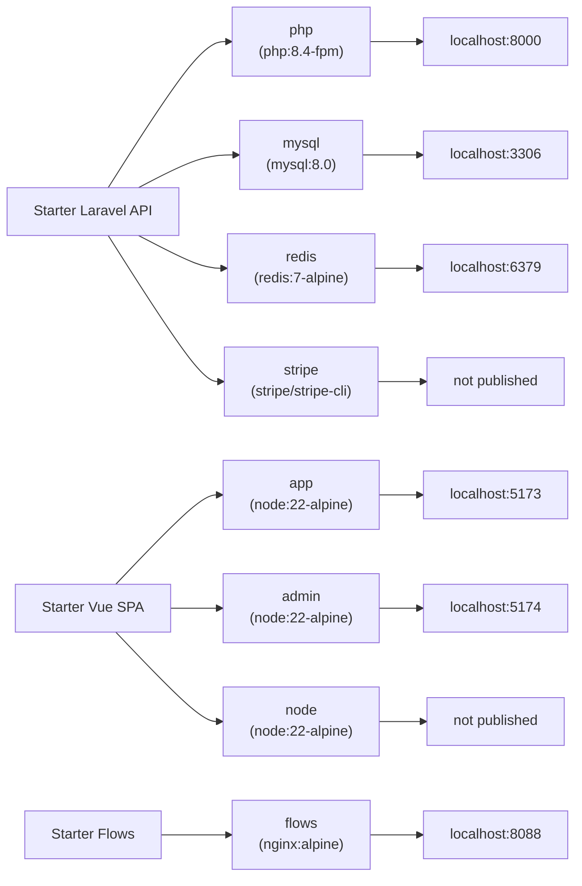

# Docker Setup

Status: done
Updated: 2026-09-02

## Layout

| Repo | Container | Address | Compose hostname | Use |
| --- | --- | --- | --- | --- |
| starter-laravel-api | php | `http://localhost:8000` | `php:8000` | The API |
| starter-laravel-api | mysql | `localhost:3306` | `mysql:3306` | Database, published for a desktop client on the host |
| starter-laravel-api | redis | `localhost:6379` | `redis:6379` | Cache, published for a desktop client on the host |
| starter-laravel-api | stripe | not published | none | Stripe CLI, dials out and forwards inward |
| starter-vue-spa | app | `http://localhost:5173` | none | The App |
| starter-vue-spa | admin | `http://localhost:5174` | none | The Admin |
| starter-vue-spa | node | not published | none | Install and one-off commands |
| starter-flows | flows | `http://localhost:8088` | none | Markdown viewer for `flows/` and `docs/` |

Three repos sit side by side under one parent directory, each with its own `docker-compose.yml`, its own containers and its own `./dev` wrapper script. No shared network and no root compose file. Each stack publishes ports on localhost and the repos reach each other over those published ports, so any one of them runs on its own.

Every repo bind mounts its working tree into the container, so edits apply live with no rebuild. Dependencies are never installed on boot. Each entrypoint checks whether the dependency directory exists and only starts the dev server when it does, which keeps `composer.lock` and `yarn.lock` from moving without an explicit command. The `./dev` script in each repo is a thin `docker compose exec` wrapper with the same verbs everywhere, `up`, `down`, `restart`, `logs`, `sh`.

## Starter Laravel API

### php

Built from `docker/php/Dockerfile` on `php:8.4-fpm`, with everything the API needs baked into the image.

- Extensions
    - `pdo_mysql`
    - `zip`
    - `bcmath`
    - `gd` - configured with JPEG support
    - `redis` - installed through PECL
- Binaries
    - `composer` - copied in from the official Composer image
    - `mysqldump` - copied in from the MySQL 8.0 image, so database dumps and backups run inside the container without a second toolchain

Custom image over Laravel Sail. Adding an extension here is one line in the Dockerfile and a rebuild, where Sail wraps the same job in its own publish and override layer. Once the image needs anything past the defaults, Sail is more to work around than to use.

The working tree is bind mounted, so anything the container writes lands straight in the host directory owned by whichever user wrote it. Running as root would leave `vendor/`, `storage/logs` and generated migrations owned by root on the host, editable only with sudo. Build args `USER_ID` and `GROUP_ID` create an `app` user carrying the host user's ids and the container runs as that user, so a file written by artisan or Composer belongs to the developer. The `./dev build` command reads `id -u` and `id -g` from the shell and passes both in, which is why the image is built through the script rather than a bare `docker compose build`.

The entrypoint starts `artisan serve` on `0.0.0.0:8000` when `vendor/` is present, then hands off to `php-fpm`. A fresh clone boots into a container that serves nothing until `./dev install` runs.

### mysql

Stock `mysql:8.0`. Database `laravel`, user `laravel`. Data persists in the named volume `mysql_data`, so a `down` keeps the database and a `down -v` wipes it. Port 3306 is published for a desktop client on the host.

### redis

Stock `redis:7-alpine` with no volume, so the cache is discarded on recreate. Reached by the PHP container at hostname `redis`.

### stripe

The official `stripe/stripe-cli` image running `listen`, which opens an outbound connection to Stripe and holds it open for as long as the container is up. Stripe pushes account events down that connection and the CLI replays each one as a local request directly to the php container at `php:8000/stripe/webhook`. Authenticated with `STRIPE_SECRET` from the repo `.env`.

## Starter Vue SPA

Everything lives in one dependency tree. The root `package.json` lists all the packages, `app/package.json` and `admin/package.json` list none. Both front ends import `shared/`, so they have to use the same copy of everything.

That copy is the `node_modules` volume. All three containers mount it at the same path, so one install serves all of them. Giving each app its own install would create two copies of the same packages that could drift apart, with `shared/` compiled against both. The repo itself is mounted in from the host at `/repo`, the volume covers `node_modules` alone.

The `node` container is just a shell. It runs nothing, so `./dev install` has somewhere to run that is not a container currently serving a dev server. It also still works when `app` and `admin` are broken or stopped.

The `app` and `admin` containers are split only for ports, 5173 and 5174, and so one Vite restarts without touching the other. They are otherwise identical, same image, same volume, different `APP` value.

No Dockerfile. Three stock `node:22-alpine` containers and one volume. Separate installs would mean building images or duplicating the tree, to isolate two apps that are meant to stay on identical versions.

Vite accepts connections only from inside its own container by default, so `http://localhost:5173` on the host would refuse the connection. Each Vite config reads `VITE_HOST` from `.env.development`, set to `0.0.0.0`.

### app

Runs `yarn workspace app run dev` on port 5173 through `docker/node/entrypoint.sh`, which starts the dev server only when `node_modules` is populated, then holds the container open with `tail -f /dev/null`. A crashed dev server does not take the container down with it, and `./dev sh app` still works.

### admin

Same, with `APP=admin` on port 5174.

### node

Idle, the target for `./dev install` and `./dev yarn ...`.

## Starter Flows

### flows

Stock `nginx:alpine` on host port 8088, serving the repo as a browsable site with no build step and no application code. Every mount is read-only, since the container only ever reads.

- `viewer/index.html` - the viewer itself, fetches the markdown and renders it in the browser
- `viewer/nginx.conf` - the server config, the one mount that needs a restart after an edit
- `viewer/vendor` - `marked` and `mermaid`, vendored so the viewer works offline
- `viewer/favicons`
- `flows/` - the flow files, served as `text/markdown`
- `docs/` - the docs, served as `text/markdown`

The config sends `Cache-Control: no-store` on everything and turns on `autoindex` with `autoindex_format json` for `/flows/` and `/docs/`. The viewer fetches those directory listings as JSON to build its sidebar, so a new flow file appears without an index to maintain anywhere. Rendering in the browser over compiling to HTML keeps the markdown files the only source, and a save shows up on the next refresh.

## Diagram

