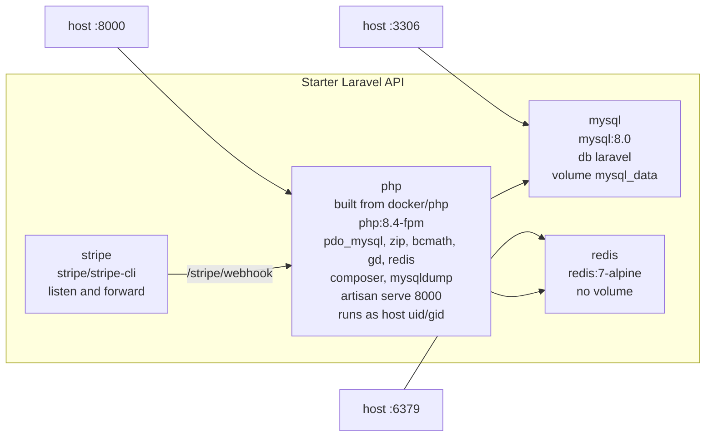
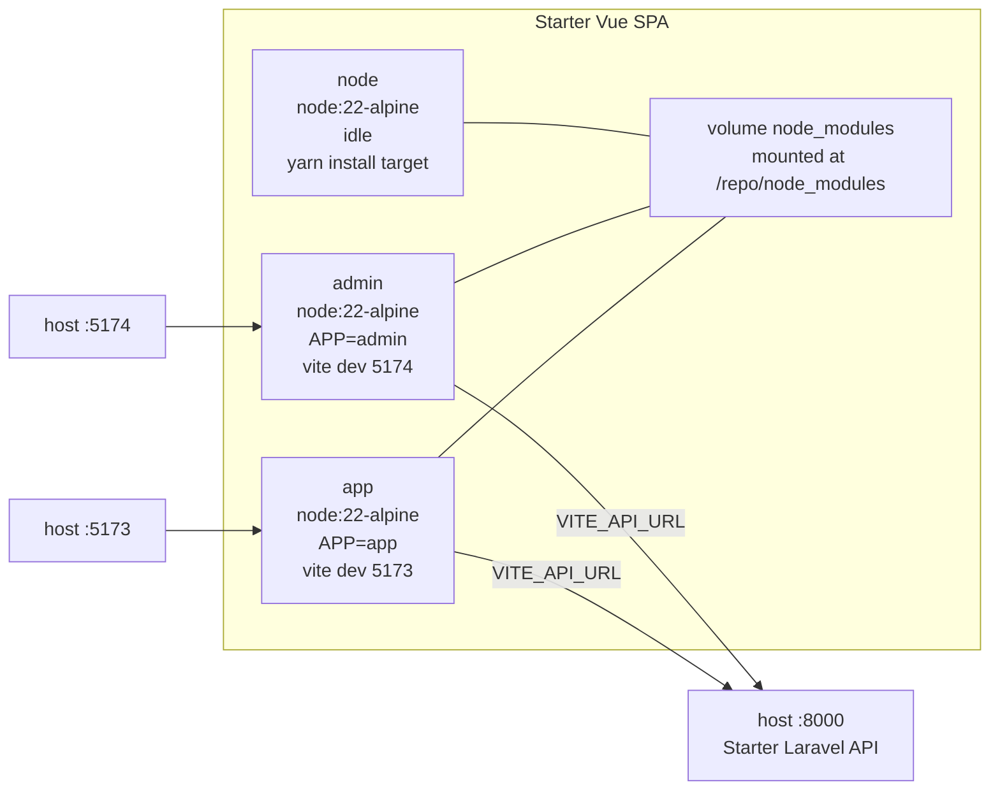
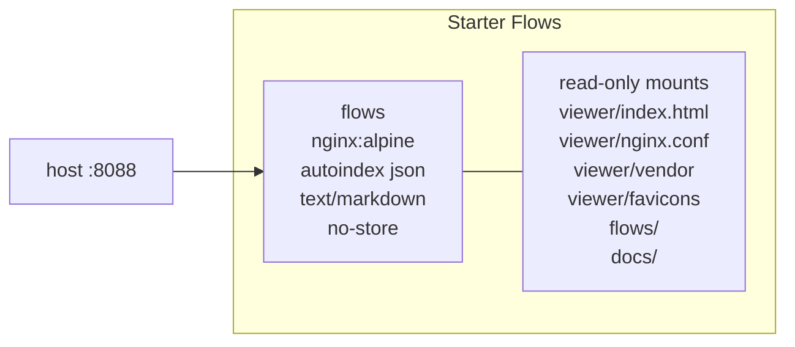

# Docker Setup

Status: wip
Updated: 2026-09-02

## Layout

Three repos sit side by side under one parent directory, each with its own `docker-compose.yml`, its own containers and its own `./dev` wrapper script. No shared network and no root compose file. Each stack publishes ports on localhost and the repos reach each other over those published ports, so any one of them runs on its own.

| Repo | Container names | Host ports |
| --- | --- | --- |
| starter-laravel-api | php, mysql, redis, stripe | 8000, 3306, 6379 |
| starter-vue-spa | app, admin, node | 5173, 5174 |
| starter-flows | flows | 8088 |

Every repo bind mounts its working tree into the container, so edits apply live with no rebuild. Dependencies are never installed on boot. Each entrypoint checks whether the dependency directory exists and only starts the dev server when it does, which keeps `composer.lock` and `yarn.lock` from moving without an explicit command. The `./dev` script in each repo is a thin `docker compose exec` wrapper with the same verbs everywhere, `up`, `down`, `restart`, `logs`, `sh`.

## Starter Laravel API

The only repo with a Dockerfile. PHP is built locally because the image needs extensions, a Composer binary and a host-matched user; everything else runs on a stock image. The App reaches the API at `http://localhost:8000` and the API points back at `http://localhost:5173` through `FRONTEND_URL`.

### php

Built from `docker/php/Dockerfile` on `php:8.4-fpm`. Extensions installed are `pdo_mysql`, `zip`, `bcmath`, `gd` configured with JPEG support, and `redis` through PECL. The `composer` binary is copied in from the official Composer image and `mysqldump` from the MySQL 8.0 image, so backup and dump commands run inside the container without a second toolchain.

Build args `USER_ID` and `GROUP_ID` create an `app` user matching the host user, and the container runs as that user. Files written by artisan or Composer land on the host owned by the developer rather than root. The `./dev build` command passes the host ids in.

The entrypoint starts `artisan serve` on `0.0.0.0:8000` when `vendor/` is present, then hands off to `php-fpm`. A fresh clone boots into a container that serves nothing until `./dev install` runs.

### mysql

Stock `mysql:8.0`. Database `laravel`, user `laravel`. Data persists in the named volume `mysql_data`, so a `down` keeps the database and a `down -v` wipes it. Port 3306 is published for a desktop client on the host.

### redis

Stock `redis:7-alpine` with no volume, so the cache is discarded on recreate. Reached by the PHP container at hostname `redis`.

### stripe

The official `stripe/stripe-cli` image running `listen`, forwarding events to `php:8000/stripe/webhook` over the compose network. Authenticated with `STRIPE_SECRET` from the repo `.env`. Webhooks arrive during local development without a tunnel or a public hostname.

## Starter Vue SPA

No Dockerfile. Three containers all run the stock `node:22-alpine` image and differ only by the `APP` environment variable and the published port. The repo is a Yarn workspaces root with `app` and `admin` as workspaces sharing a `shared/` directory, so one install serves both.

The working tree mounts at `/repo` and a named `node_modules` volume mounts over `/repo/node_modules`. The install lives in the volume, shared by all three containers, and never collides with a `node_modules` on the host. Resetting means dropping the volume.

Each Vite config binds to `0.0.0.0` through `VITE_HOST` in `.env.development`, otherwise the dev server would only answer inside the container and the published port would be dead.

### app

Runs `yarn workspace app run dev` on port 5173 through `docker/node/entrypoint.sh`, which starts the dev server only when `node_modules` is populated, then holds the container open with `tail -f /dev/null`. Holding the container open means a crashed dev server does not take the container down with it, and `./dev sh app` still works.

### admin

Identical to `app` apart from `APP=admin` and port 5174.

### node

No port and no dev server, kept alive by `tail -f /dev/null`. The install and one-off command target, so `./dev install` and `./dev yarn ...` do not disturb either running dev server.

## Starter Flows

A single container serving this repo as a browsable site. No build step and no application code, so the whole stack is one stock image plus a config file.

### flows

Stock `nginx:alpine` on host port 8088. Six read-only bind mounts, the viewer page, the nginx config, the vendored JavaScript, the favicons, `flows/` and `docs/`. Markdown files and the viewer page are live on save, only a change to `nginx.conf` needs a restart.

The config sends `Cache-Control: no-store` on everything and turns on `autoindex` with `autoindex_format json` for `/flows/` and `/docs/`. The viewer fetches those directory listings as JSON to build its sidebar, so a new flow file appears without touching any index. Markdown is served as `text/markdown` and rendered in the browser by `marked` and `mermaid`, both vendored under `viewer/vendor` so the viewer works offline.

## Diagram

## Todo

- The Starter Vue SPA docker doc calls the wrapper `./run install`, the script in the repo is `./dev`.
- No shared network across the three stacks. Cross-repo calls go out to the host and back in.
- Redis has no volume, so cached data is lost on every recreate.
