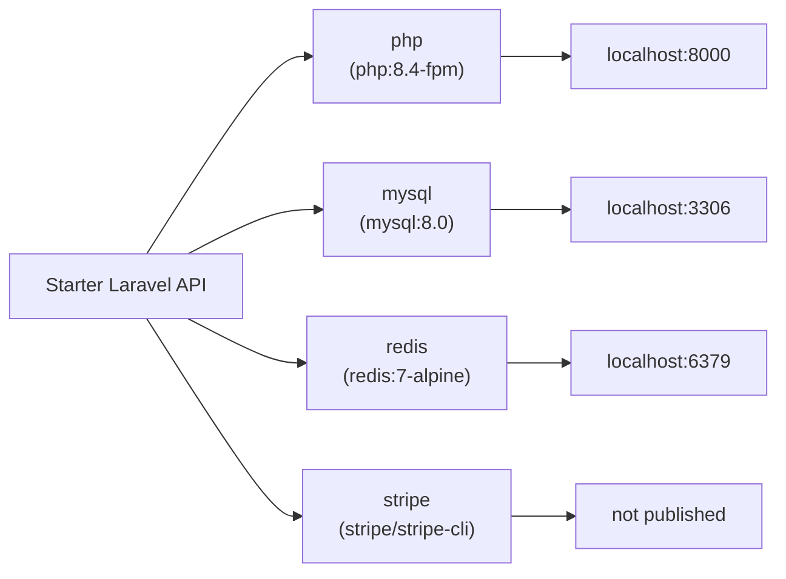
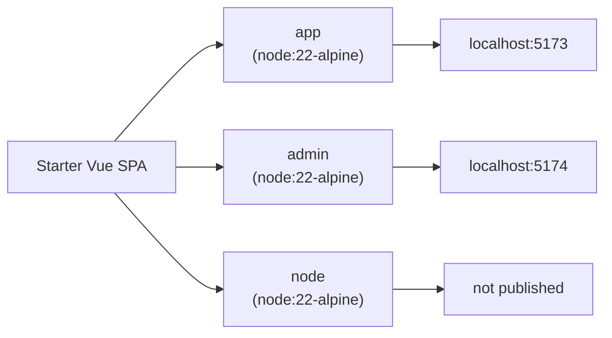
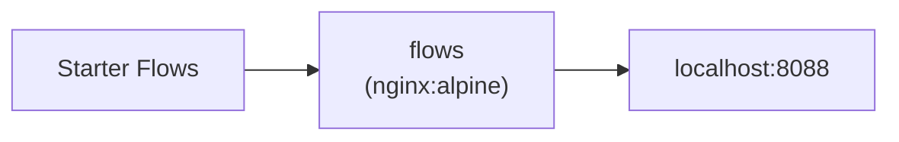

# Docker Setup

Status: wip
Updated: 2026-09-02

## Layout

| Repo | Container | Address | Compose hostname | Use |
| --- | --- | --- | --- | --- |
| starter-laravel-api | php | `http://localhost:8000` | `php:8000` | The API |
| starter-laravel-api | mysql | `localhost:3306` | `mysql:3306` | Database, published for a desktop client on the host |
| starter-laravel-api | redis | `localhost:6379` | `redis:6379` | Cache, published for a desktop client on the host |
| starter-laravel-api | stripe | not published | none | Stripe CLI, dials out and forwards inward |
| starter-vue-spa | app | `http://localhost:5173` | none | The App |
| starter-vue-spa | admin | `http://localhost:5174` | none | The Admin App |
| starter-vue-spa | node | not published | none | Install and one-off commands |
| starter-flows | flows | `http://localhost:8088` | none | Markdown viewer for `flows/` and `docs/` |

Three repos sit side by side under one parent directory, each with its own `docker-compose.yml`, its own containers and its own `./dev` wrapper script. No shared network and no root compose file. Each stack publishes ports on localhost and the repos reach each other over those published ports, so any one of them runs on its own.

Every repo bind mounts its working tree into the container, so edits apply live with no rebuild. Dependencies are never installed on boot. Each entrypoint checks whether the dependency directory exists and only starts the dev server when it does, which keeps `composer.lock` and `yarn.lock` from moving without an explicit command. The `./dev` script in each repo is a thin `docker compose exec` wrapper with the same verbs everywhere, `up`, `down`, `restart`, `logs`, `sh`.

## Starter Laravel API

### php

Built from `docker/php/Dockerfile` on `php:8.4-fpm`, with everything the API needs baked into the image.

- Extensions
    - `pdo_mysql`
    - `zip`
    - `bcmath`
    - `gd` - configured with JPEG support
    - `redis` - installed through PECL
- Binaries
    - `composer` - copied in from the official Composer image
    - `mysqldump` - copied in from the MySQL 8.0 image, so database dumps and backups run inside the container without a second toolchain

Custom image over Laravel Sail. Adding an extension here is one line in the Dockerfile and a rebuild, where Sail wraps the same job in its own publish and override layer. Once the image needs anything past the defaults, Sail is more to work around than to use.

The working tree is bind mounted, so anything the container writes lands straight in the host directory owned by whichever user wrote it. Running as root would leave `vendor/`, `storage/logs` and generated migrations owned by root on the host, editable only with sudo. Build args `USER_ID` and `GROUP_ID` create an `app` user carrying the host user's ids and the container runs as that user, so a file written by artisan or Composer belongs to the developer. The `./dev build` command reads `id -u` and `id -g` from the shell and passes both in, which is why the image is built through the script rather than a bare `docker compose build`.

The entrypoint starts `artisan serve` on `0.0.0.0:8000` when `vendor/` is present, then hands off to `php-fpm`. A fresh clone boots into a container that serves nothing until `./dev install` runs.

### mysql

Stock `mysql:8.0`. Database `laravel`, user `laravel`. Data persists in the named volume `mysql_data`, so a `down` keeps the database and a `down -v` wipes it. Port 3306 is published for a desktop client on the host.

### redis

Stock `redis:7-alpine` with no volume, so the cache is discarded on recreate. Reached by the PHP container at hostname `redis`.

### stripe

The official `stripe/stripe-cli` image running `listen`, which opens an outbound connection to Stripe and holds it open for as long as the container is up. Stripe pushes account events down that connection and the CLI replays each one as a local request directly to the php container at `php:8000/stripe/webhook`. Authenticated with `STRIPE_SECRET` from the repo `.env`.

## Starter Vue SPA

The repo holds two front ends, `app` and `admin`, built on a `shared/` directory they both draw from. Yarn workspaces ties all three together under one root `package.json`, so the packages for both front ends install once into a single `node_modules` at the root of the repo.

The repo is mounted into each container at `/repo`, so a container reads the same files sitting on the host. The exception is `node_modules`, which lives in a Docker volume mounted over `/repo/node_modules` rather than on the host. Keeping the install inside Docker means every container shares one copy, packages built for the container's Linux never mix with a copy installed on the host for a different platform, and clearing the install is `docker compose down -v` rather than deleting a folder.

Vite only accepts connections from inside its own container unless told otherwise, so `http://localhost:5173` on the host gets connection refused even with the port published and the container up. Each Vite config reads `VITE_HOST` from `.env.development`, set to `0.0.0.0`, which makes the dev server accept connections from outside the container.

### app

Stock `node:22-alpine`, running `yarn workspace app run dev` on port 5173 through `docker/node/entrypoint.sh`, which starts the dev server only when `node_modules` is populated, then holds the container open with `tail -f /dev/null`. Holding the container open means a crashed dev server does not take the container down with it, and `./dev sh app` still works.

### admin

Stock `node:22-alpine`, identical to `app` apart from `APP=admin` and port 5174.

### node

Stock `node:22-alpine` with no port and no dev server, kept alive by `tail -f /dev/null`. The install and one-off command target, so `./dev install` and `./dev yarn ...` do not disturb either running dev server.

## Starter Flows

### flows

Stock `nginx:alpine` on host port 8088, serving the repo as a browsable site with no build step and no application code. Every mount is read-only, since the container only ever reads.

- `viewer/index.html` - the viewer itself, fetches the markdown and renders it in the browser
- `viewer/nginx.conf` - the server config, the one mount that needs a restart after an edit
- `viewer/vendor` - `marked` and `mermaid`, vendored so the viewer works offline
- `viewer/favicons`
- `flows/` - the flow files, served as `text/markdown`
- `docs/` - the docs, served as `text/markdown`

The config sends `Cache-Control: no-store` on everything and turns on `autoindex` with `autoindex_format json` for `/flows/` and `/docs/`. The viewer fetches those directory listings as JSON to build its sidebar, so a new flow file appears without an index to maintain anywhere. Rendering in the browser over compiling to HTML keeps the markdown files the only source, and a save shows up on the next refresh.

## Diagram

