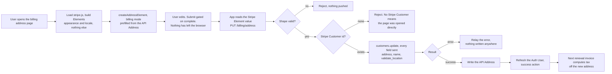

# Address Update - Stripe (Address Element)

Status: done
Updated: 2026-09-03

## Description

A User changes the billing address held against them, from the account pages, collected in a Stripe Billing Address Element rather than a form of the App's own. The address goes to Stripe first and only reaches the API Address if Stripe accepts it, and the response is the whole answer.

## Terms

| Term | Description |
| --- | --- |
| API | The back end. Holds the API records and talks to the providers. |
| API Address | The API record holding the billing name and address. |
| API User | The User's record on the API side. |
| App | The front end the User is looking at, web or mobile. |
| Auth User | The signed in User's data held by the App. |
| Stripe Billing Address Element | The Stripe Element collecting the billing address and name. |
| Stripe Checkout Session | The Stripe object a checkout runs on. Carries the line items, the address, the promotion code, the total and the Stripe Payment Method. |
| Stripe Customer | The Stripe object holding the User's id, address and saved Stripe Payment Methods. |
| Stripe Element | A Stripe UI component mounted by the App. |
| Stripe Payment Element | The Stripe Element collecting the Stripe Payment Method. |
| Stripe Payment Method | The payment method at Stripe, saved against the Stripe Customer. |
| User | The human using the App. Never the App and never the API. |

## Requirements

- Authenticated Users only.
- Change an address that already exists. There is no add path here, since the first address is collected during subscribe.
- The billing page links here only when an address is on file, and the route is guarded on the same thing.
- Collect the address with the Stripe Billing Address Element, so field layout and country rules come from Stripe.
- Style the Stripe Element with the App's own appearance so the page matches the rest of the App.
- Collect a billing name alongside the address, since who pays is not necessarily whose account it is.
- Verify the address resolves to a real tax jurisdiction before saving it. An address Stripe cannot place is refused and nothing changes.
- The address reaches Stripe first. The API Address is written only once Stripe accepts it.
- Nothing is charged, no invoice is created and no proration happens. The change applies from the next renewal invoice.
- The response is the answer. Nothing settles afterwards, so there is no webhook and nothing to poll.

## Flow

1. User opens the billing address page. There is no API call on load. Nothing has to be fetched because there is no secret to mount against.
   1. Load stripe.js if it isn't already on the page.
   2. Build an Elements instance with `stripe.elements({ appearance, locale })`. Both `mode` and `currency` are only required by the Stripe Payment Element and the express checkout element, so an address only instance needs neither. The call is local and nothing is sent to Stripe. Appearance and locale are the same objects the rest of the App's Stripe Elements take.
   3. Create the Stripe Billing Address Element in billing mode, prefilled through `defaultValues` off the API Address when there is one. Stripe reads `defaultValues` once at creation, so the Stripe Element goes up after the Auth User is loaded. See the note below.
   4. The Stripe Billing Address Element always renders a name field and there is no turning it off. Setting `display.name` only chooses between a full name, a split first and last, or an organization. Seed it from the account's first and last name while nothing has been saved, and let the stored billing name win from then on.
   5. Country is an ISO alpha-2 select and the field layout follows the country, so the shape of an address is Stripe's problem rather than a hand rolled form's. Labels, postal formats and whether a region field appears at all come with it.
   6. Neither `contacts` nor `customerSessionClientSecret` is passed, so the Stripe Element stays a plain form and never renders the addresses Stripe has saved against the Stripe Customer.
   7. Failing to load stripe.js leaves the User with nowhere to enter anything. Show the failure rather than an empty page where the form should be.
2. User edits the address. The change event reports `complete` along with the value. Submit stays disabled until the value is complete, and nothing has left the browser at any point.
3. User submits. The App reads the value off the Stripe Billing Address Element and sends it to the API.
   1. Validate the basic shape. The check does not need to be anything fancy, since the Stripe Billing Address Element has already enforced the country's own field rules and Stripe verifies the address properly on the next call. This is a backstop for a request that did not come from the Stripe Element, not the validation the User sees, and nothing here should be built to render field errors.
   2. Load the API User's Stripe Customer id. There is always one, since the route is guarded on an address being on file and an address on file means subscribe already created the Stripe Customer. If there isn't one, error out rather than creating one. Same backstop as the shape check above and for the same case, a request that did not come through the page.
   3. Update `address` and `name` on the Stripe Customer with `tax[validate_location]` set to `immediately`, so the address has to resolve to a valid tax jurisdiction. The `name` field is `customer.name`, which sits alongside `address` on the Stripe Customer rather than inside it. See the note below.
   4. Send every field on every save, empty where the User cleared it. Stripe only touches what it is sent, so a field left out of the call keeps whatever was on the Stripe Customer before. A country change is where that bites, since the Stripe Billing Address Element stops rendering a state for a country that has none and the old subdivision stays sitting under the new country. An empty string is what clears one.
   5. An address Stripe cannot place errors back for display and nothing is written anywhere. Stripe leaves the Stripe Customer unchanged, so there is nothing to undo.
   6. Write the API Address once Stripe returns a success. See the note below.
4. App refreshes the Auth User and takes the success action. The API Address is what prefills the Stripe Billing Address Element next time, so it has to be the one just written.
5. Nothing is charged and no invoice is created. The current cycle is already finalized and its tax is locked at the rate that applied when it was issued.
6. The change applies from the next renewal invoice. Stripe recomputes tax off the Stripe Customer's address every time it creates one, so nothing on the subscription has to be re-pointed. See the note below.
7. The Stripe Payment Method's `billing_details.address` is a separate field and nothing here touches it. That one is AVS data the bank checks against the Stripe Payment Method. Stripe only falls back to it for tax when the Stripe Customer carries no address, which holds until the first successful save. Editing the address here does not change it, and editing the Stripe Payment Method does not change the tax address.

## Diagram

## Notes

### The Stripe Billing Address Element over a form of the App's own

Setting `tax[validate_location]` to `immediately` makes address correctness a hard requirement rather than a nicety, and getting there by hand means an ISO alpha-2 country list, per country subdivision lists, per country postal rules and labels, and translations for all of it. Stripe ships that and keeps it current. The cost is that validation stops being the App's, so field rules, field labels and their translations go with the form.

### No Stripe Customer is created here

The page changes an address that exists, so a Stripe Customer already exists too, and a request without one is a broken state rather than a first address. Creating one would open a Stripe Customer at Stripe for someone who has never paid and hand back a success, which reads as the address being saved somewhere it matters. Subscribe creates the Stripe Customer and pushes the first address through its Stripe Checkout Session when the time comes.

### How this page differs from subscribe

Subscribe collects the same address through the Stripe Checkout Session's own Stripe Billing Address Element and never writes it to the Stripe Customer until confirm, so the two do not overlap. See the [subscription create flow](../../subscription/stripe/Create.md). This page is the other half, a direct write to the Stripe Customer with no Stripe Checkout Session behind it. Same Stripe Element, different construction, and the reason both exist is that a Stripe Checkout Session only exists while something is being bought.

There is no intent, no client secret, no confirm and no webhook on this path. The Stripe Element is a widget and nothing it collects goes to Stripe from the browser. Its value comes back to the App, and the address only reaches Stripe through the API's own update.

### The API Address fields

The API Address needs `state` and `name` fields. The Stripe Billing Address Element collects both.

Never write `billing_details.address` on the Stripe Payment Method from here. Tax reads the Stripe Customer's address while one is set, AVS reads the Stripe Payment Method's address, and the two are answering different questions.

### No address autocomplete here

Stripe only lends its Google Maps key when a Stripe Payment Element is in the same Elements group, which subscribe has and this page does not. Bringing our own is `autocomplete: { mode: 'google_maps_api', apiKey: '...' }`, which means a Google Maps Platform key and Google's billing behind it. Out of scope.

### Note on 1.3 - mounting before the Auth User resolves

Stripe reads `defaultValues` once, when the Stripe Element is created, so a Stripe Element built before the Auth User arrives comes up empty and stays empty. Behind the auth guard the Auth User is always available, so this is a matter of ordering the mount after the load rather than a case to handle.

### Note on 3.3 - what validate_location does not check

Setting `tax[validate_location]` to `immediately` returns an error and leaves the Stripe Customer unchanged when the address cannot be placed, so an unplaceable address never reaches the API Address. What it does not check is registration. An address that resolves cleanly in a jurisdiction you are not registered in comes back with `automatic_tax` at `not_collecting` and bills zero tax, which you may still be liable for.

### Note on 3.6 - when Stripe accepts and the API write fails

Stripe is correct and tax is already right, only the API Address is behind, and the page keeps showing the old address. A retry pushes the same address again and is idempotent, so there is nothing to reconcile between the two attempts.

### Note on 6 - saving while a renewal invoice is being created

Whichever address is on the Stripe Customer at the moment Stripe creates the invoice is the one it computes tax off. There is no mid invoice recompute, so a save that lands a moment late applies to the invoice after it.

## Todo

- Reconcile job for an address that saved at Stripe and failed to write to the API Address.
- Tax IDs, VAT numbers and reverse charge.
- Reissuing an invoice for a cycle already finalized.
- Billing details on the Stripe Payment Method.
