# Billing Payment Method Update - Stripe (Payment Element)

Status: done
Updated: 2026-09-02

## Description

A User replaces the Stripe Payment Method held against them, from the account pages, entered in a Stripe Payment Element that is mounted and ready the moment the page opens. Confirming stores the Stripe Payment Method and an API sync call is what makes it the one on file, and nothing is charged along the way.

This is the housekeeping case, a User in good standing swapping one Stripe Payment Method for another. A User whose renewal has failed is a different flow with a different answer, and is not resolved here.

## Terms

| Term | Description |
| --- | --- |
| API | The back end. Holds the API records and talks to the providers. |
| API Payment Method | The API record holding the Stripe Payment Method's brand and last4. |
| API User | The User's record on the API side. |
| App | The front end the User is looking at, web or mobile. |
| Auth User | The signed in User's data held by the App. |
| Stripe Customer | The Stripe object holding the User's id, address and saved Stripe Payment Methods. |
| Stripe Element | A Stripe UI component mounted by the App. |
| Stripe Payment Element | The Stripe Element collecting the Stripe Payment Method. |
| Stripe Payment Method | The payment method at Stripe, saved against the Stripe Customer. |
| Stripe Setup Intent | The Stripe object that stores a Stripe Payment Method against a Stripe Customer without charging it. |
| Stripe Subscription | The subscription at Stripe. |
| User | The human using the App. Never the App and never the API. |

## Requirements

- Authenticated Users only.
- Replace a Stripe Payment Method that already exists. There is no add path here, since the first one is collected during subscribe.
- The billing page links here only when a Stripe Payment Method is on file, and the route is guarded on the same thing.
- Collect the new Stripe Payment Method with the Stripe Payment Element, mounted and ready when the page opens.
- Style the Stripe Element with the App's own appearance so the page matches the rest of the App.
- Handle bank authentication challenges (3DS), including one that takes the User off the page and returns them.
- A refused Stripe Payment Method leaves the User on the page to correct it, with nothing changed anywhere.
- Make the new Stripe Payment Method the default for both the Stripe Customer and the Stripe Subscription, and remove the old one.
- Write the API Payment Method's brand and last4 for display.
- An API sync call does the work while the User waits, and a Stripe webhook runs the same work as a backstop.
- Nothing is charged and no invoice is created. The new Stripe Payment Method is what the next renewal invoice bills.
- Nothing here settles an invoice a failed renewal left open, or reads whether there is one. A User behind on payment is resolved elsewhere. See the note below.

## Flow

1. User opens the payment method page. The route is guarded on a Stripe Payment Method being on file, so a User with nothing to replace goes back to billing before the page loads.
   1. The App asks the API for a Stripe Setup Intent on load, without waiting for the User to do anything. See the note below.
   2. Load the API User's Stripe Customer id. There is always one, since a Stripe Payment Method on file means subscribe already created the Stripe Customer. If there isn't one, error out rather than creating one. A backstop for a request that did not come through the page.
   3. Create the Stripe Setup Intent with the Stripe Customer and `usage` set to `off_session`. The renewal charges with nobody at the keyboard, and the mandate that allows it is what `off_session` sets up.
   4. No amount, no price, nothing about the Stripe Subscription. A Stripe Setup Intent only ever stores a Stripe Payment Method.
   5. Stripe erroring on the create errors back for display. Without a secret there is nothing to mount, so the page cannot continue.
   6. Return the client secret.
2. The App mounts the Stripe Payment Element against that secret.
   1. Load stripe.js if it isn't already on the page.
   2. Build an Elements instance off the client secret, with the same appearance and locale objects the rest of the App's Stripe Elements take. Neither `mode` nor `currency` is passed, Stripe reads what it needs off the Stripe Setup Intent.
   3. The appearance is a snapshot taken when the instance is created. A Stripe Element has no access to the page's own custom properties, so a colour scheme or breakpoint change is pushed into the mounted instance rather than cascading into it.
   4. The Stripe Element mounts while the loading state is still up, so its container is hidden rather than removed. Taking the container out of the document tears the mount down.
   5. Anything that stops the mount, a dead stripe.js among them, shows the failure. An empty form with a live submit button under it is the one outcome to avoid.
3. User enters the new Stripe Payment Method and submits. The App confirms the Stripe Setup Intent with a `return_url` and `redirect` set to `if_required`.
   1. A bank challenge either runs in a dialog and resolves inline, or sends the User away to the bank and back to the return url. Nothing is being charged and the bank can still want the Stripe Payment Method verified.
   2. A refusal leaves the Stripe Setup Intent confirmable and the Stripe Element standing. The User corrects the Stripe Payment Method and submits again on the same secret, with no new Stripe Setup Intent.
   3. The return url is the page's own url with Stripe's return keys stripped off it. A second attempt that carried the first attempt's secret back would resume a Stripe Setup Intent that is already spent.
4. Landing back from a bank. The page loads with no state and Stripe has appended the Stripe Setup Intent's secret to the url.
   1. Read the secret and retrieve the Stripe Setup Intent rather than opening a second one. A create here spends a Stripe Setup Intent that nothing mounts and buries a challenge the User already passed.
   2. Anything other than a success remounts the Stripe Element against the same secret and shows what came back, so the User tries again without a new Stripe Setup Intent.
   3. A success goes straight to the sync call. The confirm is over and only the writes are left.
5. A confirmed Stripe Setup Intent attaches the Stripe Payment Method to the Stripe Customer and that is all. It is not the default and nothing will charge it. Attaching and defaulting are two separate things, and this is where the flow is easy to get wrong.
6. Two paths turn the confirmed Stripe Setup Intent into the Stripe Payment Method on file. The App posts its id to the API sync call as soon as the confirm resolves, and Stripe fires `setup_intent.succeeded` carrying the same Stripe Setup Intent. Both run the same writes and whichever arrives first does them.
   1. The sync call checks that the Stripe Setup Intent belongs to the authenticated User's Stripe Customer and that it succeeded, and rejects anything else. The webhook is verified by its signature.
   2. Set `invoice_settings.default_payment_method` on the Stripe Customer to the new Stripe Payment Method. That is what a future invoice reads.
   3. Set `default_payment_method` on the Stripe Subscription to the same Stripe Payment Method. A Stripe Subscription level default overrides the Stripe Customer level one, so an old Stripe Payment Method left pinned there bills at the next renewal. Nothing fails at update time, it surfaces a month later. A User with no Stripe Subscription skips this and the rest of the writes still run.
   4. Detach the old Stripe Payment Method, otherwise every update leaves another one sitting on the Stripe Customer. One that is already detached is not an error.
   5. Write the API Payment Method's brand and last4.
   6. Both paths are idempotent. The same Stripe Setup Intent can arrive twice on either.
   7. Every write lands before the sync call responds, since the App reads the result off the Auth User it refreshes next.
7. The sync call is what the User waits on, so its response is the answer and there is nothing to poll for.
   1. On success the App refreshes the Auth User and sends the User back to billing, where the new brand and last4 are what shows.
   2. On failure the User is held on the page with the message. The Stripe Setup Intent is confirmed and kept, so submitting again retries the sync rather than asking for the Stripe Payment Method a second time.
   3. The webhook is not a second thing to wait for. It covers the User who closed the tab or never came back from the bank, and lands as a no-op when the sync call already ran.
8. A Stripe Setup Intent is opened for everyone who lands on the page. There is no Stripe Subscription and no API record behind an unconfirmed one, and Stripe ages it out on its own, so there is nothing to clean up.
9. Nothing is charged. The current cycle is already paid and the new Stripe Payment Method is what the next renewal invoice bills.

## Diagram

```mermaid
flowchart LR
    A[User opens the payment method page] -->|on load| B["POST /payment-method/intent"]
    B --> C[Load the Stripe Customer id]
    C --> D["setupIntents.create<br/>usage: off_session"]
    D --> E[Return the client secret]

    E --> F["Elements off the secret<br/>mount the Stripe Payment Element"]
    F --> G[User submits]
    G --> H[confirmSetup]
    H --> I{Result}

    I -->|refused| G
    I -->|challenge redirect| I1["Back at the return url<br/>retrieveSetupIntent"]
    I1 -->|not succeeded| F
    I -->|succeeded| J
    I1 -->|succeeded| J

    J["Stripe Payment Method attached to the<br/>Stripe Customer, nothing defaulted"] --> K1["POST /payment-method/sync"]
    J --> K2["Stripe fires<br/>setup_intent.succeeded"]

    K1 --> L["Stripe Customer<br/>invoice_settings.default_payment_method"]
    K2 --> L
    L --> M["Stripe Subscription<br/>default_payment_method"]
    M --> N[Detach the old Stripe Payment Method]
    N --> O["API Payment Method<br/>brand and last4"]
    O --> P[Refresh the Auth User]
    P --> Q[Back to billing]
    Q --> R["Next renewal invoice bills<br/>the new Stripe Payment Method"]
```

## Notes

### The Stripe Payment Element on a page of its own

A bank challenge can send the browser away and bring it back to a cold url with the secret on it. A dedicated page comes back up as itself, reads the secret and retrieves the Stripe Setup Intent. A dialog or an inline section has to work out that it is mid flow and rebuild the state it was in before the redirect. Same result, more work.

### The sync call alongside the webhook

Leaving the writes to the webhook alone puts the User in front of a spinner for something that has already succeeded, and the obvious thing to poll on, the last4, does not change when the same Stripe Payment Method is entered again. The sync call gives the page a straight answer to wait on. The webhook stays because the browser can be closed or sent to the bank and never come back, and the webhook is the only path that always arrives. Two writers is the cost and idempotency is what pays for it.

### One Stripe Payment Method on file

Detaching the old Stripe Payment Method keeps exactly one against the Stripe Customer, which is what a single brand and last4 on the API Payment Method can describe and what every screen showing the Stripe Payment Method assumes. Keeping a list buys a picker, a default marker and a delete path on every one of those screens.

### A past due User is not resolved here

This flow swaps the Stripe Payment Method on file and stops. It does not look for an invoice a failed renewal left open, does not charge one, and does not report on one. A User who is behind on payment can walk through this whole flow, get a success, and still be past due at the end of it, because replacing a Stripe Payment Method does not prompt Stripe to retry anything.

That is deliberate. Resolving a failed renewal is a different job with a different answer. The Stripe Payment Method on file might be fine and only need a bank challenge cleared, in which case sending the User here to type a card in again asks them for something that was never the problem. It is also the one case where the User might need to be charged before they get their access back, and charging is not what this page does.

So a past due User defaults to billing until the App handles them. See the [subscription guards flow](../../subscriptions/Guards.md).

### Note on 1.1 - opening the Stripe Setup Intent on page load

The page does one job, so arriving on it is the User declaring intent already and a button asking for the same declaration is the second time. The Stripe Element also cannot mount without a secret, so the call has to land before the form is usable whichever way it is triggered. A button would lower the number of abandoned Stripe Setup Intents rather than remove them, and an abandoned one costs nothing.

## Todo

- Manual reconcile for a Stripe Payment Method that confirmed at Stripe where neither the sync call nor the webhook ran. Stripe holds the new Stripe Payment Method attached to the Stripe Customer, nothing is defaulted at either level, and the API still shows the old brand and last4, so the next renewal bills the old Stripe Payment Method and nothing on any screen says so. It takes both writers failing on the same update, and the webhook retries itself, so this is thin. Closing it means a sweep that finds succeeded Stripe Setup Intents whose Stripe Payment Method is not the Stripe Customer default and runs the same writes over them.
- Multiple Stripe Payment Methods on file. The flow assumes exactly one throughout.
