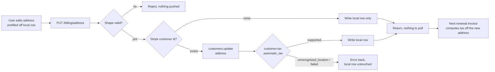

# Billing Address Update - Stripe

Status: draft
Updated: 2026-08-17

## Purpose & Scope

Saving a billing address. If the user has a Stripe customer the address goes to Stripe first, and it only reaches the local record if Stripe accepts it. If it doesn't, the request errors and nothing changes. Without a customer it's just a local update.

Note that Stripe may accept an address that is not necessarily taxable as it treats these operations as separate when saving an address. If it accepts a non taxable address, the billing will not fail, but instead a 0 for tax which you may still be liable for.

## Actors & Entities

Actors

- User - edits the address on the billing page.
- Client App - prefills the form off the local row, submits, renders the response.
- API - validates the shape, pushes to Stripe, reads the tax status back, writes the local row.
- Stripe - stores the address on the customer, resolves it for tax, returns the status.

Entities

- Local address row - country, line1, line2, city, postal code, state.
- Stripe Customer - carries `address`. May not exist, the user may never have subscribed.
- `customer.tax.automatic_tax` - Stripe's verdict on the address, read off the update response.

## Flow

1. User opens the billing address form, prefilled off the local record. No element, no intent, no client secret. This is a customer record write, not a payment.
2. Submit sends the address to the API.
   1. Validate the basic shape, doesn't need to anything fancy as Stripe will ultimately verify the address for us when it's actually needed for billing.
   2. Load the user's Stripe customer id. If there isn't one the user has never subscribed, so the write is local only and there is nothing to push.
   3. If there is a Stripe customer update the  `address` with `tax[validate_location]` set to `immediately` to ensure the address resolves to a valid tax jurisdiction.
   4. If the response is a success we can proceed to write the local row otherwise relay the error to the front end to display for the user.
3. Nothing is charged and no invoice is created. The current cycle is already finalized and its tax is locked at the rate that applied when it was issued.
4. The change applies from the next renewal invoice. Stripe recomputes tax off the customer address every time it creates one, so nothing on the subscription has to be re-pointed.
5. The payment method's `billing_details.address` is a separate field and is not touched by this. That one is AVS data the bank checks against the card, tax reads the customer address. Editing the address here does not change it, and editing the card does not change the tax address.
6. The response is the answer. Nothing asynchronous, no webhook, no polling.

## Diagram

## States

Tax status on the customer. The address itself has no status.

| State | Meaning |
| ----- | ------- |
| unset | No Stripe customer, or no address pushed yet. Nothing resolved |
| supported | Address resolves to a jurisdiction. The next renewal invoice computes tax |
| unrecognized_location | Stripe cannot resolve the address. The next renewal invoice will not finalize |
| failed | Stripe could not compute against the address. Same billing consequence, different cause |

Allowed transitions

| From | To | Trigger |
| ---- | -- | ------- |
| unset | unset | No Stripe customer. Local write only, nothing to resolve |
| unset | supported | First address pushed, Stripe resolves it |
| unset | unrecognized_location | First address pushed, no jurisdiction |
| supported | supported | Address edited, still resolves |
| supported | unrecognized_location | Edited to an address Stripe cannot resolve |
| unrecognized_location | supported | Corrected on a later save |
| supported, unrecognized_location | failed | Stripe could not compute at write time |
| failed | supported | Retried and resolved |

Effect on billing

| Tax status | Next renewal invoice |
| ---------- | -------------------- |
| supported | Finalizes, tax computed off the new address |
| unrecognized_location | Does not finalize |
| failed | Does not finalize |

## Rules

- Authenticated user required.
- Validation is shape only. Country, line1, city, postal code, and state where the country requires one.
- No Stripe customer id means the user never subscribed. Write locally, push nothing.
- Push to Stripe first. The local row is written only on `supported`.
- Anything but `supported` is an error. Nothing is written locally.
- Never write `billing_details.address` on the payment method. Tax reads the customer address, AVS reads the card address.
- Nothing is charged, no invoice is created, no proration.
- The current cycle is not recomputed. Its tax is locked at finalization.
- The response is the answer. Nothing asynchronous, no webhook, no polling.

## Edge & Error Cases

| Case | Cause | Expected behavior |
| ---- | ----- | ----------------- |
| No Stripe customer id | User never subscribed | Write the local row, push nothing. Not an error |
| State missing where the country requires one | Client did not collect it | Reject on shape before any Stripe call |
| `unrecognized_location` or `failed` returned | Stripe cannot resolve the address, or could not compute against it | Error back, local row untouched. Stripe is holding the address it just rejected |
| Stripe errors on the customer update | Provider unavailable | Error back, local row untouched, user retries |
| Stripe write succeeds, local write fails | Partial failure | Stripe is correct and tax is right, the form shows the old address. Retry is idempotent, the same address pushes again |
| Address saved as a renewal is being created | Race between the write and Stripe creating the invoice | Whichever address is on the customer when Stripe creates the invoice is the one it computes off. No mid invoice recompute |

## Decisions

- To further enforce a taxable address, Stripe does support checking some amount with address, tax, etc, to see what the total would be, which could be used as a test for a taxable address. However, tax[validate_location] should handle this for us, so we'll leave that out assuming it works as intended.

## TODO

Now

- After a rejected save Stripe is holding the unresolvable address. Decide whether to leave it or push the old one back.
- Pin which countries require a state or province, in one place both the client and the API read.
- Decide whether this address form is the same one the create flow collects before mounting the element.

Later

- Reconcile job for an address that saved at Stripe and failed to write locally.

Out of scope

- Tax IDs, VAT numbers, reverse charge.
- Reissuing an invoice for a cycle already finalized.
- Card billing details. See the update flow.
