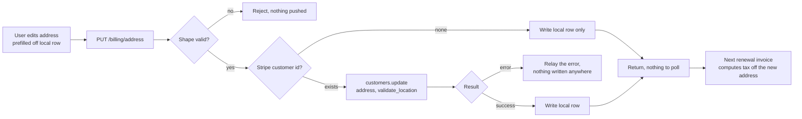

# Billing Address Update - Stripe

Status: draft
Updated: 2026-08-17

## Purpose & Scope

Saving a billing address. If the user has a Stripe customer the address goes to Stripe first, and it only reaches the local record if Stripe accepts it. If it doesn't, the request errors and nothing changes. Without a customer it's just a local update.

Note that Stripe may accept an address that is not necessarily taxable as it treats these operations as separate when saving an address. If it accepts a non taxable address, the billing will not fail, but instead a 0 for tax which you may still be liable for.

## Actors & Entities

Actors

- User - edits the address on the billing page.
- Client App - prefills the form off the local row, submits, renders the response.
- API - validates the shape, pushes to Stripe, writes the local row.
- Stripe - validates the address against a tax jurisdiction, stores it on the customer.

Entities

- Local address row - country, line1, line2, city, postal code, state.
- Stripe Customer - carries `address`. May not exist, the user may never have subscribed.

## Flow

1. User opens the billing address form, prefilled off the local record. No element, no intent, no client secret. This is a customer record write, not a payment.
2. Submit sends the address to the API.
   1. Validate the basic shape, doesn't need to be anything fancy as Stripe will ultimately verify the address for us when it's actually needed for billing.
   2. Load the user's Stripe customer id. If there isn't one the user has never subscribed, so the write is local only and there is nothing to push.
   3. If there is a Stripe customer update the `address` with `tax[validate_location]` set to `immediately` to ensure the address resolves to a valid tax jurisdiction.
   4. If the response is a success we can proceed to write the local row otherwise relay the error to the front end to display for the user.
3. Nothing is charged and no invoice is created. The current cycle is already finalized and its tax is locked at the rate that applied when it was issued.
4. The change applies from the next renewal invoice. Stripe recomputes tax off the customer address every time it creates one, so nothing on the subscription has to be re-pointed.
5. The payment method's `billing_details.address` is a separate field and is not touched by this. That one is AVS data the bank checks against the payment method. Stripe only falls back to it for tax when the customer carries no address, which cannot happen here. Editing the address here does not change it, and editing the payment method does not change the tax address.
6. The response is the answer. Nothing asynchronous, no webhook, no polling.

## Diagram

## Rules

- Authenticated user required.
- Validation is basic shape only. Stripe does the real check.
- No Stripe customer id means the user never subscribed. Write locally, push nothing.
- Push to Stripe first. The local row is written only on a successful update.
- Never write `billing_details.address` on the payment method. Tax reads the customer address while one is set, AVS reads the payment method address.
- Nothing is charged, no invoice is created, no proration.
- The current cycle is not recomputed. Its tax is locked at finalization.
- The response is the answer. Nothing asynchronous, no webhook, no polling.

## Edge & Error Cases

| Case | Cause | Expected behavior |
| ---- | ----- | ----------------- |
| No Stripe customer id | User never subscribed | Write the local row, push nothing. Not an error |
| Address resolves to no tax jurisdiction | Stripe cannot place it | The update errors, the error is relayed, nothing is written anywhere |
| Stripe errors on the customer update | Provider unavailable | Error back, local row untouched, user retries |
| Stripe write succeeds, local write fails | Partial failure | Stripe is correct and tax is right, the form shows the old address. Retry is idempotent, the same address pushes again |
| Address saved as a renewal is being created | Race between the write and Stripe creating the invoice | Whichever address is on the customer when Stripe creates the invoice is the one it computes off. No mid invoice recompute |

## Decisions

- To further enforce a taxable address, Stripe has tools that could test one before saving. A tax calculation takes the address and errors when it cannot be placed, and there may be dedicated address endpoints, though not fully released or behind a waitlist. However, `tax[validate_location]` should handle this for us, so we'll leave that out assuming it works as intended.

## TODO

Now

- Decide whether this address form is the same one the create flow collects before mounting the element.

Later

- Reconcile job for an address that saved at Stripe and failed to write locally.

Out of scope

- Tax IDs, VAT numbers, reverse charge.
- Reissuing an invoice for a cycle already finalized.
- Payment method billing details. See the update flow.
