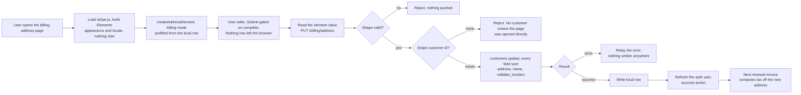

# Billing Address Update - Stripe (Address Element)

Status: draft
Updated: 2026-08-29

## Purpose & Scope

Saving a billing address from the account pages, collected in a Stripe Address Element rather than a form of our own. There is no intent, no client secret, no confirm and no webhook. The element is a widget and nothing it collects goes to Stripe from the browser. Its value comes back to the client, and the address only reaches Stripe through our own customer update on the server.

The page updates an address that already exists. The billing page only links to it when there is one, and the first address is collected by subscribe in its own session element, so there is no add path here. A user who never subscribes never sets one, which is right, since nothing is billing them.

The address goes to Stripe first and only reaches the local record if Stripe accepts it. If it doesn't, the request errors and nothing changes. A customer is always there to update, since an address on file means subscribe already made one, so arriving here without one is a broken state rather than a first address.

Setting `tax[validate_location]` to `immediately` returns an error and leaves the customer unchanged when the address cannot be placed, so an unplaceable address never reaches the local record. What it does not check is registration. An address that resolves cleanly in a jurisdiction you are not registered in comes back with `automatic_tax` at `not_collecting` and bills zero tax, which you may still be liable for.

The subscribe page collects the same address through the Checkout Session's own element and never writes it to the customer until confirm, so the two do not overlap. See the [subscription create flow](../../subscriptions/stripe/create.md). This page is the other half, a direct customer write with no session behind it. Same element, different construction, and the reason both exist is that a session only exists while something is being bought.

## Actors & Entities

Actors

- User - edits the address in the element on the billing address page.
- Client App - mounts the element prefilled off the local row, reads its value, submits, renders the response.
- API - pushes to Stripe, writes the local row.
- Stripe - validates the address against a tax jurisdiction, stores it on the customer.

Entities

- Local address row - name, country, line1, line2, city, postal code, state.
- Stripe Customer - carries `address` and `name`. Created by subscribe, so one is already there by the time this page is reachable.
- Address Element - a form widget and nothing more. It holds no intent, stores nothing at Stripe, and has no server side of its own.

## Flow

1. User opens the billing address page. There is no API call on load. Nothing has to be fetched because there is no secret to mount against.
   1. Load stripe.js if it isn't already on the page.
   2. Build an Elements instance with `stripe.elements({ appearance, locale })`. `mode` and `currency` are only required by the payment and express checkout elements, so an address only instance needs neither. It is a local call and nothing is sent to Stripe. Appearance and locale are the same objects the rest of the app's elements take.
   3. Create the address element in billing mode, prefilled through `defaultValues` off the local address row when there is one. `defaultValues` is read once at creation, so the element goes up after the user is loaded.
   4. The element always renders a name field and there is no turning it off. `display.name` only chooses between a full name, a split first and last, or an organization. Seed it from the account's first and last name while nothing has been saved, and let the stored billing name win from then on, since who pays is not necessarily whose account it is.
   5. Country is an ISO alpha-2 select and the field layout follows the country, so the shape of an address is Stripe's problem rather than a hand rolled form's. Labels, postal formats and whether a region field appears at all come with it.
   6. Neither `contacts` nor `customerSessionClientSecret` is passed, so the element stays a plain form and never renders the addresses Stripe has saved against the customer.
   7. stripe.js failing to load leaves the user with nowhere to enter anything. Show the failure rather than an empty page where the form should be.
2. User edits the address. The change event reports `complete` along with the value. Submit stays disabled until it is complete, and nothing has left the browser at any point.
3. User submits. The client reads the value off the element and sends it to the API.
   1. Validate the basic shape. It doesn't need to be anything fancy, the element has already enforced the country's own field rules and Stripe verifies the address properly on the next call. This is a backstop for a request that did not come from the element, not the validation the user sees, and nothing here should be built to render field errors.
   2. Load the user's Stripe customer id. There is always one, since nothing links here without an address on file and an address on file means subscribe already created it. If there isn't, error out rather than creating one. Same backstop as the shape check above and for the same case, the page being opened directly.
   3. Update `address` and `name` with `tax[validate_location]` set to `immediately` to ensure the address resolves to a valid tax jurisdiction. `name` is `customer.name`, which sits alongside `address` on the customer rather than inside it.
   4. Send every field on every save, empty where the user cleared it. Stripe only touches what it is sent, so a field left out of the call keeps whatever was on the customer before. A country change is where that bites, since the element stops rendering a state for a country that has none and the old subdivision stays sitting under the new country. An empty string is what clears one.
   5. If the response is a success we can proceed to write the local row, otherwise relay the error to the front end to display for the user.
4. Refresh the auth user and take the success action. The local row is what prefills the element next time, so it has to be the one that was just written.
5. Nothing is charged and no invoice is created. The current cycle is already finalized and its tax is locked at the rate that applied when it was issued.
6. The change applies from the next renewal invoice. Stripe recomputes tax off the customer address every time it creates one, so nothing on the subscription has to be re-pointed.
7. The payment method's `billing_details.address` is a separate field and is not touched by this. That one is AVS data the bank checks against the payment method. Stripe only falls back to it for tax when the customer carries no address, which holds until the first successful save. Editing the address here does not change it, and editing the payment method does not change the tax address.
8. The response is the answer. Nothing asynchronous, no webhook, no polling.

## Diagram

## Rules

- Authenticated user required.
- The address is collected in a Stripe Address Element. There is no form of our own, no field rules of our own and no country list of our own.
- Update only. The billing page links here when an address is on file and offers nothing when there isn't, since subscribe collects the first one.
- No intent, no client secret, no confirm, no 3DS and no webhook. The element is a widget and the address reaches Stripe only through our own customer update.
- The element always renders a name field. `display.name` only changes its shape, so the billing name is stored rather than collected and thrown away.
- Neither `contacts` nor `customerSessionClientSecret` is passed. The element never renders Stripe's saved addresses.
- API side shape validation is a backstop for requests that did not come from the element. It is not what the user sees and should not grow field error handling.
- A Stripe customer is always there to update. No customer id is an error, not a local write and not a reason to create one.
- Every address field goes on every save, empty where it was cleared. A field left out of the call keeps its old value on the customer.
- Push to Stripe first. The local row is written only on a successful update.
- The local address row needs `state` and `name` columns. The element collects both.
- Never write `billing_details.address` on the payment method. Tax reads the customer address while one is set, AVS reads the payment method address.
- Nothing is charged, no invoice is created, no proration.
- The current cycle is not recomputed. Its tax is locked at finalization.
- The response is the answer. Nothing asynchronous, no webhook, no polling.

## Edge & Error Cases

| Case | Cause | Expected behavior |
| ---- | ----- | ----------------- |
| stripe.js fails to load | Network, blocker, provider down | Show the failure. There is no fallback form to fall back to |
| Submit pressed on an incomplete address | Should not happen, the button is gated on the element's complete flag | Nothing is sent. The element draws its own field errors |
| Shape validation fails | Request did not come from the element | Reject before anything is pushed. Nothing is written locally or at Stripe |
| No Stripe customer id | Page opened directly, the user never subscribed | Reject. Nothing is written locally and no customer is created. Not a path the billing page offers |
| User clears an optional field | line2 or city emptied, or a country change that drops the state | The field goes as an empty string and Stripe clears it. Leaving it out would keep the old value on the customer while the local row goes empty |
| Address resolves to no tax jurisdiction | Stripe cannot place it | The update errors, the error is relayed, nothing is written anywhere |
| Stripe errors on the customer update | Provider unavailable | Error back, local row untouched, user retries |
| Stripe write succeeds, local write fails | Partial failure | Stripe is correct and tax is right, the page shows the old address. Retry is idempotent, the same address pushes again |
| User loaded before the auth user resolves | Element created with no defaults | Prefill is missed and the element comes up empty. Mount after the user is available, which behind the auth guard it always is |
| Address saved as a renewal is being created | Race between the write and Stripe creating the invoice | Whichever address is on the customer when Stripe creates the invoice is the one it computes off. No mid invoice recompute |

## Decisions

The element rather than a form of our own. `tax[validate_location]` at `immediately` makes address correctness a hard requirement rather than a nicety, and getting there by hand means an ISO alpha-2 country list, per country subdivision lists, per country postal rules and labels, and translations for all of it. Stripe ships that and keeps it current. The cost is that validation stops being ours, so zod rules, field labels and their translations go with the form.

Plain Elements rather than the Checkout Session SDK. `createBillingAddressElement()` only exists on a session, and there is no session outside subscribe. The element instance is the same type either way, so the difference is confined to how it is constructed and where the value is sent afterwards.

No customer is created here. The page is update only, so one already exists, and a request without one is a broken state rather than a first address. Creating it would open a customer at Stripe for someone who has never paid and hand back a success, which reads as the address being saved somewhere it matters. Subscribe creates the customer and pushes the first address through its session when the time comes.

No webhook. There is no intent, no confirm and no challenge, so nothing can settle after the response. There is nothing to poll for and nothing to reconcile against on the happy path.

## Notes

### Note on 1 - no address autocomplete here

Stripe only lends its Google Maps key when a Payment Element is in the same Elements group, which subscribe has and this page does not. Bringing our own is `autocomplete: { mode: 'google_maps_api', apiKey: '...' }`, which means a Google Maps Platform key and Google's billing behind it. Out of scope.

## TODO

Later

- Reconcile job for an address that saved at Stripe and failed to write locally.

Out of scope

- Tax IDs, VAT numbers, reverse charge.
- Reissuing an invoice for a cycle already finalized.
- Payment method billing details.
