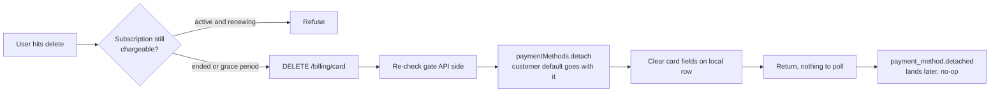

# Billing Delete - Stripe

Status: draft
Updated: 2026-08-17

## Purpose & Scope

Removing the card on file once the subscription can no longer be charged. No element, no confirm, no 3DS, nothing asynchronous, so the request is one API call and its response is the answer.

Gated on no further invoice being due. Allowed once the subscription has ended, or while it is cancelled and running out a grace period to the end of the paid term. Refused while a subscription is live and will renew, pulling the card there only books a failed renewal.

Detach is not a delete on Stripe's side. Past charges, invoices and refunds still reference the payment method by id, so Stripe only nulls `customer` on it and keeps the object retrievable. It can never be re-attached, and re-adding the same card is a new payment method with a new id. Removal is permanent. Subscribing again later goes through the create flow, which collects a card from scratch.

## Flow

1. Delete is gated on the subscription no longer being chargeable. Allowed once the subscription has ended, or while it is cancelled and running out a grace period to the end of the paid term. In both cases no further invoice is coming. Refused while a subscription is live and will renew, pulling the card there just books a failed renewal.
2. The gate is decided on the API side. The client hides or disables the control off the same subscription state, but that is display only, the API re-checks it.
3. Client hits the delete endpoint.
   1. Re-check the gate against the local subscription row. Refuse if anything is still going to be charged.
   2. Detach at Stripe. The card comes off the customer along with their default payment method (`invoice_settings.default_payment_method`). Stripe keeps the object itself on file for the charges and refunds that reference it, however it can never be attached to a customer again.
   3. Clear the card fields on the local row.
4. No element, no confirm, no 3DS, so there is nothing asynchronous to wait on. The response is the answer, no polling.
5. `payment_method.detached` lands afterwards. Idempotent, the local row is already clear by then.
6. Subscribing again later goes through the create flow, which collects a card from scratch.

## Diagram

