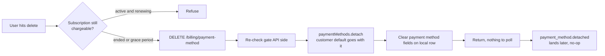

# Billing Payment Method Delete - Stripe

Status: draft
Updated: 2026-08-17

## Purpose & Scope

Removing the payment method on file once the subscription can no longer be charged. No element, no confirm, no 3DS, nothing asynchronous, so the request is one API call and its response is the answer.

Gated on no further invoice being due. Allowed once the subscription has ended, or while it is cancelled and running out a grace period to the end of the paid term. Refused while a subscription is live and will renew, pulling the payment method there only books a failed renewal.

Detach is not a delete on Stripe's side. Past charges, invoices and refunds still reference the payment method by id, so Stripe only nulls `customer` on it and keeps the object retrievable. It can never be re-attached, and re-adding the same payment method is a new payment method with a new id. Removal is permanent. Subscribing again later goes through the create flow, which collects a payment method from scratch.

## Actors & Entities

Actors

- User - hits delete on the billing page.
- Client App - hides or disables the control off the subscription state, calls the endpoint, renders the response.
- API - owns the gate, detaches at Stripe, clears the local row.
- Stripe - detaches the payment method, fires `payment_method.detached`.

Entities

- Local subscription row - the gate is decided off its status and period end.
- Stripe Customer - loses `invoice_settings.default_payment_method` along with the detach.
- PaymentMethod - detached, not deleted. Stays retrievable, `customer` nulled, never re-attachable.
- Local billing row - brand, last4, expiry, cleared on success.

## Flow

1. Delete is gated on the subscription no longer being chargeable. Allowed once the subscription has ended, or while it is cancelled and running out a grace period to the end of the paid term. In both cases no further invoice is coming. Refused while a subscription is live and will renew, pulling the payment method there just books a failed renewal.
2. The gate is decided on the API side. The client hides or disables the control off the same subscription state, but that is display only, the API re-checks it.
3. Client hits the delete endpoint.
   1. Re-check the gate against the local subscription row. Refuse if anything is still going to be charged.
   2. Detach at Stripe. The payment method comes off the customer along with their default payment method (`invoice_settings.default_payment_method`). Stripe keeps the object itself on file for the charges and refunds that reference it, however it can never be attached to a customer again.
   3. Clear the payment method fields on the local row.
4. No element, no confirm, no 3DS, so there is nothing asynchronous to wait on. The response is the answer, no polling.
5. `payment_method.detached` lands afterwards. Idempotent, the local row is already clear by then.
6. Subscribing again later goes through the create flow, which collects a payment method from scratch.

## Diagram

## States

Payment method on file.

| State | Meaning |
| ----- | ------- |
| on file | Attached to the customer, brand, last4 and expiry on the local row |
| detached | Off the customer at Stripe, payment method fields cleared locally. Terminal for this payment method |

Allowed transitions

| From | To | Trigger |
| ---- | -- | ------- |
| on file | on file | Delete refused, subscription still chargeable |
| on file | detached | Delete accepted, gate passed |
| detached | on file | Not for this payment method. A new payment method goes through create with a new id |

The gate, read off the subscription.

| Subscription | Delete |
| ------------ | ------ |
| Active and renewing | Refused |
| Cancelled, running out a grace period | Allowed |
| Ended | Allowed |

## Rules

- Authenticated user required.
- The gate lives on the API. The client hides the control off the same state, that is display only.
- Refuse while any further invoice is due.
- Detach clears the customer default with it. No separate unset call.
- Detach is permanent. Re-adding the same payment method produces a new payment method with a new id.
- The response is the answer. Nothing asynchronous, no polling.
- `payment_method.detached` handling is idempotent and is a no-op by the time it lands.

## Edge & Error Cases

| Case | Cause | Expected behavior |
| ---- | ----- | ----------------- |
| Delete while the subscription is active | Endpoint called directly, or the client failed to hide the control | Refuse API side. Pulling the payment method only books a failed renewal |
| Client shows the control when it should not | Client state stale against the subscription | API refuses. The hidden button was never the rule |
| No payment method on file | Already removed, or never had one | Return success, nothing to detach |
| Payment method already detached at Stripe | Removed in the Dashboard, or a retried request | Treat as done, clear the local row, return success |
| Detach succeeds, local clear fails | Partial failure | Payment method is gone at Stripe and still displays. Nothing renews, so no billing impact. User retries and the already detached path clears the row, or a manual sync (admin |
| Stripe errors on detach | Provider unavailable | Error back, local row untouched, user retries |
| Grace period ends mid request | Subscription ends between render and the API check | Still allowed. The gate only gets more permissive with time |
| Subscription resumed between render and request | User resumes in another tab, then deletes | API re-check refuses. The gate is evaluated at request time, not at render time |
| `payment_method.detached` for an out of band removal | Payment method pulled from the Dashboard | Same handler clears the local row |
| User subscribes again later | Payment method was removed | Create flow collects a payment method from scratch. The old id is not reusable |

## Decisions

Gate on chargeability, not on subscription status alone. Cancelled with a grace period and ended both mean no invoice is coming, and both allow removal. Keying on `active` would lock a cancelled user out of removing their payment method for the rest of the paid term.

The API owns the gate. The client hides the control off the same subscription state, but that is presentation, the API re-checks on every request.

Detach rather than delete. Stripe has no delete for a payment method, and past charges, invoices and refunds reference the id. Detach is the only removal available.

No webhook wait. Unlike create and update there is no intent, no confirm and no 3DS, so nothing can settle after the response. Polling here would wait on something that already happened.

## TODO

Now

- Decide whether a confirmation prompt guards the delete. It is permanent and re-adding means a fresh payment method through create.
- Pin the exact subscription states that pass the gate, in one place both the client and the API read.
- Decide the behavior for a user with a payment method on file and no subscription row at all.

Later

- Reconcile job for a detach that succeeded at Stripe and left the local row populated.
- Handler for `payment_method.detached` arriving from an out of band Dashboard removal.

Out of scope

- Replacing the payment method. See the update flow.
- Cancel and resume.
- Multiple payment methods on file.
