# Billing Payment Method Update - Stripe (Payment Element)

Status: draft
Updated: 2026-08-29

## Purpose & Scope

Replacing the payment method on file with the Payment Element. The user already entered a valid payment method during subscribe, so a customer and a payment method exist. This is a swap, not a first capture. A SetupIntent is created on page load and the element mounts straight off its secret. Nothing is charged, the current cycle is already paid, the new payment method is what the next renewal invoice bills.

The page is dedicated to this one job, so arriving on it is already the user declaring intent. The element is mounted and ready on arrival rather than sitting behind an additional button, which would ask for the same declaration twice.

It is also only reachable with a payment method already on file. The billing page guards the route and sends anyone without one back, so the page never comes up empty over a customer it has nothing to replace for. The API keeps its own check for a request that did not come through the page.

The cost is a SetupIntent opened for every visitor. Unlike create there is no subscription and no local row behind it, an unconfirmed SetupIntent goes stale on Stripe on its own, so there is nothing to clean up.

## Actors & Entities

Actors

- User - enters the new payment method in the Payment Element.
- Client App - requests the setup intent on load, mounts the element, confirms, syncs the confirmed intent.
- API - creates the SetupIntent, repoints the defaults, detaches the old payment method, writes the local row. It does that on the sync call the client makes and again on the webhook, whichever lands first.
- Stripe - issues the SetupIntent, runs 3DS, attaches the payment method, fires the webhook.

Entities

- User record - holds the Stripe customer id. Must already exist, the payment method being replaced was entered during subscribe.
- Stripe Customer - carries `invoice_settings.default_payment_method`, the customer level default.
- Subscription - carries its own `default_payment_method`, which overrides the customer level one.
- SetupIntent - created on page load with `usage: off_session`. No amount, no price, nothing about the subscription.
- PaymentMethod - old one detached, new one attached and defaulted. Two separate operations.
- Local billing row - brand and last4. Display only.

## Flow

1. User lands on the dedicated billing update page. It shows the payment method currently on file (brand, last4) off the local row. The route is guarded on there being one, so a user with nothing to replace is sent back to billing before the page loads.
2. On page load, without waiting for any user action, the client hits the API for a setup intent. Nothing to send, the customer is the authenticated user. The element cannot mount without a secret, so this fires before the form is usable rather than behind a save or a change payment method button.
   1. Load the user's Stripe customer id from your DB. It has to already exist, the payment method being replaced was entered during subscribe. No customer id means there is nothing to update, error back. The guard on the route means this is a backstop for a direct hit rather than something the user can walk into.
   2. Create a SetupIntent on Stripe with `customer` and `usage: 'off_session'`. The `off_session` part matters, the payment method gets charged by the renewal with nobody at the keyboard, and that is what sets the mandate up for it.
   3. No amount, no price, nothing about the subscription. A SetupIntent only stores a payment method.
   4. If it errors out, that error needs to get sent back to the client for display.
   5. Return the client secret. Unlike create there is no `type` to branch on, it is always a setup.
   6. A SetupIntent is opened for anyone who lands on the page. Unlike create there is no subscription and no local row behind it, an unconfirmed SetupIntent just goes stale on Stripe, so there is nothing to clean up.
3. Element mounts against that secret with `elements({ clientSecret })`, then `paymentElement.mount(target)`. Same as create, no mode, no amount, no currency, Stripe reads it off the intent.
4. User enters the new payment method and hits save.
5. Call `confirmSetup({ elements, clientSecret, confirmParams: { return_url }, redirect: 'if_required' })`. The `return_url` is mandatory.
6. Response is success / error / 3DS. Nothing is being charged but the bank can still want the payment method verified, so 3DS is on the table exactly like create. It either runs in a dialog and resolves inline, or sends the browser away to the bank and back to your return url.
7. If it redirected, the user comes back to a freshly loaded page with no state. Stripe appends `setup_intent_client_secret` to the return url. Read it and call `retrieveSetupIntent` to see how it landed rather than starting the flow over. Only one key to look for here, there is no payment variant.
8. On success the payment method is attached to the Stripe customer and that is all. It is not the default and nothing will charge it. Attaching and defaulting are two separate things, and this is where the flow is easy to get wrong.
9. The confirmed intent still has to be turned into the payment method on file, and there are two paths into that. The client posts the setup intent id to a sync endpoint as soon as the confirm resolves, and Stripe fires `setup_intent.succeeded` carrying the same SetupIntent with its `payment_method`. Both run the same writes and whichever arrives first does them:
   1. Set `invoice_settings.default_payment_method` on the Stripe customer to the new payment method. That is what a future invoice reads.
   2. Set `default_payment_method` on the subscription to the same payment method, or clear it. A subscription level default overrides the customer level one, so if the old payment method is still pinned on the subscription the renewal charges the old payment method no matter what the customer record says. Nothing fails now, it surfaces a month later on the renewal.
   3. Detach the old payment method, otherwise every update leaves another payment method sitting on the customer.
   4. Write the new brand and last4 to the local row for display.
   5. Has to be idempotent. Two paths write and the same setup intent can arrive twice on either.
10. The sync call is what the user waits on, so its response is the answer and there is nothing to poll for. Reload the auth user off the back of it and the payment method on file is the new one. The webhook is not a second thing to wait for, it covers the customer who closed the tab or never came back from the bank, and lands as a no-op when the sync already ran.
11. Take the success action, redirect back to billing, wherever. A sync that errors leaves the user on the page with the message and the confirmed intent still in hand, so submitting again retries the sync rather than asking for the card a second time.
12. Nothing is charged by any of this. The current cycle is already paid, the new payment method gets used by the next renewal invoice.

## Diagram

```mermaid
flowchart LR
    A[Billing update page] --> B["Show payment method on file<br/>brand, last4"]
    A -->|on load| C["POST /payment-method/intent"]
    C --> D[Load Stripe customer id]
    D --> E["setupIntents.create<br/>usage: off_session"]
    E --> F[Return client_secret]

    F --> G["elements({ clientSecret })<br/>mount element"]
    G --> H[User hits save]
    H --> I[confirmSetup]
    I --> J{Result}

    J -->|declined| H
    J -->|3DS redirect| J1["Back at return_url<br/>retrieveSetupIntent"]
    J -->|success| K
    J1 --> K

    K["Payment method attached to customer<br/>not default yet"] --> L1["POST /payment-method/sync"]
    K --> L2["Stripe fires<br/>setup_intent.succeeded"]

    L1 --> M["Customer invoice_settings<br/>default_payment_method = new pm"]
    L2 --> M
    M --> N["Subscription default_payment_method<br/>= new pm or cleared"]
    N --> O[Detach old pm]
    O --> P["Local row -> new brand, last4"]
    P --> Q[Refresh the auth user]
    Q --> R[Success action]
    R --> S["Next renewal invoice<br/>charges the new payment method"]
```

## States

SetupIntent, plus two states of this flow's own. `requires_payment_method`, `requires_action` and `succeeded` are Stripe's. `repointed` and `stale` are ours, Stripe has no such status. The local row has no status here, only payment method fields.

| State | Meaning |
| ----- | ------- |
| requires_payment_method | Created on page load, element mounted against it, no payment method entered |
| requires_action | 3DS, either a dialog or a bank redirect |
| succeeded | Payment method attached to the customer. Not default, nothing repointed, nothing will charge it |
| repointed | Sync call or webhook processed. Customer and subscription defaults moved, old payment method detached, local row written |

Allowed transitions

| From | To | Trigger |
| ---- | -- | ------- |
| none | requires_payment_method | Page load, SetupIntent created |
| requires_payment_method | requires_action | confirmSetup, bank wants the payment method verified |
| requires_payment_method | succeeded | confirmSetup, no challenge |
| requires_action | succeeded | Challenge passed inline or at the return url |
| requires_payment_method | requires_payment_method | Declined. Same secret stays confirmable, user retries |
| succeeded | repointed | Sync call or `setup_intent.succeeded`, whichever lands first |
| requires_payment_method | stale | User abandons. Stripe ages it out, nothing local to clean |

## Rules

- Authenticated user required.
- A Stripe customer and a payment method must already exist. The route is guarded on the payment method, and no customer id on the API side is an error, not a create.
- Setting `usage: off_session` is mandatory. The renewal charges with nobody at the keyboard, that is what the mandate is for.
- Attaching is not defaulting. Success on the SetupIntent alone changes nothing about what gets billed.
- Both defaults have to be handled. The subscription level default overrides the customer level one, so repointing only the customer leaves the old payment method billing at the next renewal.
- Detach the old payment method, or every update leaves another payment method on the customer.
- A confirmed intent changes nothing on its own. The sync call repoints for the user who is still on the page, the webhook covers the one who is not.
- Both paths are idempotent, the same setup intent can arrive twice on either.
- The sync response is the answer. Nothing is polled.
- Nothing is charged. The current cycle is already paid.

## Edge & Error Cases

| Case | Cause | Expected behavior |
| ---- | ----- | ----------------- |
| No payment method on file | User never subscribed | Guarded route, sent back to billing before the page loads. Nothing to replace and this flow does not create one |
| No Stripe customer id | The id was never saved, or the request did not come through the page | Error back to the client. A backstop, the guard means it is not a path the user can walk into |
| Payment method declined | Bank refused | Element stays mounted against the same secret, user corrects and submits again. No new secret needed |
| 3DS sends the browser away | Bank requires a challenge page | User returns to a cold page. Read `setup_intent_client_secret` off the url and `retrieveSetupIntent` rather than restarting |
| Abandoned page | SetupIntent opened for every visitor | Unconfirmed intent goes stale on Stripe on its own. No local row behind it, nothing to clean up |
| Subscription default left pinned | Only the customer level default repointed | Renewal charges the old payment method. Nothing fails at update time, it surfaces a month later |
| Old payment method not detached | Detach step skipped | Payment methods pile up on the customer, one per update |
| New payment method is the one already on file | User re-enters the same details | Stripe issues a new payment method id. Repoint and detach the old one as normal. Last4 not changing costs nothing, the sync response is what the client goes on |
| Sync call fails after a successful confirm | API unreachable, or it errored mid write | User is held on the page with the message. The intent is already confirmed, so submitting again retries the sync without asking for the card again, and the webhook lands regardless |
| Webhook lands before the sync call | Asynchronous, ordering is not guaranteed | Writes are already done. The sync call finds nothing to change and returns the same answer |
| Webhook and sync both arrive | Normal case | Second one through is a no-op |
| Neither path runs | User closed the tab mid confirm and the webhook was dropped | Payment method is attached at Stripe but nothing is defaulted and the row still shows the old payment method. The renewal charges the old payment method. Needs a manual sync |
| Repoint succeeds, local row write fails | Partial failure mid write | Stripe is correct, display is stale until the other path runs or the user syncs again |

## Decisions

Dedicated page over an inline form or a dialog. 3DS can send the browser to the bank and back to a cold url with the secret on it. The dedicated page comes back up as itself, reads the secret and retrieves the intent. A dialog or an inline section has to work out it is mid flow and rebuild the state it was in before the redirect. Same result, more work.

The dedicated page fetches the intent on load. There is no need for additional setup or buttons here since hitting the page is the intent already. Gating it behind an additional button would only lower the count of stale SetupIntents, not remove them.

The repoint runs on a sync call and on the webhook rather than on the webhook alone. Doing it only on the webhook means the user watches a spinner for something that has already succeeded, and the obvious thing to poll on, last4, does not change when they re-enter the same card. The sync call gives the page a straight answer to wait on. The webhook stays because the browser can be closed or sent to the bank and never come back, and it is the only path that always arrives. Two writers is the cost, and idempotency is what pays it.

Detach the old payment method rather than keeping a list. One payment method on file is the model everywhere else in the flow, and the local row holds a single brand and last4.

## TODO

Now

- Decide whether the subscription level default gets set to the new payment method or cleared. Clearing leans on the customer default, setting it is explicit. Pick one and use it everywhere.
- Decide the behavior when a payment method exists with no subscription. The repoint has no subscription to touch.

Later

- Manual sync command to reconcile the payment method on file against Stripe when both the sync call and the webhook are missed.
- Multiple payment methods on file. The flow assumes exactly one throughout.

Out of scope

- First payment method capture. That is the create flow.
- Payment method removal. See the delete flow.
- Dunning and failed renewals.
