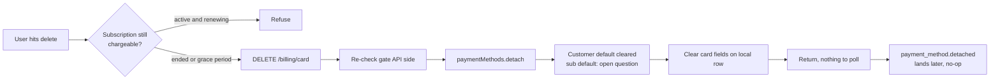

# Billing Update - Stripe (Payment Element)

Status: draft
Updated: 2026-08-17

## Purpose & Scope

Replacing the card on file with the Payment Element, and removing it once the subscription can no longer be charged. The user already entered a valid card during subscribe, so a customer and a payment method exist. This is a swap, not a first capture. A SetupIntent is created on page load and the element mounts straight off its secret. Nothing is charged, the current cycle is already paid, the new card is what the next renewal invoice bills.

The page is dedicated to this one job, so arriving on it is already the user declaring intent. The element is mounted and ready on arrival rather than sitting behind an additional button, which would ask for the same declaration twice.

The cost is a SetupIntent opened for every visitor. Unlike create there is no subscription and no local row behind it, an unconfirmed SetupIntent goes stale on Stripe on its own, so there is nothing to clean up.

Not covered: subscribe, cancel, resume, plan change, dunning, failed renewals.

## Flow

### Update

1. User lands on the dedicated billing update page. It shows the card currently on file (brand, last4, expiry) off the local row, the Payment Element to replace it, and a delete control that is only live when the subscription can no longer be charged (see Delete below). The element is mounted and ready on arrival, there is no intermediate step to reveal it.
2. On page load, without waiting for any user action, the client hits the API for a setup intent. Nothing to send, the customer is the authenticated user. The element cannot mount without a secret, so this fires before the form is usable rather than behind a save or a change card button.
   1. Load the user's Stripe customer id from your DB. It has to already exist, the card being replaced was entered during subscribe. No customer id means there is nothing to update, error back.
   2. Create a SetupIntent on Stripe with `customer` and `usage: 'off_session'`. The `off_session` part matters, the card gets charged by the renewal with nobody at the keyboard, and that is what sets the mandate up for it.
   3. No amount, no price, nothing about the subscription. A SetupIntent only stores a card.
   4. If it errors out, that error needs to get sent back to the client for display.
   5. Return the client secret. Unlike create there is no `type` to branch on, it is always a setup.
   6. A SetupIntent is opened for anyone who lands on the page. Unlike create there is no subscription and no local row behind it, an unconfirmed SetupIntent just goes stale on Stripe, so there is nothing to clean up.
3. Element mounts against that secret with `elements({ clientSecret })`, then `paymentElement.mount(target)`. Same as create, no mode, no amount, no currency, Stripe reads it off the intent.
4. User enters the new card and hits save.
5. `confirmSetup({ elements, clientSecret, confirmParams: { return_url }, redirect: 'if_required' })`. The `return_url` is mandatory.
6. Response is success / error / 3DS. Nothing is being charged but the bank can still want the card verified, so 3DS is on the table exactly like create. It either runs in a dialog and resolves inline, or sends the browser away to the bank and back to your return url.
7. If it redirected, the user comes back to a freshly loaded page with no state. Stripe appends `setup_intent_client_secret` to the return url. Read it and call `retrieveSetupIntent` to see how it landed rather than starting the flow over. Only one key to look for here, there is no payment variant.
8. On success the card is attached to the Stripe customer and that is all. It is not the default and nothing will charge it. Attaching and defaulting are two separate things, and this is where the flow is easy to get wrong.
9. Stripe fires `setup_intent.succeeded`, carrying the SetupIntent with its `payment_method`. The API does the real work off that webhook:
   1. Set `invoice_settings.default_payment_method` on the Stripe customer to the new payment method. That is what a future invoice reads.
   2. Set `default_payment_method` on the subscription to the same payment method, or clear it. A subscription level default overrides the customer level one, so if the old card is still pinned on the subscription the renewal charges the old card no matter what the customer record says. Nothing fails now, it surfaces a month later on the renewal.
   3. Detach the old payment method, otherwise every update leaves another card sitting on the customer.
   4. Write the new brand, last4 and expiry to the local row for display.
   5. Has to be idempotent, the same setup intent can arrive twice.
10. Reload the auth user (or the billing endpoint) and check the card on file. Poll this, a hit on the new last4 means the webhook arrived and the API picked it up. Give up after a ceiling rather than spinning forever.
11. Take the success action, redirect back to billing, wherever.
12. Nothing is charged by any of this. The current cycle is already paid, the new card gets used by the next renewal invoice.

### Delete

1. Delete is gated on the subscription no longer being chargeable. Allowed once the subscription has ended, or while it is cancelled and running out a grace period to the end of the paid term. In both cases no further invoice is coming. Refused while a subscription is live and will renew, pulling the card there just books a failed renewal.
2. The gate is decided on the API side. The client hides or disables the control off the same subscription state, but that is display only, the API re-checks it.
3. Client hits the delete endpoint.
   1. Re-check the gate against the local subscription row. Refuse if anything is still going to be charged.
   2. Detach the payment method from the Stripe customer.
   3. What detaching does to the defaults is the open bit. It should null `invoice_settings.default_payment_method` on the customer, but whether it also clears `default_payment_method` on a subscription that is still live through a grace period is not confirmed. If it does not, the subscription is left pointing at a detached card. Needs checking against Stripe before this gets built.
   4. Clear the card fields on the local row.
   5. Return.
4. No element, no confirm, no 3DS, so there is nothing asynchronous to wait on. The response is the answer, no polling.
5. `payment_method.detached` lands afterwards. Idempotent, the local row is already clear by then.
6. Subscribing again later goes through the create flow, which collects a card from scratch.

## Diagram

Update.

```mermaid
flowchart LR
    A[Billing update page] --> B["Show card on file<br/>brand, last4, exp"]
    A -->|on load| C["POST /billing/intent"]
    C --> D[Load Stripe customer id]
    D --> E["setupIntents.create<br/>usage: off_session"]
    E --> F[Return client_secret]

    F --> G["elements({ clientSecret })<br/>mount element"]
    G --> H[User hits save]
    H --> I[confirmSetup]
    I --> J{Result}

    J -->|declined| H
    J -->|3DS redirect| J1["Back at return_url<br/>retrieveSetupIntent"]
    J -->|success| K
    J1 --> K

    K["Card attached to customer<br/>not default yet"] --> L["Stripe fires<br/>setup_intent.succeeded"]
    L --> M["Customer invoice_settings<br/>default_payment_method = new pm"]
    M --> N["Subscription default_payment_method<br/>= new pm or cleared"]
    N --> O[Detach old pm]
    O --> P["Local row -> new brand, last4, exp"]
    P --> Q[Client polls until last4 changes]
    Q --> R[Success action]
    R --> S["Next renewal invoice<br/>charges the new card"]
```

Delete.

## Decisions

Dedicated page over an inline form or a dialog. 3DS can send the browser to the bank and back to a cold url with the secret on it. The dedicated page comes back up as itself, reads the secret and retrieves the intent. A dialog or an inline section has to work out it is mid flow and rebuild the state it was in before the redirect. Same result, more work.

The dedicated page fetches the intent on load. There is no need for additional setup or buttons here since hitting the page is the intent already. Gating it behind an additional button would only lower the count of stale SetupIntents, not remove them.
