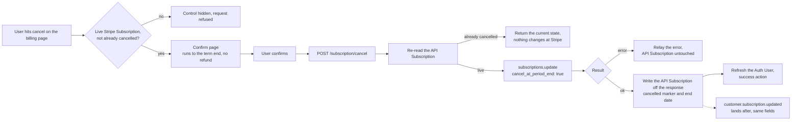

# Subscription Cancel - Stripe

Status: draft
Updated: 2026-09-04

## Description

A User cancels their Stripe Subscription from a dedicated confirm page, and access runs to the end of the paid term rather than stopping on confirm. Nothing is charged and nothing is refunded.

## Terms

| Term | Description |
| --- | --- |
| API | The back end. Holds the API records and talks to the providers. |
| API Subscription | The API record mirroring the Stripe Subscription. Stripe id, plan, interval, status. |
| API User | The User's record on the API side. |
| App | The front end the User is looking at, web or mobile. |
| Auth User | The signed in User's data held by the App. |
| Stripe Subscription | The subscription at Stripe. |
| User | The human using the App. Never the App and never the API. |

## Requirements

- Authenticated Users only.
- Cancel a Stripe Subscription that is live and not already cancelled.
- The control leads to a dedicated confirm page rather than an inline button or a dialog.
- The page states what cancelling does before the User commits. Access runs to the end of the paid term, no further charge, no refund.
- A trialing Stripe Subscription cancels the same way, but nothing was ever charged so there is nothing to refund, and access runs to the end of the trial instead.
- Confirm is the only action on the page.
- The App hides the control on the same rule, and the API decides it again on every request.
- A cancelled API Subscription counts as subscribed until the stored end date passes.
- Nothing is charged and nothing is refunded.
- The API writes the API Subscription off Stripe's response, and the matching Stripe webhook rewrites the same fields as a backstop.
- The response is the answer. Nothing settles afterwards, so there is nothing to poll.

## Flow

1. User opens the billing page. The cancel control shows only on a live Stripe Subscription that is not already cancelled.
   1. Hiding the control is display. The API reads the same rule again on the request, so the hidden control was never the rule.
2. The control leads to a dedicated confirm page. The page states that access runs to the end of the paid term, that nothing further is charged and that nothing is refunded. Confirm is the only action on it.
   1. A User still on a trial reads a different sentence. Access runs to the end of the trial and nothing is charged, with no mention of a refund since nothing was ever taken. The date comes off the trial rather than the API Subscription. See the note below.
3. User confirms. The App calls the API. No body, the Stripe Subscription is resolved from the API User.
   1. Re-read the API Subscription and refuse when there is no live Stripe Subscription.
   2. A Stripe Subscription that is already cancelled is not a refusal. The request is already satisfied, so return the current state and change nothing at Stripe. A double submit, a second tab and a direct call all land here.
   3. Update the Stripe Subscription with `cancel_at_period_end` set to true. Stripe returns the updated Stripe Subscription in the same call, status still `active`, `cancel_at_period_end` true, `cancel_at` holding the term end.
   4. Write the API Subscription off the returned object. The cancelled marker comes from `cancel_at_period_end` and the end date from `cancel_at`, both on that same response. See the note below.
      1. A trialing Stripe Subscription takes the same call and needs no special casing. Stripe puts `cancel_at` on the trial end, so the same two fields are read the same way.
   5. Stripe erroring on the update errors back for display. The API Subscription is left as it is and the User retries.
4. The response is the answer. Nothing is pending, so the App does not poll.
   1. App refreshes the Auth User so everything reading subscription state picks up the cancelled API Subscription. One refresh, not a poll. The App takes its state off that refreshed Auth User rather than off the response body, since subscription state is spread across flags the Auth User carries and the response holds only the one record.
   2. Take the success action, back to billing or a confirmation page.
5. Stripe fires `customer.subscription.updated` afterwards carrying the same fields the API already wrote, so the handler rewrites what is already there. The same handler writes the API Subscription for a cancel done in the Stripe Dashboard.
   1. The event and the response write carry the same fields either way, so whichever lands second rewrites the same values.
6. A cancelled API Subscription counts as subscribed until the stored end date passes. The Stripe Subscription stays `active` at Stripe for the same window.

## Diagram

## Notes

### Cancel at the end of the term over cancelling on the spot

Cancelling on the spot cuts access that is already paid for, which means either the User forfeits the remainder or a proration and a refund have to be settled. Neither belongs in a self-serve cancel.

### Note on 2.1 - the date the confirm page names

The page renders before anything has been cancelled, so any date on it has to already be sitting on the Auth User. A trial carries its end date, so the trial wording has one to show. A paid term does not. The API Subscription's end date is only set once the subscription is cancelled and running out its term, and nothing else on the Auth User carries the renewal date. So either the paid page names no date and puts the term end in words, or the Auth User starts carrying the current term end. Unresolved, and it is the confirm page copy that decides it.

### Note on 3.4 - where the end date comes from

Both fields come off the same update response. The end date is `cancel_at`, not `current_period_end`, which is not on the Stripe Subscription at all and sits on the subscription items instead.
