# Subscription Create - Stripe (Embedded Checkout)

Status: ref
Updated: 2026-09-01

## Description

A User with no Stripe Subscription signs up for a plan through a Stripe Checkout Session rendered in an iframe on the App's own page. Stripe collects the address, the promotion code and the payment method, calculates tax and runs the trial, all inside its own UI, so the App has no elements to mount and no totals to render.

## Terms

| Term | Description |
| --- | --- |
| API | The back end. Holds the API records and talks to the providers. |
| API Subscription | The API record mirroring the Stripe Subscription. Stripe id, plan, interval, status. |
| API User | The User's record on the API side. |
| App | The front end the User is looking at, web or mobile. |
| Auth User | The signed in User's data held by the App. |
| Stripe Checkout Session | The Stripe object a checkout runs on. Carries the line items, the address, the promotion code, the total and the Stripe Payment Method. |
| Stripe Customer | The Stripe object holding the User's id, address and saved Stripe Payment Methods. |
| Stripe Payment Element | The Stripe Element collecting the Stripe Payment Method. |
| Stripe Payment Method | The payment method at Stripe, saved against the Stripe Customer. |
| Stripe Subscription | The subscription at Stripe. |
| User | The human using the App. Never the App and never the API. |

## Requirements

- Create an initial Stripe Subscription, either for a new User or for a User whose previous Stripe Subscription has ended.
- Authenticated Users only.
- Render the checkout in an iframe on the App's own page, so the User never visibly leaves the domain.
- Stripe collects the billing address, the promotion code and the payment method inside the iframe. The App collects nothing.
- Show the total, tax and discount as Stripe calculates them, live inside the iframe.
- Start a trial when the User is eligible, with a Stripe Payment Method collected up front. Eligibility is decided by the API.
- Treat a trialing Stripe Subscription as subscribed, so a trial signup is not left waiting for a state that never arrives.
- Write the API Subscription from the Stripe webhook. Neither the return redirect nor the completion callback is proof of payment.
- Nothing is created until the checkout completes. Abandoning the page leaves no Stripe Subscription, no trial and no API records.
- Styling is limited to the logo, colors, fonts and border radius set in the Stripe Dashboard.

## Flow

1. On page load, the App hits the API for a Stripe Checkout Session, sending `{ plan, interval }`.
   1. Load the API User's Stripe Customer id.
   2. Create the Stripe Customer with the User's email and name if there isn't one, and save the returned id. Stripe requires neither field, but without them the Dashboard and receipts are useless. No billing address is needed here, Stripe collects one inside the Stripe Checkout Session. See the note below.
   3. Work out trial eligibility here. The API decides eligibility, since it already knows whether this User has burned a trial before.
   4. Create the Stripe Checkout Session with `ui_mode: 'embedded'`, `mode: 'subscription'`, the Stripe Customer, `line_items` carrying the plan's price id, `subscription_data.trial_end` when eligible, `allow_promotion_codes: true`, `automatic_tax: { enabled: true }`, `billing_address_collection: 'required'`, `customer_update: { address: 'auto', name: 'auto' }` and a `return_url`. Use `trial_end` rather than `trial_period_days`, since a User carrying a partial trial keeps whatever is left of it and a whole number of days cannot say that.
   5. Setting `customer_update` is easy to miss. Without it Stripe collects the address and name for the tax calculation but never writes them back to the Stripe Customer, so nothing is on file for the next renewal.
   6. Nothing else is created. No Stripe Subscription, no invoice, no intent, no API records. The Stripe Checkout Session is a container.
   7. Return the Stripe Checkout Session's `client_secret`.
2. The App mounts it with `initEmbeddedCheckout({ clientSecret })`, then `checkout.mount(target)`.
3. Everything from here happens inside the iframe. The User fills in the address, applies a promotion code, picks a Stripe Payment Method, pays, and clears a bank challenge if the bank asks. Stripe recalculates tax and totals live as they type, with no calls to the API at any point.
4. On completion Stripe creates the Stripe Subscription and the invoice on its own side. Without a trial it charges the Stripe Payment Method. On a trial the first invoice is `$0`, nothing is charged, and the Stripe Subscription lands at `trialing`.
5. Stripe then either redirects to the `return_url` with `?session_id={CHECKOUT_SESSION_ID}` appended, or fires an `onComplete` callback and stays on the page when `redirect_on_completion` is set to `never`. See the note below.
6. The API still knows nothing at this point. Nothing in the chain above tells it the payment landed, only the webhook does.
7. Stripe fires `checkout.session.completed`. The API reads the Stripe Subscription id off the session's `subscription` field, then retrieves that Stripe Subscription for its status, since a webhook payload carries the id and cannot be expanded. The API Subscription is written off that status. This is the first thing to land on the API side. The webhook is asynchronous and has no fixed timing, so it can arrive before the browser finishes redirecting, or seconds after. See the note below.
8. The App reloads the Auth User and checks for the subscription. Poll it, since a hit means the webhook arrived and the API picked it up. Give up after a ceiling and show a pending state rather than spinning forever.
9. Take the success action. Redirect to billing, a success page, wherever.

## Diagram

```mermaid
flowchart LR
    A[Page load] --> B["App asks the API for a<br/>Stripe Checkout Session"]
    B --> C[Load or create the<br/>Stripe Customer]
    C --> D["checkout.sessions.create<br/>ui_mode: embedded<br/>mode: subscription<br/>allow_promotion_codes<br/>automatic_tax<br/>billing_address_collection<br/>customer_update, trial_end?"]
    D --> E[Return client_secret]

    E --> F["initEmbeddedCheckout({ clientSecret })<br/>checkout.mount()"]
    F --> G["Inside the iframe. Address,<br/>promotion code, tax,<br/>Stripe Payment Method, bank challenge"]
    G --> H[Stripe creates the Stripe Subscription<br/>and the invoice, charges unless trialing]

    H --> I{redirect_on_completion}
    I -->|default| I1["Redirect to return_url<br/>?session_id="]
    I -->|never| I2[onComplete callback,<br/>stays on the page]
    I1 --> J
    I2 --> J

    J["Webhook<br/>checkout.session.completed"] --> K[Write the API Subscription,<br/>status off the Stripe Subscription]
    K --> L[App polls the Auth User]
    L --> M[Success action]
```

## Notes

### Embedded checkout over hosted checkout

The iframe stays on the App's own page, so the User never visibly leaves the domain. That is the only difference. Styling is identical between the two and hosted is less to build, so embedded is worth it only when the domain change matters.

### Embedded checkout over the Stripe Payment Element

Stripe collects the address, the promotion code and the Stripe Payment Method inside the iframe, so there is no Stripe Element to mount, no address to push onto the Stripe Checkout Session, no mount lifecycle to carry across a bank challenge and no total to read back and render. Both approaches create the same kind of Stripe Checkout Session, so the fork is UI control against build cost.

What the choice costs is the UI. Styling comes from the logo, colors, fonts and border radius set in the Stripe Dashboard and nothing further, since the appearance object the Stripe Payment Element takes does not apply here. When the checkout has to look like the rest of the App, [Create](Create.md) is the option.

### Nothing exists until the checkout completes

A User who lands on the page and leaves costs nothing but a Stripe Checkout Session record, and those expire on their own after 24 hours. There is no incomplete state to model on the API side, because the API Subscription is written for the first time by the webhook.

### Note on 1.2 - letting Stripe create the Stripe Customer

Passing `customer_email` instead of `customer` on the Stripe Checkout Session skips the create entirely. Stripe makes the Stripe Customer during checkout, and the API reads the id off the completed session and saves it. One less call, and a Stripe Customer only exists for Users who go through with it.

### Note on 5 - returning to a cold page

The default sends the browser to the `return_url`, which comes up with no state. Read `session_id` off the query and treat the page as a landing page. Setting `redirect_on_completion` to `never` keeps the User on the page with its state intact.

### Note on 7 - when the webhook never arrives

The User sits in a pending state indefinitely, since nothing else writes the API Subscription. Reconciling means a manual sync against Stripe. Rare enough to live with, common enough to need the command.

## Todo

- Manual sync command to reconcile the API Subscription against Stripe when the webhook is missed.
