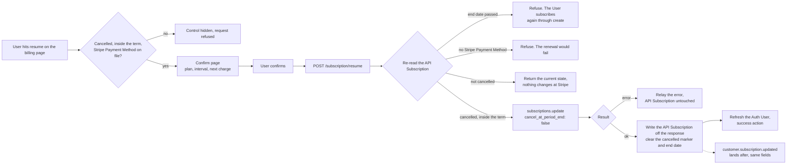

# Subscription Resume - Stripe

Status: done
Updated: 2026-09-06

## Description

A User resumes a cancelled Stripe Subscription from a dedicated confirm page, while the paid term is still running and a Stripe Payment Method resolves for the renewal. The existing Stripe Subscription carries on, so the plan and interval are not picked again and nothing is charged on confirm.

## Terms

| Term | Description |
| --- | --- |
| API | The back end. Holds the API records and talks to the providers. |
| API Payment Method | The API record holding the Stripe Payment Method's brand and last4. |
| API Subscription | The API record mirroring the Stripe Subscription. Stripe id, plan, interval, status. |
| API User | The User's record on the API side. |
| App | The front end the User is looking at, web or mobile. |
| Auth User | The signed in User's data held by the App. |
| Stripe Customer | The Stripe object holding the User's id, address and saved Stripe Payment Methods. |
| Stripe Payment Method | The payment method at Stripe, saved against the Stripe Customer. |
| Stripe Subscription | The subscription at Stripe. |
| User | The human using the App. Never the App and never the API. |

## Requirements

- Authenticated Users only.
- Resume a cancelled Stripe Subscription that is still inside the paid term.
- Refused once the end date has passed.
- Refused when no Stripe Payment Method resolves for the renewal.
- The control leads to a dedicated confirm page rather than an inline button or a dialog.
- The page states the plan, the interval and the date billing picks back up. Confirm is the only action on it.
- The App hides the control on the same rule, and the API decides it again on every request.
- Resume keeps the existing Stripe Subscription. The plan and interval are not picked again.
- Nothing is charged on confirm.
- The API writes the API Subscription off Stripe's response, and the matching Stripe webhook rewrites the same fields as a backstop.
- The response is the answer. Nothing settles afterwards, so there is nothing to poll.

## Flow

1. User opens the billing page. The resume control shows only on a cancelled Stripe Subscription that is still inside the paid term with a Stripe Payment Method on file.
   1. Once the end date passes there is nothing left at Stripe to resume, and the User goes through the [subscription create flow](Create.md).
   2. Hiding the control is display. The API reads the same rule again on the request, so the hidden control was never the rule.
2. The control leads to a dedicated confirm page. The page states the plan, the interval and the date billing picks back up. Confirm is the only action on it.
3. User confirms. The App calls the API. No body, the Stripe Subscription is resolved from the API User.
   1. Re-read the API Subscription and refuse once the end date has passed. The gate only gets stricter with time, so a term that ran out while the page sat open is refused here and the User subscribes again through create.
   2. Refuse when no Stripe Payment Method resolves. Read `default_payment_method` on the Stripe Subscription, falling back to `invoice_settings.default_payment_method` on the Stripe Customer, which is the order the renewal itself reads. Not the API Payment Method, which is display and lags the webhook. See the note below.
   3. A Stripe Subscription that is not cancelled is not a refusal. The request is already satisfied, so return the current state and change nothing at Stripe. A double submit, a second tab and a direct call all land here.
   4. Update the Stripe Subscription with `cancel_at_period_end` set to false. Stripe returns the updated Stripe Subscription in the same call, status still `active`, `cancel_at_period_end` false, `cancel_at` null.
   5. Write the API Subscription off the returned object, clearing the cancelled marker and the end date. See the note below.
   6. Stripe erroring on the update errors back for display. The API Subscription is left as it is and the User retries.
4. The response is the answer. Nothing is pending, so the App does not poll.
   1. App refreshes the Auth User so everything reading subscription state picks up the resumed API Subscription.
   2. Take the success action, back to billing or a confirmation page.
5. Stripe fires `customer.subscription.updated` afterwards carrying the same fields the API already wrote, so the handler rewrites what is already there. The same handler writes the API Subscription for a resume done in the Stripe Dashboard.
   1. The event and the response write carry the same fields either way, so whichever lands second rewrites the same values.
6. Nothing is charged on confirm. The Stripe Subscription bills again at the renewal it was always going to bill at.

## Diagram

## Notes

### Refusing a resume with no Stripe Payment Method on file

Stripe does not reject one. Clearing `cancel_at_period_end` generates no invoice and attempts no payment, so there is nothing for Stripe to validate against, the Stripe Subscription is `active` throughout, and a Stripe Customer with no Stripe Payment Method is a legal state. The failure lands at the renewal instead, where the invoice cannot be paid and the Stripe Subscription drops into dunning. Letting the resume through trades one refusal now for a guaranteed failed payment weeks later.

### Cancelled with no Stripe Payment Method on file

Rare in practice. The Stripe Payment Method is stored during subscribe and a cancellation does not touch it, so the only way to arrive here is a User who deleted the card themselves after cancelling. It is a real state though, and it is a dead one. The resume control is hidden and the API refuses, so there is nothing to resume until a card is back on the Stripe Customer.

Restoring one is the payment method flow's job. Resume has no opinion on how the User gets a card back, only that it will not run until one resolves.

### Plan controls while cancelled

Anywhere plans are listed, a cancelled Stripe Subscription still inside the term has exactly one thing on offer, resuming the plan and interval it already carries. Every other control on that surface leads somewhere that refuses, so none of them belong there. Absent rather than disabled, since a disabled control still needs a label and there is no honest one to put on it.

The same applies to an interval toggle. Resume takes no plan and no interval, so a toggle that changes what the resume control appears to offer is describing something the flow cannot do.
