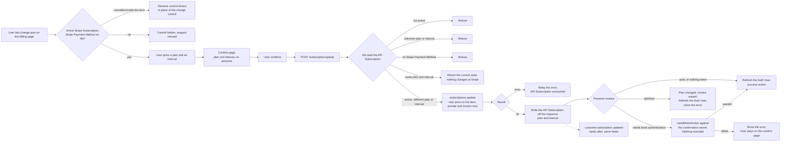

# Subscription Update - Stripe

Status: draft
Updated: 2026-09-07

## Description

A User on an active Stripe Subscription changes the plan, the interval, or both. The existing Stripe Subscription carries on with a different price against it, so nothing is cancelled and nothing is created, and the difference is charged on confirm.

## Terms

| Term | Description |
| --- | --- |
| API | The back end. Holds the API records and talks to the providers. |
| API Payment Method | The API record holding the Stripe Payment Method's brand and last4. |
| API Subscription | The API record mirroring the Stripe Subscription. Stripe id, plan, interval, status. |
| API User | The User's record on the API side. |
| App | The front end the User is looking at, web or mobile. |
| Auth User | The signed in User's data held by the App. |
| Stripe Customer | The Stripe object holding the User's id, address and saved Stripe Payment Methods. |
| Stripe Payment Method | The payment method at Stripe, saved against the Stripe Customer. |
| Stripe Subscription | The subscription at Stripe. |
| User | The human using the App. Never the App and never the API. |

## Requirements

- Authenticated Users only.
- Change the plan, the interval, or both, on an active Stripe Subscription.
- Keep the existing Stripe Subscription. Nothing is cancelled and nothing is created.
- Refused on anything other than an active Stripe Subscription. Trialing, past due and unpaid each refuse with their own error. See the [subscription guards flow](../Guards.md).
- A cancelled Stripe Subscription still inside the term shows the resume control and never the change control. See the [subscription resume flow](Resume.md).
- Refused when no Stripe Payment Method resolves.
- The control leads to a dedicated confirm page rather than an inline picker.
- The page states the plan and the interval being changed to. No amounts are shown.
- The difference is prorated and charged on confirm.
- A downgrade leaves a credit on the Stripe Customer rather than a refund.
- A charge the bank wants authenticated is challenged on the confirm page.
- A declined charge leaves the User on the changed plan with an unpaid invoice.
- The App hides the control on the same rule, and the API decides it again on every request.
- The API writes the API Subscription off Stripe's response, and the matching Stripe webhook rewrites the same fields as a backstop.

## Flow

1. User opens the billing page. The change control shows only on an active Stripe Subscription with a Stripe Payment Method on file.
   1. A cancelled Stripe Subscription still inside the term shows the resume control and never the change control. The User resumes first and changes plan after.
   2. Hiding the control is display. The API reads the same rule again on the request, so the hidden control was never the rule.
2. User picks a plan and an interval. Only the plan and interval combination currently on the Stripe Subscription is marked and cannot be picked, so the same plan on a different interval is a valid pick.
3. The pick leads to a dedicated confirm page stating the plan and the interval being changed to. Confirm is the only action on it and no amounts are shown.
4. User confirms. The App calls the API with the plan and the interval, `POST /subscription/update`. The Stripe Subscription is resolved from the API User.
   1. Re-read the API Subscription and refuse anything other than an active Stripe Subscription. No Stripe Subscription at all, trialing, past due, unpaid and cancelled inside the term each refuse.
   2. Refuse a plan or an interval the API does not know.
   3. Refuse when no Stripe Payment Method resolves. Read `default_payment_method` on the Stripe Subscription, falling back to `invoice_settings.default_payment_method` on the Stripe Customer, which is the order the charge itself reads. Not the API Payment Method, which is display and lags the webhook.
   4. A plan and interval already on the Stripe Subscription is not a refusal. The request is already satisfied, so return the current state and change nothing at Stripe.
   5. Update the Stripe Subscription's item with the new price, prorating and invoicing on the spot. Stripe returns the updated Stripe Subscription in the same call.
   6. Write the API Subscription off the returned object, plan and interval.
   7. Read the proration invoice off the same call. Paid, or nothing owed on a downgrade, ends the call. A charge the bank wants authenticated returns the invoice's confirmation secret. A declined charge returns the failure with the price change already applied. See the note below.
   8. Stripe erroring on the update itself errors back for display. The API Subscription is left as it is and the User retries.
5. The API returns one of three, and they are exclusive. A settled charge, a confirmation secret, or a failure.
   1. A settled charge, nothing owed or paid outright, refreshes the Auth User so everything reading subscription state picks up the changed API Subscription, then takes the success action.
   2. A confirmation secret means the bank wants the charge authenticated. The App loads stripe.js and hands the secret to `handleNextAction`, which runs the bank challenge. Nothing is mounted and no card is collected. Passing takes the same success action as 5.1, failing shows the error and leaves the User on the confirm page.
   3. A failure shows the error. The API Subscription already carries the new plan from 4.6, so the Auth User is refreshed on this path too.
6. Stripe fires `customer.subscription.updated` afterwards carrying the same fields the API already wrote, so the handler rewrites what is already there. The same handler writes the API Subscription for a change done in the Stripe Dashboard.

## Diagram

## Notes

### Charging the difference on confirm over riding it to the next renewal

Immediate proration over deferring the difference, because deferring hands the User the higher plan for the rest of the term at the old price. An upgrade taken the day after a renewal runs almost a full period before costing anything, and the pattern is repeatable. Charging on confirm keeps what the User pays and what the User has in step, at the cost of a payment that can fail in the middle of the change.

### Downgrades leave a credit

Stripe does not refund on its own. The unused portion of the old plan comes back as a negative line item that sits as credit on the Stripe Customer and eats into the next invoice. A refund is a separate deliberate action against the original charge, and nothing here takes one.

### Note on 4.7 - a declined charge does not roll the price change back

Stripe applies the price to the Stripe Subscription and raises the invoice as two separate things, so the price change stands whether or not the invoice is paid. Rolling the price back would buy nothing. The invoice exists either way, sits unpaid either way, and drops the Stripe Subscription into `past_due` on Stripe's retry schedule either way. The User is blocked by the same guard on both sides of a rollback, so the change stays and the User is sent to settle the invoice. See the [subscription guards flow](../Guards.md).

### Note on 5.2 - handing the challenge to stripe.js over mounting a Stripe Payment Element

A call to `handleNextAction` over a Stripe Payment Element, because the card is not in question. The Stripe Payment Method was resolved at 4.3 and charged at 4.5, and the bank is asking the User to prove they are the cardholder, not asking for a different card. Mounting a Stripe Payment Element would put a card form in front of a User who came to change a plan, and a card entered into it would be a second, unrelated change riding on the confirm.

## Todo

- Changing plan during a trial is refused outright. Revisit once a trial is tied to a specific plan rather than to the Stripe Subscription.
- A flat decline at 5.3 leaves the Stripe Subscription on the new plan with the proration invoice unpaid, and nothing in the App settles it. Rare, and tied to the payment recovery page in the [subscription guards flow](../Guards.md).
