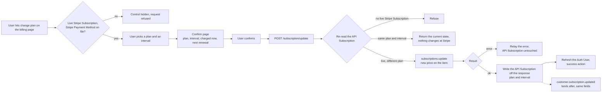

# Subscription Update - Stripe

Status: wip
Updated: 2026-09-04

## Description

A User on a live Stripe Subscription changes the plan or the interval they are on. The existing Stripe Subscription carries on with a different price against it, so nothing is cancelled and nothing is created.

## Terms

| Term | Description |
| --- | --- |
| API | The back end. Holds the API records and talks to the providers. |
| API Payment Method | The API record holding the Stripe Payment Method's brand and last4. |
| API Subscription | The API record mirroring the Stripe Subscription. Stripe id, plan, interval, status. |
| API User | The User's record on the API side. |
| App | The front end the User is looking at, web or mobile. |
| Auth User | The signed in User's data held by the App. |
| Stripe Customer | The Stripe object holding the User's id, address and saved Stripe Payment Methods. |
| Stripe Payment Method | The payment method at Stripe, saved against the Stripe Customer. |
| Stripe Subscription | The subscription at Stripe. |
| User | The human using the App. Never the App and never the API. |

## Requirements

- Authenticated Users only.
- Change the plan, the interval, or both, on a live Stripe Subscription.
- Keep the existing Stripe Subscription. Nothing is cancelled and nothing is created.
- The control leads to a dedicated confirm page rather than an inline picker.
- The page states the plan, the interval, what is charged now and what the next renewal costs, before the User commits.
- Refused when there is no live Stripe Subscription. Past due and unpaid refuse with their own error. See the [subscription guards flow](../Guards.md).
- A cancelled Stripe Subscription still inside the term goes through the [subscription resume flow](Resume.md) first.
- Refused when no Stripe Payment Method resolves.
- The App hides the control on the same rule, and the API decides it again on every request.
- The API writes the API Subscription off Stripe's response, and the matching Stripe webhook rewrites the same fields as a backstop.

## Flow

1. User opens the billing page. The change control shows only on a live Stripe Subscription.
   1. Hiding the control is display. The API reads the same rule again on the request, so the hidden control was never the rule.
2. User picks a plan and an interval. The plan currently on the Stripe Subscription is marked and cannot be picked.
3. The pick leads to a dedicated confirm page stating the plan, the interval, what is charged now and what the next renewal costs. Confirm is the only action on it.
4. User confirms. The App calls the API with the plan and the interval. The Stripe Subscription is resolved from the API User.
   1. Re-read the API Subscription and refuse when there is no live Stripe Subscription.
   2. Refuse a plan or an interval the API does not know.
   3. A plan and interval already on the Stripe Subscription is not a refusal. The request is already satisfied, so return the current state and change nothing at Stripe.
   4. Update the Stripe Subscription's item with the new price. Stripe returns the updated Stripe Subscription in the same call.
   5. Write the API Subscription off the returned object, plan and interval.
   6. Stripe erroring on the update errors back for display. The API Subscription is left as it is and the User retries.
5. App refreshes the Auth User so everything reading subscription state picks up the changed API Subscription, then takes the success action.
6. Stripe fires `customer.subscription.updated` afterwards carrying the same fields the API already wrote, so the handler rewrites what is already there. The same handler writes the API Subscription for a change done in the Stripe Dashboard.

## Diagram

## Todo

- Proration. Whether the change bills on the spot for the difference, rides to the next renewal, or splits by direction. Everything below hangs off this one.
- The immediate charge, if there is one. It is an invoice that can be refused or can need bank authentication (3DS), and neither has a path here.
- Downgrades. Whether money already paid comes back as a credit on the Stripe Customer, a refund, or nothing.
- Plan limits on a downgrade, where the User is already over the new plan's limit at the moment they confirm.
- A trialing Stripe Subscription changing plan, and whether the trial end moves.
- Interval change on its own, monthly to yearly, and whether it reads differently from a plan change to the User.
- Promotion codes and tax carried on the existing Stripe Subscription, and what a price change does to both.
- Whether the response is the answer or something settles afterwards that the App has to wait on.
