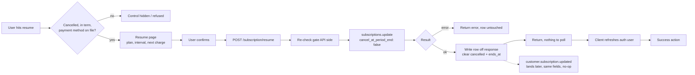

# Subscription Resume - Stripe

Status: draft
Updated: 2026-08-25

## Purpose & Scope

Resuming a cancelled subscription from a dedicated confirm page. Only available while the paid term is still running and a default payment method resolves.

## Actors & Entities

Actors

- User - confirms on the resume page.
- Client App - hides or disables the control off subscription state, calls the endpoint, refreshes the auth user.
- API - owns the gate, calls Stripe, writes the row off the response.
- Stripe - clears the flag, fires the webhook.

Entities

- Local subscription row - the gate is read off it, the cancelled marker and the end date are cleared from it.
- Stripe Subscription - status unchanged, `cancel_at_period_end` cleared, `cancel_at` dropped.

## Flow

1. Resume is gated on a cancelled subscription that is still inside the paid term, with a payment method on file. Once the end date passes there is nothing left at Stripe to resume and the user goes through the [create flow](Create.md).
2. The control leads to a dedicated page rather than an inline button or a modal. The page states what is being resumed. Plan, interval, and the date billing picks back up. Confirm is the only action on it.
3. User confirms. Client hits the resume endpoint. No body, the subscription is resolved from the authenticated user.
   1. Re-check the gate against the local subscription row. Refuse if the end date has already passed, or if no default payment method resolves. Already active is not a refusal, the request is already satisfied, so return the current state.
   2. Call `subscriptions.update(stripe_sub_id, { cancel_at_period_end: false })`. Stripe returns the updated subscription in the same call. Status still `active`, `cancel_at` gone.
   3. Write the local row off the returned object. `cancel_at_period_end` comes back false and `cancel_at` comes back null, so the cancelled marker and the end date are both cleared on the local row.
   4. If Stripe errors, that error goes back to the client for display and the local row is left untouched.
4. The response is the answer. Nothing is pending, so the client does not poll.
5. Client refreshes the auth user so everything reading subscription state picks up the resumed row.
6. Take the success action, back to billing, a confirmation page, wherever.
7. Stripe fires a subscription updated webhook afterwards (`customer.subscription.updated`) carrying the same fields the API already wrote. Idempotent, the handler rewrites what is already there.

## Diagram

## States

Local subscription row.

| State | Meaning |
| ----- | ------- |
| cancelled | Will not renew, ends at the stored date. Resume is available |
| active | Renewing again. Nothing to resume |

Allowed transitions

| From | To | Trigger |
| ---- | -- | ------- |
| cancelled | active | Resume confirmed, gate passed |
| cancelled | cancelled | Resume refused, end date already passed |
| active | active | Webhook lands, same fields rewritten |

## Rules

- Authenticated user required.
- The gate lives on the API. The client hides the control off the same state, that is display only.
- Refuse once the end date has passed. The gate only gets stricter with time, unlike the cancel gate.
- Refuse when no default payment method resolves. Read the subscription's `default_payment_method`, falling back to the customer's `invoice_settings.default_payment_method`, which is the order the renewal itself reads. Not the local billing row, it is display only and lags the webhook. Stripe accepts the resume either way, the block is ours.
- Already active is not a refusal.
- Resume keeps the existing subscription, the plan and interval are not re-picked and nothing is charged on confirm.
- State is written off the Stripe response. The webhook is never waited on.
- The response is the answer. No polling.
- Webhook handling is idempotent.

## Edge & Error Cases

| Case | Cause | Expected behavior |
| ---- | ----- | ----------------- |
| Payment method was removed during the grace period | The [delete flow](../../billing/stripe/PaymentMethodDelete.md) allows removal once cancelled, and the detach takes the customer default with it | Refuse. The user adds one through [payment method update](../../billing/stripe/PaymentMethodUpdate.md) and comes back, the subscription and the paid remainder are still there |
| End date passes between render and the request | Term ran out while the page sat open | API re-check refuses. The user subscribes again through create |
| Resume on a subscription that is not cancelled | Double submit, second tab, direct call | Return the existing active state. Nothing changes at Stripe |
| Resume on an ended subscription | Endpoint called directly, or client state stale | Refuse. Nothing at Stripe to update |
| Stripe errors on update | Provider unavailable | Error back, local row untouched, user retries |
| Stripe update succeeds, local write fails | Partial failure | Stripe renews, the app still shows cancelled. The webhook lands and corrects the row. If the webhook is also dropped, nothing corrects it and the row needs a reconcile |
| Webhook arrives before the response is written | Asynchronous, no fixed timing | Same fields either way, last write wins |
| Resumed in the Stripe Dashboard | Out of band | The same webhook handler writes the row |
| Webhook never arrives | Delivery dropped or failed the attempts | No-op as long as the response write landed, the row already holds the state. The partial failure above is the only case left uncovered |

## Decisions

Block resume when there is no payment method on file. Stripe does not reject it. Flipping `cancel_at_period_end` back generates no invoice and attempts no payment, so there is nothing for Stripe to validate against. The subscription is still `active` the whole time, and a customer with no payment method is a perfectly legal state. The failure lands at the renewal instead, where the invoice cannot be paid and the subscription drops into dunning. Letting it through trades one refusal now for a guaranteed failed payment weeks later.

## TODO

Now

- Pin the subscription states that pass the gate, in one place both the client and the API read.

Later

- Whether an ended subscription gets a "resume" affordance at all, or just drops the user into create.
- Reconcile job for a resume that succeeded at Stripe and left the local row cancelled.

Out of scope

- Cancel. See the [cancel flow](Cancel.md).
- Plan change.
