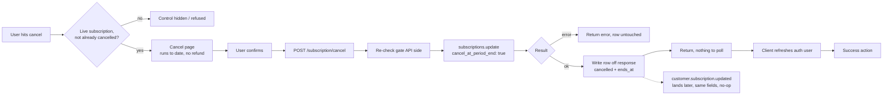

# Subscription Cancel - Stripe

Status: draft
Updated: 2026-08-17

## Purpose & Scope

Cancelling a subscription from a dedicated confirm page.

## Actors & Entities

Actors

- User - confirms on the cancel page.
- Client App - hides or disables the control off subscription state, calls the endpoint, refreshes the auth user.
- API - owns the gate, calls Stripe, writes the row off the response.
- Stripe - flags the subscription, fires the webhook.

Entities

- Local subscription row - the gate is read off it, the cancelled marker and the end date are written to it.
- Stripe Subscription - status unchanged, `cancel_at_period_end` set, `cancel_at` holding the term end.

## Flow

1. Cancel is gated on a live subscription that is not already cancelled. The client hides or disables the control off the same state, that is display only, the API re-checks it.
2. The control leads to a dedicated page rather than an inline button or a modal. The page states what cancelling does before the user commits. Access runs to the end of the paid term, no further charge, no refund. Confirm is the only action on it.
3. User confirms. Client hits the cancel endpoint. No body, the subscription is resolved from the authenticated user.
   1. Re-check the gate against the local subscription row. Refuse if there is no live subscription, or if it is already cancelled.
   2. `subscriptions.update(stripe_sub_id, { cancel_at_period_end: true })`. Stripe returns the updated subscription in the same call. Status still `active`, `cancel_at_period_end` true, `cancel_at` set to the current period end.
   3. Write the local row off the returned object. Cancelled marker and the period end date come from the response, and the row stays subscribed for access purposes until that date passes.
   4. If Stripe errors, that error goes back to the client for display and the local row is left untouched.
4. The response is the answer. Nothing is pending, so the client does not poll.
5. Client refreshes the auth user so everything reading subscription state picks up the cancelled row. One refresh, not a poll.
6. Take the success action, back to billing, a confirmation page, wherever.
7. Stripe fires a subscription updated webhook afterwards (`customer.subscription.updated`) carrying the same fields the API already wrote. Idempotent, the handler rewrites what is already there.

## Diagram

## States

Local subscription row.

| State | Meaning |
| ----- | ------- |
| active | Renewing. Cancel is available |
| cancelled | Cancel accepted. Still subscribed for access, will not renew, ends at the stored date |

Allowed transitions

| From | To | Trigger |
| ---- | -- | ------- |
| active | cancelled | Cancel confirmed, gate passed |
| active | active | Cancel refused, no live subscription |
| cancelled | cancelled | Webhook lands, same fields rewritten |

## Rules

- Authenticated user required.
- The gate lives on the API. The client hides the control off the same state, that is display only.
- Refuse when there is no live subscription, or when it is already cancelled.
- State is written off the Stripe response. The webhook is never waited on.
- The response is the answer. No polling.
- A cancelled row counts as subscribed until the stored end date passes.
- Webhook handling is idempotent.

## Edge & Error Cases

| Case | Cause | Expected behavior |
| ---- | ----- | ----------------- |
| Cancel while already cancelled | Double submit, second tab, direct call | Return the existing cancelled state. Nothing changes at Stripe |
| Cancel with no subscription | Endpoint called directly, or client state stale | Refuse |
| Client shows the control when it should not | Client state stale against the subscription | API refuses. The hidden button was never the rule |
| Stripe errors on update | Provider unavailable | Error back, local row untouched, user retries |
| Stripe update succeeds, local write fails | Partial failure | Stripe holds the cancel, the app still shows renewing. The webhook lands and corrects the row |
| Webhook arrives before the response is written | Asynchronous, no fixed timing | Same fields either way, last write wins |
| Cancelled in the Stripe Dashboard | Out of band | The same webhook handler writes the row |
| Webhook never arrives | Delivery dropped or failed the attempts | Row already holds the state, written off the response. Nothing to reconcile |

## Decisions

Cancel at the end of the term, not immediately. Cancelling on the spot cuts access already paid for, which means either the user forfeits the remainder or a proration and a refund have to be settled. Neither belongs in a self-serve cancel.

## TODO

Now

- Decide where the confirm page reads the end date from, since it states when access runs out.
- Pin the subscription states that pass the gate, in one place both the client and the API read.

Later

- Immediate cancel as an admin action.

Out of scope

- Resume.
- Plan change.
- The period end transition and the subscription deleted webhook.
