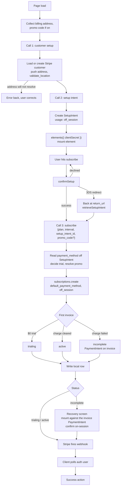

# Subscription Create - Stripe (Payment Element, billing first)

Status: draft
Updated: 2026-08-26

## Purpose & Scope

Creating a subscription in three steps. The billing address is settled first, the payment method is stored second, and the subscription is created last, once a payment method already exists on the customer.

The billing half of this flow is a setup intent and nothing else. The API hands back one client secret, the client makes one call to Stripe to store the payment method, and a bank challenge sends the user out and back to one return url in the app. A trial changes none of those three, because the trial is decided later, when the subscription is created.

Someone who lands on the page and leaves has a SetupIntent on Stripe and nothing else. No subscription is opened, no trial clock is started, no local row is written, and nothing needs cleaning up.

The first concern is that a stored payment method proves nothing about a charge clearing. A SetupIntent can confirm cleanly, 3DS included, and the first invoice can still be refused or challenged. Stripe charges the first invoice inside the subscription create call, off-session, with no connection to the mount. The mount ended when the SetupIntent confirmed, so the element has no part in the charge. A refused charge can take a different payment method, and a different payment method takes a new intent and a new mount, not the mount the user just went through.

A trial pushes the same concern out. Nothing is charged at signup, so a payment method that cannot be charged is indistinguishable from one that can until the first real invoice runs at trial end, with no user on the page. The failure arrives as a webhook, and the subscription has to carry state that forces the user back into entering a payment method through whatever mechanism gets built for it.

The second concern is the total. A tax-inclusive price, if one has to be shown at all, is an estimate or a plain "+ tax" line. The real figure takes a call to Stripe to calculate, since the first invoice does not exist until after the payment method is stored, and a promo code adds another step to the calculation.

## Actors & Entities

Actors

- User - enters the billing address, then the payment method in the Payment Element.
- Client App - makes the two setup calls, mounts the element, confirms, makes the subscribe call, polls after success.
- API - creates the customer, pushes the address, creates the SetupIntent, creates the subscription, writes the local row, receives the webhook.
- Stripe - stores the payment method, runs 3DS, computes the first invoice, charges it, fires the webhook.

Entities

- User record - holds the Stripe customer id and the billing address that gets pushed up.
- Stripe Customer - must carry a validated billing address before anything else is created, tax on or off.
- SetupIntent - standalone, created against the customer with `usage` set to `off_session`. Nothing mints it, it is created on its own. Secret at `client_secret`, starts with `seti_`.
- Payment Method - the stored payment method. Attached to the customer when the SetupIntent succeeds, and read back off the confirmed SetupIntent's `payment_method` field.
- Subscription - created only after the payment method is stored. Lands at `trialing` on a trial, `active` when the first charge clears, `incomplete` when it does not.
- Invoice - first invoice, created and charged by Stripe inside the subscription create call. `$0` on a trial.
- PaymentIntent - exists only when the off-session charge fails. Sits on the first invoice and stays confirmable.
- Local subscription row - written once the Stripe subscription exists, never before.

## Flow

1. User hits the subscribe wizard. It opens on the first stage that is not already done.
   1. No customer address, the wizard starts on the address stage with a note that the address is needed for tax purposes.
   2. Address already settled, it shows as a summary at the top with a change button back to the address stage.
   3. Payment method already on file, the card shows at the top with a change button back to the payment method stage.
   4. Both already done, the wizard opens on confirm/submit.
2. User submits the billing address. Client hits the API to settle the customer. Skipped when the customer already carries a validated address and the user did not press change.
   1. Load the user's Stripe customer id. Create the customer on Stripe if there isn't one, and save the returned id.
   2. Push the address to the customer with `tax[validate_location]` set to `immediately`, whether or not tax is enabled. See the [address update flow](../../billing/stripe/address-update.md).
   3. An address Stripe cannot place fails here. A customer is the only thing that exists at this point, so there is nothing to tear down. Error back, the user corrects the address and retries.
   4. Stripe unreachable on either call fails the same way. Nothing is written locally, so the user retries as-is rather than correcting anything.
   5. Write the local address row once Stripe accepts, never before.
   6. On success the wizard advances to the payment method stage, or back to confirm if the user came from the summary.
3. Client hits the API for a setup intent. Skipped when a payment method is already on file and the user did not press change. The element cannot mount without a secret, so this fires as the step opens rather than behind the confirm button.
   1. Load the user's Stripe customer id. No id means the address stage never ran, so fail back to the address stage.
   2. Retrieve the customer and read `customer.tax.automatic_tax`. `supported` and `not_collecting` both pass. `failed` and `unrecognized_location` fail back to the address stage. The value was stamped when the address was pushed, so the check costs a retrieve and re-sends no address.
   3. Create the SetupIntent against the customer with `usage` set to `off_session`. That `usage` value records the mandate while the user is present, and the mandate is what lets Stripe charge the first invoice later with the user gone.
   4. Stripe erroring on the create errors back for display. Without a secret there is no mount, so the step cannot continue.
   5. Return `client_secret` to the client.
   6. Nothing about price, currency, tax, promo or trial goes on this call. A SetupIntent has no amount field, so there is nothing to compute and nothing to keep in sync.
   7. Every pass through the flow creates a new SetupIntent. An unconfirmed one holds no subscription, no trial and no money, so nothing has to be deduplicated and no cleanup is required.
4. Element mounts against the `client_secret` returned in step 3. Skipped whenever step 3 was skipped.
   1. Load stripe.js if it isn't already on the page.
   2. Call `elements({ clientSecret })` to build the Elements object. Local only, no network call.
   3. Call `paymentElement.mount(target)` to create the iframe.
   4. stripe.js failing to load, or the mount failing, leaves the user with no way to enter a card. Show the failure rather than an empty box where the card fields should be.
   5. No mode, no amount, no currency and no trial handling go on the mount. Stripe reads all of it off the SetupIntent.
   6. User enters the payment details. The element validates format inline as they type. Nothing has gone to Stripe or to your API yet.
   7. The details never touch your server. They sit in the iframe and go straight to Stripe when confirm runs.
5. User presses confirm. What that runs depends on whether the element is on screen.
   1. Element mounted. Confirm calls `confirmSetup({ elements, clientSecret, confirmParams: { return_url }, redirect: 'if_required' })`. The `return_url` is mandatory.
   2. Response is success / error / 3DS. 3DS either runs in a dialog and resolves inline, or sends the browser away to the bank and back to your return url. Either way you end up at the same place, a stored payment method.
   3. An error leaves the element mounted against the same `client_secret`. The user corrects and presses confirm again, no new intent needed.
   4. If it redirected, the user comes back to a freshly loaded page with no state. Stripe appends `setup_intent_client_secret` to the return url, so the page reads it off the query and calls `retrieveSetupIntent` to see how it landed rather than starting the flow over. The wizard has to look for that key before running its landing checks, otherwise it drops the user back on the payment method step and mounts a fresh element over a payment method that is already stored.
   5. On success the client makes the billing sync call with the setup intent id. It reads `payment_method` off the intent, sets `invoice_settings.default_payment_method` on the customer, and writes brand and last4 locally. Without it the payment method is attached and nothing will charge it. See the billing capture flow.
   6. The sync call failing errors back for display and stops before subscribe. The payment method is stored but not defaulted, so a subscription created now would have nothing to charge. The SetupIntent is still confirmed, so pressing confirm again retries the sync call and leaves the element alone. A refresh falls back to the landing checks in step 1, which find no card recorded and open on the payment method step again.
   7. Stripe fires the `setup_intent.succeeded` webhook for the same SetupIntent. Your webhook handler runs the same writes as the sync call, idempotently, so it is the backstop for every path where the sync call never lands. A browser that died after `confirmSetup`. A 3DS challenge that cleared at the bank while the user closed the tab instead of returning to `return_url`. A sync call that errored or timed out after the confirm already succeeded.
   8. Payment method already on file. Confirm makes the subscribe call only, no intent and no sync.
6. Client hits the API to subscribe, sending `{ plan, interval, promo_code? }`. No payment method reference of any kind, the customer already carries a default from step 5.
   1. Work out trial eligibility here. The API already knows whether the user has burned a trial. The client is never told and never branches on it.
   2. Resolve the promo code into a Stripe promotion code object if one came through. Optional, no code means the step is skipped.
   3. Create the subscription on Stripe with the customer id, the plan's price id, `trial_period_days` if eligible, `discounts: [{ promotion_code }]` if there was a code, `automatic_tax: { enabled: true }`, `off_session: true`, and `expand: ['latest_invoice.payment_intent', 'latest_invoice.confirmation_secret']`.
   4. Send no `default_payment_method` and no `payment_behavior`. Stripe falls back to the customer's `invoice_settings.default_payment_method`, which the billing sync call set, and the default `payment_behavior` (`allow_incomplete`) is what makes Stripe attempt the charge.
   5. Stripe creates the first invoice and settles it inside the same call. On a trial the invoice is `$0`, nothing is charged, and the subscription lands at `trialing` with `trial_end` stamped from now. Otherwise Stripe computes price plus tax minus discount, charges the customer's default payment method off-session, and the subscription lands at `active` if the charge cleared or `incomplete` if it did not. You never send an amount.
   6. If the create errors, that error goes back to the client for display. The payment method is already stored and defaulted, so a retry does not ask the user for card details again.
   7. On success write the local subscription row, now that the Stripe id exists. Stripe sub id, plan, interval, status.
   8. Return the outcome, including whether the subscription is live or sitting at `incomplete`. An `incomplete` result carries the first invoice's client secret too, read off `latest_invoice.confirmation_secret.client_secret`, so the recovery screen has something to mount against.
7. Subscription came back at `incomplete` with `authentication_required` on the first invoice's PaymentIntent. The user is still on screen, so the challenge runs now.
   1. No element is needed. The payment method is already on the PaymentIntent, only the challenge is missing.
   2. Call `stripe.handleNextAction({ clientSecret })` with the invoice client secret the subscribe call returned.
   3. It either runs the challenge in a dialog and resolves inline, or sends the browser away to the bank and back to a return url.
   4. On a redirect Stripe appends `payment_intent_client_secret`, not `setup_intent_client_secret`. The page reads it off the query and calls `retrievePaymentIntent` to see how it landed.
   5. Challenge cleared. The PaymentIntent succeeds and Stripe pays the invoice, but the local row still reads `incomplete` because the create call wrote it before the challenge ran. The flip to `active` comes one of two ways. Poll the auth user until the subscription webhook lands and reconciles the row, or have the client make a subscription sync call now that retrieves the subscription from Stripe and writes the row, with the webhook as backstop. Same shape as the billing sync in step 5.
   6. Challenge failed. The PaymentIntent falls to `requires_payment_method` and nothing more clears with that payment method. The user needs a different one.
8. Client refreshes the auth user so everything reading subscription state picks up the new row, then takes the success action. Redirect to billing, a success page, wherever.

TODO:

Error handling at each step. Step 3 has no error line at all now.
Where the promo code lives, still an open TODO in the file.

OLD

1. On page load, collect the billing address. Collect the promo code too if codes are on. The promo code is not bound to the mount here, it is only needed by the subscribe call in step 8, so it can be entered or changed at any point before then.
2. Call the API to set up the customer, sending the address.
   1. Load the user's Stripe customer id from your DB.
   2. If there isn't one, create the customer on Stripe. Save the returned customer id to your users table.
   3. Push the billing address to the Stripe customer with `tax[validate_location]` set to `immediately`, whether or not tax is enabled. See the [address update flow](../../billing/stripe/address-update.md) for details.
   4. An address Stripe cannot place fails on this call. Nothing else exists yet, so there is nothing to tear down. Error back to the client, the user corrects the address and retries.
3. Call the API for the SetupIntent.
   1. Create a SetupIntent on Stripe against the customer with `usage` set to `off_session`. That `usage` value is what records the mandate while the user is present, and the mandate is what lets Stripe charge the first invoice later with the user gone. Without it the first charge is far more likely to come back needing authentication.
   2. Return `client_secret` to the client.
   3. Nothing about price, currency, tax, promo or trial goes on this call. A SetupIntent has no amount field, so there is nothing to compute and nothing to keep in sync.
4. Element mounts against that secret with `elements({ clientSecret })`. No mode, no amount, no currency, no trial handling.
   1. Load stripe.js if it isn't already on the page.
   2. Calling `elements({ clientSecret })` builds the Elements object locally. No network calls here.
   3. Calling `paymentElement.mount(target)` creates the iframe.
5. User hits subscribe. Call `confirmSetup()` with `{ elements, clientSecret, confirmParams: { return_url }, redirect: 'if_required' }`. The `return_url` is mandatory. There is no branch to pick here, `confirmSetup` is the only confirm this flow ever calls.
6. Response is success / error / 3DS. An issuer that wants the payment method verified runs 3DS now, either in a dialog that resolves inline or by sending the browser away to the bank and back to the return url.
7. If it redirected, the user comes back to a freshly loaded page with no state. Stripe appends `setup_intent_client_secret` to the return url, and that is the only key name this flow ever produces. Call `retrieveSetupIntent` with it. On success the flow has to carry on into step 8, because the payment method is now stored but no subscription exists yet. This is not a retrieve and show success.
8. Call the API to create the subscription, sending `{ plan, interval, setup_intent_id, promo_code? }`.
   1. Retrieve the SetupIntent and read `payment_method` off it. The client never sends a payment method id, so it cannot assert one that isn't its own.
   2. Work out trial eligibility on the API side, since it already knows whether this user has burned a trial before. The client is not told the answer and never has been.
   3. If a promo code came through it gets resolved into a Stripe promo code object. The field is optional, no code means this step is skipped entirely.
   4. Create the Subscription on Stripe with customer (stripe id), the plan's price id, `default_payment_method` set to the payment method from step 8.1, `trial_period_days` if eligible, `discounts: [{ promotion_code: 'promo_xxx' }]` if there was a code, `automatic_tax: { enabled: true }`, `off_session: true`, and `expand: ['latest_invoice.payment_intent', 'latest_invoice.confirmation_secret']`.
   5. Leave `payment_behavior` at its default. Setting it to `default_incomplete`, which is what the on-init strategy needs, would hold every subscription at `incomplete` waiting for a confirmation that is never coming, since there is no element on screen at this point. The default lets Stripe attempt the charge instead.
   6. Stripe creates the first invoice and settles it inside this one call. On a trial the invoice is `$0`, nothing is charged, and the subscription lands at `trialing` with `trial_end` stamped from now. Otherwise Stripe computes price plus tax minus discount, charges the stored payment method off-session, and the subscription lands at `active` if the charge cleared or `incomplete` if it did not. You never send an amount.
   7. If the create errors out, that error needs to get sent back to the client for display. The payment method is already stored either way, so a retry does not cost the user their payment method details.
   8. On success, write your local subscription row now that the Stripe id exists - stripe sub id, plan, interval, status.
   9. Return the outcome to the client, including whether the subscription is live or is sitting at `incomplete` waiting on the payment method. An `incomplete` result needs the first invoice's client secret sent back too, read off `latest_invoice.confirmation_secret.client_secret`, so the recovery screen has something to mount against.
9. Stripe fires the webhook. Your backend looks up the local row by Stripe sub id and reconciles the status. This is asynchronous and has no fixed timing, and it can land before the subscribe call has even returned to the browser.
10. Reload the auth user and check for the subscription. Poll this, and give up after a ceiling rather than spinning forever. On a trial or a cleared charge the row was already written in step 8.8, so this resolves on the first pass.
11. Take the success action - redirect to billing, a success page, wherever.

## Diagram

## States

Local subscription row.

| State | Meaning |
| ----- | ------- |
| trialing | Trial running, payment method already stored before the subscription was created. Counts as subscribed. |
| active | First invoice charged and cleared. |
| incomplete | Subscription exists, the off-session charge failed. A PaymentIntent sits on the first invoice waiting for the user on-session. |

Allowed transitions

| From | To | Trigger |
| ---- | -- | ------- |
| none | trialing | Subscription created with `trial_period_days`, first invoice was `$0` |
| none | active | Subscription created, off-session charge on the first invoice cleared |
| none | incomplete | Subscription created, off-session charge on the first invoice failed |
| incomplete | active | User confirmed the first invoice's PaymentIntent on-session from the recovery screen |

There is no state before the subscription exists. A visitor who never finishes has no row at all, so nothing accumulates and nothing has to be swept up.

## Rules

- Authenticated user required.
- The Stripe customer must carry a validated billing address before the SetupIntent is created, tax on or off. Pushed with `tax[validate_location]` set to `immediately`, see the [address update flow](../../billing/stripe/address-update.md).
- Push the address to Stripe first. The local row is written only on a successful update.
- The SetupIntent must be created with `usage` set to `off_session`. The first invoice is charged with the user gone, and that value is what makes the charge clear without an authentication challenge.
- The subscription must not be created until the SetupIntent has been confirmed. Creating it earlier is the on-init strategy and it starts the trial clock at page load, see Decisions.
- Trial eligibility is decided on the API side only, on the subscribe call. The client is never told and never branches on it.
- The payment method is read off the confirmed SetupIntent by the API. The client never sends a payment method id.
- Subscription create leaves `payment_behavior` at its default so Stripe attempts the charge. `default_incomplete` would park every subscription at `incomplete` with nothing on screen to confirm it.
- The subscribed flag must treat `trialing` as subscribed, otherwise a trial signup polls forever.
- A user who already has a live subscription for the plan and interval does not go through this flow again.
- Repeat visits create a fresh SetupIntent each time. That costs nothing and needs no deduplication, since a SetupIntent holds no subscription and no trial.
- Polling has a ceiling. Past it, show a pending state rather than spinning.

## Edge & Error Cases

| Case | Cause | Expected behavior |
| ---- | ----- | ----------------- |
| Address resolves to no tax jurisdiction | Stripe cannot place it | The customer update fails on call 1. No SetupIntent and no subscription exist. Error back to the client, the user corrects the address and retries |
| Card declined at setup | Issuer refused the payment method outright when storing it | Element stays mounted against the same SetupIntent secret. User corrects the details and submits again, no new secret needed |
| 3DS at setup | Issuer wants the payment method verified before storing it | Handled by `confirmSetup`, either inline in a dialog or by redirecting out to the bank and back |
| 3DS sends the browser away | Bank requires a challenge page | User returns to a cold page. Stripe appends `setup_intent_client_secret`, the only key name this flow produces. Retrieve the SetupIntent, then make the subscribe call, which never ran |
| Tab closed after the payment method is stored | User leaves between `confirmSetup` and the subscribe call | A payment method sits on the customer and no subscription exists. Nothing to clean up, no local row was ever written. Coming back runs the flow again |
| First charge needs authentication | Issuer wants the challenge despite the mandate. `last_payment_error.code` on the PaymentIntent is `authentication_required` | Subscription sits at `incomplete`. Bring the user back to the recovery screen, mount against the first invoice's PaymentIntent and confirm on-session. The stored payment method clears once the challenge runs |
| First charge declined | Insufficient funds, refused, lost payment method | Same recovery screen. No challenge will fix it, so the user enters a different payment method into the element mounted against that same PaymentIntent |
| Tax not computable | Missing registration or no product tax code | The subscribe call fails, after the payment method is already stored. Error back for display. The payment method stays on the customer, so a retry does not ask for it again |
| Invalid promo code | Code does not resolve to a Stripe promo object | The subscribe call fails. Error back for display. The user fixes the code and the subscribe call is retried on its own, the element is not remounted |
| 100% promo zeroes the invoice | Nothing to charge | No off-session charge runs and the subscription goes straight to `active`. The mount was a SetupIntent regardless of the amount, so there is no missing client secret to work around |
| Webhook lands late | Asynchronous, can arrive before the subscribe call returns | Poll the auth user, show pending until the flag flips |
| Webhook never arrives | API dropped or failed the attempts | The local row can drift from Stripe on everything after create. Needs a manual sync command to reconcile |
| Trial signup polls forever | Subscribed flag ignores `trialing` | Flag must count `trialing` as subscribed |

## Decisions

Billing-first over on-init - on-init mints the intent off the subscription, so the subscription has to exist before the payment method is ever collected. On a trial that subscription is created at `trialing` with `trial_end` already stamped, which starts the trial clock at page load and marks the user subscribed before any payment method exists. Setting `payment_behavior` to `default_incomplete` does not hold it back, because that only applies when the first invoice requires payment and a trial's first invoice is `$0`. There is no Stripe setting that keeps a trial subscription out of `trialing` until a SetupIntent is confirmed, so the only way to start the clock when the user actually subscribes is to not create the subscription until the payment method is stored. See [reference/create-init.md](reference/create-init.md).

Billing-first over deferred - the element mounts against a real client secret, so there is no amount, currency or mode to keep in sync and no `IntegrationError` class of failure at confirm. Deferred also forces trial eligibility onto the client, because the mount mode has to be `setup` or `payment` before anything exists on Stripe. Here every mount is a SetupIntent and the client is never told.

Billing-first over hosted and embedded - the payment UI is the Payment Element on your own page, styleable with the Appearance API. Checkout gives you Dashboard branding and nothing more.

Cost of the choice: the first invoice is charged off-session inside the subscribe call, once the element is gone, so a refused or challenged payment method lands with the user no longer on the payment screen and needs a second screen to clear. Showing a tax-inclusive total before the user commits needs a separate preview call, because the first invoice does not exist until the payment method is already stored. On-init got that number for free, since its first invoice was finalized before the element ever mounted.

Address before the element over address after. Collecting the address after the payment method is stored moves the rejection to subscription create, since `automatic_tax` cannot compute on an address Stripe cannot place. That failure arrives with the payment method already on the customer and the payment screen gone, so clearing it needs a second screen for something the user could have fixed in the first form. Collecting first costs a round trip before the element mounts and puts every rejection on a form the user is already looking at.

The billing address is collected and validated on every subscribe, tax on or off. Collecting it only when tax is on saves a step in the subscription flow but ends up with all the users having missing or unvalidated addresses for tax purposes. This can lead to headaches and tax liability, and takes some work to then backfill the enforcement. That leaves `automatic_tax` as a backend flag, it decides what goes on the subscription create and nothing else.

## TODO

Now

- Tax and promo codes are each a configurable on/off field. The API owns both and is the source of truth - the client is told what is on, it never decides. The address step runs either way, so what is left to decide is:
  - Promo off - the address is collected, pushed, and the element mounts behind it.
  - Promo on - a code field is shown as well, and the code travels with the subscribe call rather than gating the mount.
- Decide how the client learns the two flags (config payload at page load vs baked into the plan response).
- Decide where the promo code field lives now that it no longer has to be resolved before the element mounts.
- Lay out the recovery screen for a failed first charge. Where it lives, how the user is sent to it, and what it says for `authentication_required` versus a flat decline.
- Decide how subscribe failures get diagnosed. When Stripe rejects the create (tax misconfigured, bad address, invalid promo), the API returns a generic "provider unavailable" and the real reason is only attached when app.debug is on. In production it is discarded, so a user reports a failed subscribe and there is nothing to go on.

Later

- Preview call for a tax-inclusive total shown before the user commits.
- Manual sync command to reconcile against Stripe when a webhook is dropped.
- Polling ceiling value and what the pending state looks like.
- Decide whether `once` promo codes are allowed alongside a trial, where the `$0` trial invoice consumes the code.

Out of scope

- Cancel, resume, plan change.
- Renewal failures and dunning.
