# Subscription Create - Stripe (Payment Element, intent on init)

Status: draft
Updated: 2026-08-16

## Purpose & Scope

Creating a subscription with the Payment Element, where the intent gets created before the element mounts. The element is driven straight off a real client secret, so there is no amount to keep in sync. Trials fall out for free - the server decides whether it is a payment or a setup and just tells the client which.

The tradeoff is that a subscription gets opened on Stripe for anyone who so much as lands on the page, and anything that changes the amount afterwards, a promo code or a billing address that changes the tax, means tearing it down and building a new one.

If you go with tax or promo codes, both have to be captured before the element mounts, however you want to lay the steps out. The intent cannot be created until every input to the amount is known, and once it is created the first invoice is finalized and its amount does not change, so neither can be applied after the fact. Re-pointing the mounted element at a new secret is not an option either, `clientSecret` is fixed when `elements()` is created. That also means letting the user go back and change the address or promo code costs a fresh intent and a fresh mount, which wipes the card they typed. With `automatic_tax: { enabled: false }` and no promo codes none of this applies, there is nothing to settle and the element can mount straight away.

Not covered: cancel, resume, plan change, dunning, failed renewals.

## Actors & Entities

Actors

- User - enters card details in the Payment Element on your page.
- Client App - requests the intent, mounts the element, confirms, polls after success.
- API - creates the customer and the subscription, writes the local row, receives the webhook.
- Stripe - issues the intent, runs 3DS, settles the charge, fires the webhook.

Entities

- User record - holds the Stripe customer id and the billing address that gets pushed up.
- Stripe Customer - must carry a billing address if tax is enabled.
- Subscription - created at `incomplete` (or `trialing`) before any payment.
- Invoice - first invoice, finalized at creation. `$0` on a trial.
- PaymentIntent - on the invoice when there is no trial.
- SetupIntent - on `pending_setup_intent` when there is a trial.
- Local subscription row - written at `incomplete` as soon as the Stripe id exists, before payment.

## Flow

1. On page load, if tax or promo codes are in play, collect the billing address and promo code first. The intent cannot be created until every input to the amount is known.
2. Hit the API for the intent, sending `{ plan, interval, promo_code? }`.
   1. Load the user's Stripe customer id from your DB.
   2. If there isn't one, create the customer on Stripe. Save the returned customer id to your users table.
   3. If tax is to be applied the Stripe customer MUST have a billing address on it. This is the first problem with doing it on init, at page load the user hasn't filled anything in yet, so there is nothing to push up.
   4. Work out trial eligibility on the API side, since it already knows whether this user has burned a trial before.
   5. If a promo code came through it gets resolved into a Stripe promo code object. The field is optional, no code means this step is skipped entirely.
   6. Create the Subscription on Stripe with customer (stripe id), the plan's price id, `discounts: [{ promotion_code: 'promo_xxx' }]` if there was a code, `trial_period_days` if eligible, `payment_behavior: 'default_incomplete'`, `automatic_tax: { enabled: true }`, `expand: ['latest_invoice.payment_intent', 'pending_setup_intent']`.
   7. That single call creates the Subscription on Stripe at status `incomplete` (or `trialing`), plus one of two things depending on the trial:
      - No trial - a first Invoice for the full amount, and a PaymentIntent against that invoice.
      - Trial - the first invoice is `$0`, so there is nothing to charge. Stripe opens a SetupIntent on `pending_setup_intent` instead, which stores the card for when the trial ends.
   8. The amount is computed by Stripe from price + tax. You never send one, and nothing on the client has to match it.
   9. If it errors out, that error needs to get sent back to the client for display.
   10. On success, write your local subscription row now that the Stripe id exists - stripe sub id, plan, interval, status.
   11. Return the client secret to the client app, along with a `type` of `payment` or `setup` so the client knows which confirm to call later.
3. Element mounts against that secret with `elements({ clientSecret })`. No mode, no amount, no currency, and no trial handling, Stripe reads all of that off the intent. The `type` is not used here at all, only at confirm.
   1. Load stripe.js if it isn't already on the page.
   2. `elements({ clientSecret })` builds the Elements object locally. No network calls here.
   3. `paymentElement.mount(target)` creates the iframe.
4. User hits subscribe.
5. Branch on the `type` from above - `confirmSetup()` for a trial, `confirmPayment()` otherwise. Both take `{ elements, clientSecret, confirmParams: { return_url }, redirect: 'if_required' }`. The `return_url` is mandatory.
6. Response is success / error / 3DS. 3DS either runs in a dialog and resolves inline, or sends the browser away to the bank and back to your return url. Either way you end up at the same place - a settled intent.
7. If it redirected, the user comes back to a freshly loaded page with no state. Stripe appends the secret to the return url, and which key it appends also tells you the type, so read the pair together and call `retrievePaymentIntent` or `retrieveSetupIntent` to see how it landed rather than starting the flow over. Same mount path as the initial one since it is a client secret either way, so there is only one mode to support.
8. On success, your API still knows nothing. Nothing in the chain above told it the payment landed, only the webhook does.
9. Stripe fires the webhook. Your backend looks up the local row by Stripe sub id and flips it to `active`, or `trialing` if there was a trial. This is asynchronous and has no fixed timing, it can land before confirm even resolves in the browser, or seconds after.
10. Reload the auth user and check for the subscription. Poll this, a hit means the webhook arrived and the API picked it up. Give up after a ceiling rather than spinning forever.
11. Take the success action - redirect to billing, a success page, wherever.

## Diagram

```mermaid
flowchart LR
    A[Page load] --> B{tax or<br/>promo codes?}

    B -->|no| C
    B -->|yes| B1[Collect address and<br/>promo code first]
    B1 --> C

    C["POST /subscription/intent<br/>{plan, interval, promo_code?}"] --> D["Load or create Stripe customer<br/>push billing address"]
    D --> E["Resolve promo code<br/>(if sent)"]
    E --> F["subscriptions.create<br/>default_incomplete"]
    F --> G{Trial?}

    G -->|no| H1["PaymentIntent on invoice<br/>type: payment"]
    G -->|yes| H2["SetupIntent on pending_setup_intent<br/>type: setup"]

    H1 --> I["Write local row<br/>status: incomplete"]
    H2 --> I
    I --> J[Return client_secret + type]

    J --> K["elements({ clientSecret })<br/>mount element"]
    K --> L[User hits subscribe]
    L --> M{type}

    M -->|payment| N1[confirmPayment]
    M -->|setup| N2[confirmSetup]

    N1 --> O{Result}
    N2 --> O

    O -->|declined| L
    O -->|3DS redirect| O1["Back at return_url<br/>retrieve intent"]
    O -->|success| P
    O1 --> P

    P[Stripe fires webhook] --> Q["Local row -> active / trialing"]
    Q --> R[Client polls auth user]
    R --> S[Success action]
```

## States

Local subscription row.

| State | Meaning |
| ----- | ------- |
| incomplete | Written at intent creation. Subscription exists on Stripe, nothing charged, card may never be entered. |
| trialing | Webhook landed, trial running, card stored via SetupIntent. Counts as subscribed. |
| active | Webhook landed, first invoice paid. |

Allowed transitions

| From | To | Trigger |
| ---- | -- | ------- |
| none | incomplete | Subscription created on Stripe at `default_incomplete` |
| incomplete | active | Webhook, payment settled |
| incomplete | trialing | Webhook, trial was eligible |
| incomplete | incomplete | Confirm declined. Same secret stays confirmable, user retries |
| incomplete | expired | User abandons. Stripe expires the subscription after 23 hours, local row needs cleaning up |

Unlike hosted and embedded, a local row exists before any payment. That row is the cleanup problem.

## Rules

- Authenticated user required.
- Trial eligibility is decided on the API side only. The client never asserts it - it is told the `type` to confirm with.
- If tax is enabled the Stripe customer must carry a billing address before the subscription is created.
- Every input to the amount - address and promo code - must be captured before the element mounts. Nothing can be applied after.
- One in-flight subscription per user, plan and interval. Revisiting the page must hand back the existing incomplete subscription rather than opening another.
- The subscribed flag must treat `trialing` as subscribed, otherwise a trial signup polls forever.
- Only the webhook flips the row to active or trialing. A resolved confirm is not proof.
- Polling has a ceiling. Past it, show a pending state rather than spinning.

## Edge & Error Cases

| Case | Cause | Expected behavior |
| ---- | ----- | ----------------- |
| Promo code entered after mount | First invoice is already finalized. A discount applied now only affects future invoices | Cancel the subscription on Stripe, create a new one with the promo attached, mount a fresh element against the new secret. The typed card is lost |
| Billing address changes the tax after init | Same as above, the amount is locked once the intent exists | Same teardown and remount. The typed card is lost |
| Abandoned page | Subscription opened for anyone who lands | Incomplete subscription on Stripe and an incomplete row in your DB. Stripe expires its side after 23 hours, your rows need a cleanup job |
| Revisit while incomplete | User comes back to the page | Hand back the in flight subscription for the same plan and interval rather than opening a second one |
| Card declined | Bank refused | Element stays mounted against the same secret, user corrects the card and submits again. The intent is still confirmable, no new secret needed |
| 3DS sends the browser away | Bank requires a challenge page | User returns to a cold page with no state. Stripe appends the secret to the return url, and the key name tells you the type. Retrieve the intent rather than restarting the flow |
| Trial hits 3DS | Bank wants the card verified even though nothing is charged | Handle 3DS on the SetupIntent path too, not just payment |
| Tax not computable | Missing registration, no customer address, or no product tax code | Error back to the client for display. Subscription create fails |
| Invalid promo code | Code does not resolve to a Stripe promo object | Error back to the client for display |
| Webhook lands late | Asynchronous, can arrive before confirm resolves | Poll the auth user, show pending until the flag flips |
| Webhook never arrives | API dropped or failed the attempts | User sits in a pending state with an incomplete row. Needs a manual sync command to reconcile against Stripe |
| Trial signup polls forever | Subscribed flag ignores `trialing` | Flag must count `trialing` as subscribed |

## Decisions

Chose the Payment Element with the intent created on init. Four strategies were evaluated - hosted Checkout, embedded Checkout, Payment Element with the intent on init, and Payment Element with a deferred intent. The three not taken are kept in `reference/`.

On-init over deferred - the element mounts against a real client secret, so there is no amount, currency or mode to keep in sync and no `IntegrationError` class of failure at confirm. The server decides trial eligibility and tells the client which confirm to call, rather than the client guessing it up front. The 3DS cold return also uses the same mount path as the initial one, so there is only one mode to support instead of two.

On-init over hosted and embedded - the payment UI is the Payment Element on your own page, styleable with the Appearance API. Checkout gives you Dashboard branding and nothing more.

Cost of the choice: a subscription is opened on Stripe for every visitor to the page, which needs a cleanup job on your side. Tax and promo codes have to be collected before the element mounts, and changing either afterwards means a full teardown that wipes the card the user typed.

## TODO

Now

- Decide whether tax and promo codes are in play at all. With `automatic_tax` off and no promo codes, the address and promo step disappears and the element mounts on page load.
- Lay out how the address and promo code get collected before mount.

Later

- Cleanup job for abandoned incomplete rows.
- Manual sync command to reconcile against Stripe when a webhook is dropped.
- Polling ceiling value and what the pending state looks like.

Out of scope

- Cancel, resume, plan change.
- Renewal failures and dunning.
