# Subscription Create - Stripe (Checkout Sessions, Payment Element)

Status: draft
Updated: 2026-08-31

## Purpose & Scope

One Checkout Session does the whole thing. The billing address, the card, the promotion code, the tax calculation and the subscription all hang off a single session created server side, and the client mounts two elements against it and confirms once.

The page runs as two steps, address then payment. Both elements are created and mounted together and the steps only show and hide them. The steps exist for one reason. The billing address element does not write itself onto the session, so no tax is calculated against it until something pushes it, and once something does, Stripe refuses to confirm while that element is still mounted. Leaving a step is a natural place to push and unmount, and coming back to it is a natural place to mount again, which a single page with everything standing has nowhere to put.

Someone who lands on the page and leaves has a Checkout Session on Stripe and nothing else. No subscription is opened, no trial clock is started, no local row is written, and the session ages out on its own.

A stored payment method proves nothing about a charge clearing later. On a trial nothing is charged at signup, so a card that cannot be charged is indistinguishable from one that can until the first real invoice runs at trial end with no user on the page. The failure arrives as a webhook, and the subscription has to carry state that forces the user back into entering a payment method through whatever mechanism gets built for it.

The session knows its line items, so `getSession()` hands back a real total with tax and discount already applied by Stripe. Nothing is priced or estimated on the client. That total is only as good as what the session is carrying, though. A promotion code moves it the moment it is applied, an address moves it when the address step is left, so the address step shows a figure before tax and has to say so, and the payment step does not.

A refused first charge leaves no subscription and no invoice behind, since the subscription is created after payment completes rather than upfront. The session stays open and the user retries on the same one, so there is nothing to reconcile and nothing to tear down between attempts.

Everything here assumes API version `2026-03-25.dahlia` or later. See the rules for why the floor sits there.

## Flow

1. User hits the subscribe page. Client asks the API for a Checkout Session. The steps are component state rather than routes, so there is nothing to route between and no landing checks on the client.
   1. Load the user's Stripe customer id. Create the customer on Stripe if there isn't one, and save the returned id. It goes first because the sweep below is addressed to a customer, and a customer made a moment ago has nothing to sweep. Passing `customer` on the session is also what satisfies its email requirement, so no contact details element is needed.
   2. Expire every open session the customer already has. One live session at a time, so a tab left open on another device cannot be confirmed after this one is handed out. Only an `open` session can be expired and a completed one throws, so the sweep swallows that rather than failing the create on it. See the note below.
   3. Refuse if the user already has a subscription. A live one, which counts a trial and a cancelled one still inside its paid term, comes back as `already_subscribed` on the response's `error` field. Past due or unpaid is `payment_required`, kept separate so the client can send them to the card page instead of telling them they are already subscribed. Reject either way, and there is no success to hand back. It sits after the sweep so that anything an abandoned session already completed is visible to it rather than racing it, and nothing but the customer exists by the time it runs. See the note below.
   4. Work out trial eligibility here. The API decides it and never answers a question about it. The client reads whether the session it was handed carries a trial, and uses that for what it says on screen and nothing else.
   5. Create the session with `ui_mode: 'elements'`, `mode: 'subscription'`, the customer, `line_items` carrying the plan's price id at quantity one, a `return_url`, `billing_address_collection: 'required'`, `allow_promotion_codes: true`, `customer_update: { address: 'auto', name: 'auto' }`, `automatic_tax: { enabled: true }` when the app's automatic tax flag is on, and `subscription_data.trial_end` when eligible. `trial_end` rather than `trial_period_days`, since a user carrying a partial trial keeps whatever is left of it and a whole number of days cannot say that.
   6. The client offers a card already on the customer when the session comes back carrying one, so the create has to ask for saved payment methods to be returned. What that costs on the create is still open and needs pinning down against the API.
   7. Card up front on a trial is the default. `payment_method_collection` only needs setting when you want a trial without a card, which is the opposite of what this flow wants, so it is left alone.
   8. Nothing is created beyond the session itself. No address is written to the customer, no intent is opened, no subscription exists. A user who abandons here leaves a session that ages out on its own, or gets swept by their next create, so there is nothing to deduplicate and nothing to clean up.
   9. Stripe erroring on the create errors back for display. Without a client secret there is nothing to mount, so the page cannot continue.
   10. Return the session's `client_secret`.
2. Client initialises Checkout against that secret.
   1. Load stripe.js if it isn't already on the page.
   2. Call `stripe.initCheckoutElementsSdk({ clientSecret })`, then `await checkout.loadActions()` for the actions the rest of the page runs on.
   3. Nothing is mounted here. The page is still showing its loading state at this point and the containers the elements go into are not in the document yet.
   4. stripe.js failing to load, or the actions failing to resolve, leaves the user with nowhere to enter anything. Show the failure rather than an empty page where the form should be.
3. Mount both elements. They go up together once the loading state drops and the containers exist, and the steps take it from there.
   1. `checkout.createBillingAddressElement()`, prefilled through `defaultValues.billingAddress` on the init call off the local address row when there is one, the name along with the address. `contacts` is a different thing, a picker for addresses already saved against the customer.
   2. `checkout.createPaymentElement({ fields: { billingDetails: { name: 'never' } } })`. The billing address element collects a name and gives no option not to, so the payment element has to stand down. Leaving both on it fails the confirm for collecting the same field twice.
   3. Country is an ISO alpha-2 select and the field layout follows the country, so the shape of an address is Stripe's problem rather than a hand rolled form's.
   4. Both take the same appearance object, so they match the rest of the app the way the payment element already did.
   5. A step that is not open hides its container, it never removes it. Taking the container out of the document tears the mount down and the element does not come back on its own.
   6. The address element's change event is the only thing that reports what is in it. It carries the value, which is what gets pushed onto the session, and a complete flag, which is what says the user can move on. Both have to be held, since nothing else on the page knows either.
   7. A card already on the customer comes back on the session. Offer it, confirm against it by its id, and leave the payment element out of that confirm. Asking to change it drops it for the rest of the visit and the element becomes what confirm reads.
4. Read the session for what to display.
   1. `actions.getSession()` carries `total` and `lineItems`. Render those rather than pricing the plan locally. This is enforced rather than advised. Reading and displaying either `total.total.amount`, or `total.total.minorUnitsAmount` alongside `currency` and `minorUnitsAmountDivisor`, is required and Stripe throws if you skip it.
   2. Tax is calculated off whatever address the session is carrying and the discount off the promotion code, both by Stripe, both before anything is charged.
   3. The address step shows a total before tax and needs a line saying so. Tax reports as pending until the session has an address to calculate against, and the address element does not put one there.
   4. Which step opens depends on what the session already carries. An address on it is a step with nothing left to collect, so the page opens on payment.
5. Address step. The user fills the element and presses continue.
   1. Continue pushes the value onto the session with `updateBillingAddress()` and unmounts the element. One action, never split. Stripe refuses to confirm while an Address Element is mounted and the address has also been set that way, since the two are competing sources.
   2. Unmounting keeps the instance and everything typed into it, so coming back is a remount and nothing is lost.
   3. An address Stripe cannot place errors on the step. The user corrects it and continues again.
6. Payment step. The card, the promotion code and the subscribe button.
   1. Promotion codes belong to the session. `allow_promotion_codes` puts the field in play and the actions apply the code, so there is no verify call of your own and no code travelling on a subscribe payload to be resolved later.
   2. A rejected code belongs to the field it was typed into rather than to the page, since nothing else about the checkout has gone wrong.
   3. Going back to the address remounts its element and takes the subscribe button off screen with it, so confirm cannot be reached while that element is standing. That is a property of the page rather than a guard in the code, and it is the whole of what satisfies the competing sources refusal.
7. User presses subscribe. Client calls `actions.confirm({ redirect: 'if_required' })`, passing the saved card's id when that is what is being paid with.
   1. One call. It submits the card, creates the subscription and settles the first invoice. The address is already on the session by this point.
   2. On a trial the invoice is `$0`, nothing is charged, and the subscription lands at `trialing` with `trial_end` stamped from now. Otherwise Stripe charges the total it already showed the user.
   3. A bank challenge either runs in a dialog and resolves inline or sends the browser away to the bank and back to the `return_url`. There is no separate next action step, confirm owns the challenge.
   4. A refused charge leaves the session open and the payment element standing. The user corrects and confirms again on the same session, no new one needed. The address element is already down and only goes back up if they ask to change it.
   5. A refused charge creates nothing. No subscription, no invoice, nothing to compare against and nothing to tear down before the retry.
   6. The client puts the session secret in session storage on the way into the call, keyed to the user, and clears it the moment the call lands either way. A challenge that leaves the page comes back to nothing else. See the note below.
8. Landing back from a bank. The page loads with no state and finds a stored secret.
   1. Re-initialise against that session rather than creating one. It may have completed while the user was away, and a new session would subscribe them twice.
   2. A session that comes back `complete` skips the steps entirely. Nothing is mounted and the sync call runs straight away.
   3. A stored secret that will not load is spent or expired. Clear it and create over the top of it.
   4. Every visit without a stored secret creates. The create is where the server sweeps the customer's other open sessions and refuses anyone already subscribed, and reusing a session from an earlier visit walks past both.
9. Client makes the subscription sync call once the session completes. One call writes every local row, all of it read off the one session.
   1. Retrieve the session with the subscription expanded.
   2. Write the subscription row, now that the Stripe id exists. Stripe sub id, plan, interval, status.
   3. Write the address row from the name and address Stripe collected, both off the session's `customer_details`.
   4. Write the card brand and last4.
   5. The sync call failing errors back for display. Everything is already correct at Stripe, only the local rows are behind, so a retry is idempotent and the webhook lands regardless.
   6. Stripe fires `checkout.session.completed` for the same session. The handler runs the same writes, idempotently, so it is the backstop for every path where the sync call never lands. A browser that died after confirm. A challenge that cleared at the bank while the user closed the tab instead of returning. A sync call that errored or timed out after the confirm already succeeded.
   7. Both writers should expect a user who is already subscribed by the time they run, rather than assuming they are writing the first subscription. See the note below.
   8. Do not look for the invoice before the session reaches `complete`. It does not exist until then, which is why completion is the trigger rather than a payment intent event.
   9. The elements come down once the sync lands, and on leaving the page whatever happened.
10. Client refreshes the auth user so everything reading subscription state picks up the new row, then takes the success action. Redirect to billing, a success page, wherever.

## Diagram

```mermaid
flowchart LR
    A[User hits the subscribe page] --> A1{Stored secret<br/>from a confirm?}
    A1 -->|yes| H
    A1 -->|no| B[Client asks the API<br/>for a Checkout Session]
    B --> C[Load or create the Stripe customer,<br/>save the returned id]
    C --> C1[Expire every open session<br/>the customer already has.<br/>One live session at a time]
    C1 --> B1{Subscription already<br/>on the user?}
    B1 -->|"live, past due or unpaid"| B2[Refuse. already_subscribed,<br/>or payment_required.<br/>No session is created]
    B1 -->|no| D[Work out trial eligibility.<br/>The client never asks]
    D --> E["checkout.sessions.create<br/>ui_mode: elements, mode: subscription<br/>customer, line_items, return_url<br/>billing_address_collection, allow_promotion_codes<br/>automatic_tax when the flag is on, trial_end?"]
    E --> F{Result}
    F -->|error| F1[Error back for display.<br/>No secret means nothing mounts]
    F -->|ok| G[Return client_secret]
    G --> H["initCheckoutElementsSdk({ clientSecret })<br/>then loadActions()"]
    H --> I{Loaded?}
    I -->|no| I1[Show the failure, not an empty page<br/>where the form should be]
    I -->|yes| I2{Session already<br/>complete?}
    I2 -->|yes| S
    I2 -->|no| J["Drop the loading state, then mount both.<br/>Billing address element prefilled from the<br/>local row. Payment element with name: never"]
    J --> J1[Address step. Total is shown<br/>before tax and says so]
    J1 --> K[User presses continue]
    K --> K1["updateBillingAddress() pushes the value,<br/>then the element unmounts.<br/>One action, never split"]
    K1 --> L["Payment step. getSession() total now carries tax.<br/>Card, or the saved one off the session.<br/>Promotion code applies against the session"]
    L -.->|change address| L1[Remount the address element.<br/>Instance and values intact.<br/>Subscribe button leaves the page]
    L1 -.-> K
    L --> M[User presses subscribe]
    M --> N["actions.confirm({ redirect: 'if_required' }),<br/>with the saved card's id when that is what pays"]
    N --> O{Response}
    O -->|"success, or a challenge cleared in a dialog"| Q
    O -->|challenge redirect| P["Back at return_url with no state.<br/>Stored secret re-initialises the same session<br/>rather than creating a second one"]
    P --> H
    O -->|"charge refused"| R[Session stays open, payment element stays up.<br/>Nothing was created, so there is nothing<br/>to compare against or tear down]
    R --> M
    Q[Session complete. Subscription created,<br/>first invoice settled] --> S["Subscription sync call. Retrieve the session,<br/>write the subscription, address and card rows.<br/>Tear the elements down"]
    S --> T[Refresh the auth user,<br/>success action]
    Q -.-> W["checkout.session.completed runs the same<br/>writes idempotently. Backstop for a dead browser,<br/>a challenge cleared in a closed tab, or a<br/>sync call that never landed"]
    W -.-> T
```

## Rules

- API version `2026-03-25.dahlia` or later. Two separate reasons stack up to that floor. `2025-03-31.basil` is where the subscription started being created after payment completes, and anything earlier creates it upfront and leaves an incomplete one with a finalized invoice behind on a refused charge, which brings back all the reconciliation this flow deliberately does not do. Dahlia is where `ui_mode` gained `elements`, which is the value used throughout here. On Basil the same thing is called `custom`.
- Displaying the session total is required. Stripe throws if the page never reads it.
- The billing address element does not write itself onto the session. Its value is read at confirm unless the push is wired by hand.
- Pushing the address onto the session and unmounting its element are one action and are never separated. Stripe refuses to confirm while the element is mounted and the address has also been set that way.
- The subscribe control is unreachable while the address element is mounted. That is a property of how the steps are laid out, not a guard in the code.
- Step containers are hidden, never removed. Removing one tears the element's mount down.
- Nothing mounts until the loading state has dropped and the containers are in the document.
- Authenticated user required.
- One live session per customer. A create expires the customer's open ones before it does anything else, so the device that asked last is the only one that can confirm.
- A stored secret is resumed, everything else creates. Only a confirm in flight puts one in storage, and it is cleared the moment that confirm lands.
- A user who already has a subscription never gets a session. Live, past due and unpaid all refuse, since the subscription exists at Stripe in every one of those cases and a second one is wrong regardless.
- Dunning is not this flow. Past due and unpaid are refused here and handled somewhere that does not exist yet.
- Create the Stripe customer before the session if there isn't one. Passing `customer` also satisfies the session's email requirement.
- Trial eligibility is decided server side. The client never asks and never decides, it reads whether the session carries a trial and uses it for copy.
- Card up front on a trial is the default. Leave `payment_method_collection` alone.
- Nothing exists beyond the session until the user confirms. No address on the customer, no intent, no subscription.
- The subscription and its invoice only exist once the session reaches `complete`. Nothing should read the invoice before that.
- A refused charge leaves nothing behind. The same session is confirmed again rather than replaced.
- Only the sync call and the `checkout.session.completed` webhook write local rows, and both are idempotent.
- The local address row needs `state` and `name` columns. The billing address element collects both.
- The API never pushes the name on this path. `customer_update` has Stripe copy it onto the customer at confirm, unlike the billing address page where the API sends it itself.

## Decisions

The payment element on the app's own page over [hosted](reference/create-hosted.md) and [embedded](reference/create-embedded.md) checkout. The address, card and promotion code are elements the app mounts and styles with the same appearance object as everything else in it, where hosted and embedded render Stripe's UI, styled by the logo, colors, fonts and border radius set in the Dashboard and nothing further. All three create the same kind of session, so the checkout mechanics match and the fork is UI control against build cost.

Cost of the choice: everything Stripe's UI does inside its own page is built here. The two steps, since the address element does not write itself onto the session. The mount lifecycle, including a session secret held in storage so a bank challenge returns to the same session. The total read off the session and rendered by hand.

## Notes

### Note on 1.2 - why open sessions are expired

The check runs once, when the secret is handed out, and Stripe keeps a session usable for up to a day after that. So a user could pass the check with no subscription, leave the tab open, subscribe on another device, then come back to the stale tab and press subscribe. It went through, and they had two.

Expiring the customer's open sessions on every create is what closes it. The stale tab is confirming against a session that no longer accepts one, so it fails there instead of buying a second subscription, and the user starts again on a fresh session. That is the whole reason the sweep exists.

A narrow window survives. The subscription check reads the local row, and that row is only written once the sync call or the webhook lands, so it trails Stripe by a moment. Confirm on one device and then confirm on a second before the first row arrives and both go through. It takes the same person confirming twice within seconds of each other, so we are living with it.

Closing it properly means asking Stripe for the customer's live subscriptions on every create rather than reading the local row, which is an API call on every subscribe to cover that. Worth looking into later, not important now.

A subscription created at the dashboard or by an admin is outside all of this. There is no session to expire, and blocking a second one could be wrong anyway, since it may well be deliberate.

### Note on 1.3 - why the subscription check sits here

Stripe creates the subscription inside the confirm, in the browser. The server sees the user once, when it hands out the session secret, so that is the only place a check can run at all.

Reject either way. The subscription exists at Stripe whether it is live, past due or unpaid, so a second one is wrong regardless. There is nothing to hand back on success either, since the only thing this request returns is a session secret, and a subscription is not that. A double submit gets the same refusal as anything else.

Past due and unpaid get their own `error` code rather than sharing one, so the client can send the user to the card page. What happens after that, a new card, a retry on the open invoice, or dropping them, belongs to a dunning flow that has not been written.

### Note on 7.6 - why the secret is held across a confirm

A bank challenge can take the browser off the page entirely and drop it back at the `return_url` with nothing in memory. The session that was being confirmed is the one that has to be picked back up, since it may already be `complete` by the time the user lands, and creating a second one at that point subscribes them twice.

Session storage is enough for it. It only has to survive a redirect in the same tab, and it is keyed to the user so a session one account walked away from is not picked up by the next one to sign in.

It is written going into the confirm and cleared as soon as the call lands, successfully or not, so the only thing it ever holds is a confirm with an unknown outcome. That is what keeps a normal visit on the create path, where the sweep and the subscription check run, instead of quietly resuming something stale.
