# Subscription Create - Stripe (Checkout Sessions, Payment Element)

Status: draft
Updated: 2026-08-27

## Purpose & Scope

One Checkout Session does the whole thing. The billing address, the card, the promotion code, the tax calculation and the subscription all hang off a single session created server side, and the client mounts two elements against it and confirms once.

There are no phases any more. No separate address write, no SetupIntent, no subscribe call. Stripe collects the address in its own element, computes tax off it, applies the promotion code, creates the subscription on confirmation and settles the first invoice, all inside one confirm. The three step wizard that came out of the setup intent approach goes with it, since there is nothing left to sequence.

Someone who lands on the page and leaves has a Checkout Session on Stripe and nothing else. No subscription is opened, no trial clock is started, no local row is written, and the session ages out on its own.

The first concern carries over unchanged. A stored payment method proves nothing about a charge clearing later. On a trial nothing is charged at signup, so a card that cannot be charged is indistinguishable from one that can until the first real invoice runs at trial end with no user on the page. The failure arrives as a webhook, and the subscription has to carry state that forces the user back into entering a payment method through whatever mechanism gets built for it.

The second concern is gone. The session knows its line items, so `getSession()` hands back a real total with tax and discount already applied, and it updates as the user changes the address or applies a code. Nothing has to be estimated and no "+ tax" line is needed.

What replaces the old incomplete subscription handling is nothing, because there is nothing to handle. From API version `2025-03-31.basil` the subscription is created after payment completes rather than upfront, so a refused first charge leaves no subscription and no invoice behind. The session stays open and the user retries on the same one. Everything below assumes that version or later.

## Flow

1. User hits the subscribe page. Client asks the API for a Checkout Session. Both elements go up together, so there is nothing to route between and no landing checks to run.
   1. Load the user's Stripe customer id. Create the customer on Stripe if there isn't one, and save the returned id. Passing `customer` on the session is also what satisfies its email requirement, so no contact details element is needed.
   2. Work out trial eligibility here. The API already knows whether the user has burned a trial. The client is never told and never branches on it.
   3. Create the session with `ui_mode: 'elements'`, `mode: 'subscription'`, the customer, `line_items` carrying the plan's price id at quantity one, a `return_url`, `automatic_tax: { enabled: true }`, `billing_address_collection: 'required'`, `allow_promotion_codes: true`, and `subscription_data.trial_period_days` when eligible.
   4. Card up front on a trial is the default. `payment_method_collection` only needs setting when you want a trial without a card, which is the opposite of what this flow wants, so it is left alone.
   5. Nothing is created beyond the session itself. No address is written to the customer, no intent is opened, no subscription exists. A user who abandons here leaves a session that ages out on its own, so there is nothing to deduplicate and nothing to clean up.
   6. Stripe erroring on the create errors back for display. Without a client secret there is nothing to mount, so the page cannot continue.
   7. Return the session's `client_secret`.
2. Client initialises Checkout against that secret.
   1. Load stripe.js if it isn't already on the page.
   2. Call `stripe.initCheckoutElementsSdk({ clientSecret })`, then `await checkout.loadActions()` for the actions the rest of the page runs on.
   3. stripe.js failing to load, or the actions failing to resolve, leaves the user with nowhere to enter anything. Show the failure rather than an empty page where the form should be.
3. Mount both elements. They sit on the one page rather than behind steps.
   1. `checkout.createBillingAddressElement()`, prefilled through `contacts` off the local address row when there is one.
   2. `checkout.createPaymentElement()`.
   3. Country is an ISO alpha-2 select and the field layout follows the country, so the shape of an address is Stripe's problem rather than a hand rolled form's.
   4. Both take the same appearance object, so they match the rest of the app the way the payment element already did.
4. Read the session for what to display.
   1. `actions.getSession()` carries `total` and `lineItems`. Render those rather than pricing the plan locally.
   2. The total is real. Tax is calculated off the address in the element, the discount off the promotion code, both by Stripe, both before anything is charged.
   3. It updates as the user changes the address or applies a code, so the figure on screen is the figure that gets charged.
5. Promotion codes belong to the session. `allow_promotion_codes` puts the field in play and the actions apply the code, so there is no verify call of your own and no code travelling on a subscribe payload to be resolved later.
6. User presses subscribe. Client calls `actions.confirm({ redirect: 'if_required' })`.
   1. One call. It submits the address and the card, creates the subscription, and settles the first invoice.
   2. On a trial the invoice is `$0`, nothing is charged, and the subscription lands at `trialing` with `trial_end` stamped from now. Otherwise Stripe charges the total it already showed the user.
   3. A bank challenge either runs in a dialog and resolves inline or sends the browser away to the bank and back to the `return_url`. There is no separate next action step, confirm owns the challenge.
   4. A refused charge, or an address Stripe cannot place, leaves the session open and the elements mounted. The user corrects and confirms again on the same session, no new one needed.
   5. A refused charge creates nothing. No subscription, no invoice, nothing to compare against and nothing to tear down before the retry.
   6. If it redirected, the user comes back to a freshly loaded page with no state. Re-initialise against the same session and read its status rather than starting the flow over.
7. Client makes the subscription sync call once the session completes. One call writes every local row, all of it read off the one session.
   1. Retrieve the session with the subscription expanded.
   2. Write the subscription row, now that the Stripe id exists. Stripe sub id, plan, interval, status.
   3. Write the address row from the address Stripe collected.
   4. Write the card brand and last4.
   5. The sync call failing errors back for display. Everything is already correct at Stripe, only the local rows are behind, so a retry is idempotent and the webhook lands regardless.
   6. Stripe fires `checkout.session.completed` for the same session. The handler runs the same writes, idempotently, so it is the backstop for every path where the sync call never lands. A browser that died after confirm. A challenge that cleared at the bank while the user closed the tab instead of returning. A sync call that errored or timed out after the confirm already succeeded.
   7. Do not look for the invoice before the session reaches `complete`. It does not exist until then, which is why completion is the trigger rather than a payment intent event.
8. Client refreshes the auth user so everything reading subscription state picks up the new row, then takes the success action. Redirect to billing, a success page, wherever.

## Diagram

```mermaid
flowchart LR
    A[User hits the subscribe page] --> B[Client asks the API<br/>for a Checkout Session]
    B --> C[Load or create the Stripe customer,<br/>save the returned id]
    C --> D[Work out trial eligibility.<br/>The client is never told]
    D --> E["checkout.sessions.create<br/>ui_mode: elements, mode: subscription<br/>customer, line_items, return_url<br/>automatic_tax, billing_address_collection<br/>allow_promotion_codes, trial_period_days?"]
    E --> F{Result}
    F -->|error| F1[Error back for display.<br/>No secret means nothing mounts]
    F -->|ok| G[Return client_secret]
    G --> H["initCheckoutElementsSdk({ clientSecret })<br/>then loadActions()"]
    H --> I{Loaded?}
    I -->|no| I1[Show the failure, not an empty page<br/>where the form should be]
    I -->|yes| J["createBillingAddressElement, prefilled<br/>from the local row via contacts<br/>createPaymentElement"]
    J --> K["getSession() carries total and lineItems.<br/>A real figure, tax and discount applied,<br/>updating as the user edits"]
    K --> L[User enters the address and card,<br/>applies a promotion code]
    L --> M[User presses subscribe]
    M --> N["actions.confirm({ redirect: 'if_required' })"]
    N --> O{Response}
    O -->|"success, or a challenge cleared in a dialog"| Q
    O -->|challenge redirect| P["Back at return_url with no state.<br/>Re-init against the same session<br/>and read its status"]
    P --> Q
    O -->|"charge refused, or address rejected"| R[Session stays open, elements stay mounted.<br/>Nothing was created, so there is nothing<br/>to compare against or tear down]
    R --> M
    Q[Session complete. Subscription created,<br/>first invoice settled] --> S["Subscription sync call. Retrieve the session,<br/>write the subscription, address and card rows"]
    S --> T[Refresh the auth user,<br/>success action]
    Q -.-> W["checkout.session.completed runs the same<br/>writes idempotently. Backstop for a dead browser,<br/>a challenge cleared in a closed tab, or a<br/>sync call that never landed"]
    W -.-> T
```

## Rules

- API version `2025-03-31.basil` or later. Earlier versions create the subscription upfront and leave an incomplete one with a finalized invoice behind on a refused charge, which brings back all the reconciliation this flow deliberately does not do.
- Authenticated user required.
- Create the Stripe customer before the session if there isn't one. Passing `customer` also satisfies the session's email requirement.
- Trial eligibility is decided server side. The client is never told and never branches on it.
- Card up front on a trial is the default. Leave `payment_method_collection` alone.
- Nothing exists beyond the session until the user confirms. No address on the customer, no intent, no subscription.
- The subscription and its invoice only exist once the session reaches `complete`. Nothing should read the invoice before that.
- A refused charge leaves nothing behind. The same session is confirmed again rather than replaced.
- Only the sync call and the `checkout.session.completed` webhook write local rows, and both are idempotent.
- The local address row needs a `state` column. The billing address element collects one.
