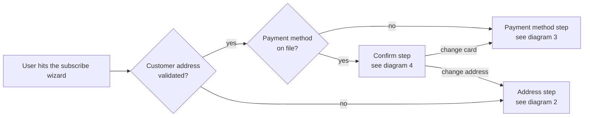
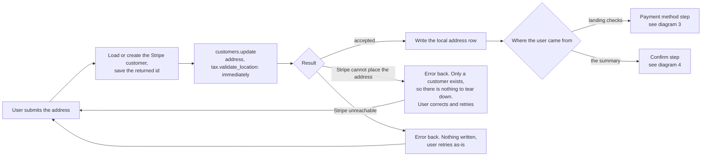

# Subscription Create - Stripe (Payment Element, billing first)

Status: draft
Updated: 2026-08-26

## Purpose & Scope

Creating a subscription in three steps. The billing address is settled first, the payment method is stored second, and the subscription is created last, once a payment method already exists on the customer.

The billing half of this flow is a setup intent and nothing else. The API hands back one client secret, the client makes one call to Stripe to store the payment method, and a bank challenge sends the user out and back to one return url in the app. A trial changes none of those three, because the trial is decided later, when the subscription is created.

Someone who lands on the page and leaves has a SetupIntent on Stripe and nothing else. No subscription is opened, no trial clock is started, no local row is written, and nothing needs cleaning up.

The first concern is that a stored payment method proves nothing about a charge clearing. A SetupIntent can confirm cleanly, 3DS included, and the first invoice can still be refused or challenged. Stripe charges the first invoice inside the subscription create call, off-session, with no connection to the mount. The mount ended when the SetupIntent confirmed, so the element has no part in the charge. A refused charge can take a different payment method, and a different payment method takes a new intent and a new mount, not the mount the user just went through.

A trial pushes the same concern out. Nothing is charged at signup, so a payment method that cannot be charged is indistinguishable from one that can until the first real invoice runs at trial end, with no user on the page. The failure arrives as a webhook, and the subscription has to carry state that forces the user back into entering a payment method through whatever mechanism gets built for it.

The second concern is the total. A tax-inclusive price, if one has to be shown at all, is an estimate or a plain "+ tax" line. The real figure takes a call to Stripe to calculate, since the first invoice does not exist until after the payment method is stored, and a promo code adds another step to the calculation.

## Flow

1. User hits the subscribe wizard. It opens on the first step that is not already done.
   1. No customer address, the wizard starts on the address step with a note that the address is needed for tax purposes.
   2. Address already settled, it shows as a summary at the top with a change button back to the address step.
   3. Payment method already on file, the card shows at the top with a change button back to the payment method step.
   4. Both already done, the wizard opens on confirm/submit.
2. User submits the billing address. Client hits the API to settle the customer. Skipped when the customer already carries a validated address and the user did not press change.
   1. Load the user's Stripe customer id. Create the customer on Stripe if there isn't one, and save the returned id.
   2. Push the address to the customer with `tax[validate_location]` set to `immediately`, whether or not tax is enabled. See the [address update flow](../../billing/stripe/address-update.md).
   3. An address Stripe cannot place fails here. A customer is the only thing that exists at this point, so there is nothing to tear down. Error back, the user corrects the address and retries.
   4. Stripe unreachable on either call fails the same way. Nothing is written locally, so the user retries as-is rather than correcting anything.
   5. Write the local address row once Stripe accepts, never before.
   6. A successful save does not advance on its own. When the payment method step is what comes next, the client goes straight on to the setup intent in step 3 with the user still sitting on the address form, and advances only once a secret comes back. Anything that comes back naming the address then lands on the form they are already looking at, next to the field they would have to fix anyway, rather than a step further on behind a change button they have to walk back through.
   7. The card step opens with that secret already in hand and mounts without fetching anything. A user who came from the summary and already has a card goes straight back to confirm instead, since step 3 is skipped for them and there is no intent to wait on.
3. Client hits the API for a setup intent. Skipped when a payment method is already on file and the user did not press change. The element cannot mount without a secret, so this fires as the step opens rather than behind the confirm button.
   1. Load the user's Stripe customer id. No id means the address step never ran, so fail back to the address step.
   2. Retrieve the customer and read `customer.tax.automatic_tax`. `supported` and `not_collecting` both pass. `failed` and `unrecognized_location` fail back to the address step. The value was stamped when the address was pushed, so the check costs a retrieve and re-sends no address.
   3. Create the SetupIntent against the customer with `usage` set to `off_session`. That `usage` value records the mandate while the user is present, and the mandate is what lets Stripe charge the first invoice later with the user gone.
   4. Stripe erroring on the create errors back for display. Without a secret there is no mount, so the step cannot continue.
   5. Return `client_secret` to the client.
   6. Nothing about price, currency, tax, promo or trial goes on this call. A SetupIntent has no amount field, so there is nothing to compute and nothing to keep in sync.
   7. Every pass through the flow creates a new SetupIntent. An unconfirmed one holds no subscription, no trial and no money, so nothing has to be deduplicated and no cleanup is required.
4. Element mounts against the `client_secret` returned in step 3. Skipped whenever step 3 was skipped.
   1. Load stripe.js if it isn't already on the page.
   2. Call `elements({ clientSecret })` to build the Elements object. Local only, no network call.
   3. Call `paymentElement.mount(target)` to create the iframe.
   4. stripe.js failing to load, or the mount failing, leaves the user with no way to enter a card. Show the failure rather than an empty box where the card fields should be.
   5. No mode, no amount, no currency and no trial handling go on the mount. Stripe reads all of it off the SetupIntent.
   6. User enters the payment details. The element validates format inline as they type. Nothing has gone to Stripe or to your API yet.
   7. The details never touch your server. They sit in the iframe and go straight to Stripe when confirm runs.
5. User presses confirm. What that runs depends on whether the element is on screen.
   1. A promo code field shows on the confirm step when promo codes are enabled. The code is verified when it is entered, then travels with the subscribe payload and is resolved into a promotion code object at 6.5.
   2. Element mounted. Confirm calls `confirmSetup({ elements, clientSecret, confirmParams: { return_url }, redirect: 'if_required' })`. The `return_url` is mandatory.
   3. Response is success / error / 3DS. 3DS either runs in a dialog and resolves inline, or sends the browser away to the bank and back to your return url. Either way you end up at the same place, a stored payment method.
   4. An error leaves the element mounted against the same `client_secret`. The user corrects and presses confirm again, no new intent needed.
   5. If it redirected, the user comes back to a freshly loaded page with no state. Stripe appends `setup_intent_client_secret` to the return url, so the page reads it off the query and calls `retrieveSetupIntent` to see how it landed rather than starting the flow over. The wizard has to look for that key before running its landing checks, otherwise it drops the user back on the payment method step and mounts a fresh element over a payment method that is already stored.
   6. On success the client makes the billing sync call with the setup intent id. It reads `payment_method` off the intent, sets `invoice_settings.default_payment_method` on the customer, and writes brand and last4 locally. Without it the payment method is attached and nothing will charge it. See the billing capture flow.
   7. The sync call failing errors back for display and stops before subscribe. The payment method is stored but not defaulted, so a subscription created now would have nothing to charge. The SetupIntent is still confirmed, so pressing confirm again retries the sync call and leaves the element alone. A refresh falls back to the landing checks in step 1, which find no card recorded and open on the payment method step again.
   8. Stripe fires the `setup_intent.succeeded` webhook for the same SetupIntent. Your webhook handler runs the same writes as the sync call, idempotently, so it is the backstop for every path where the sync call never lands. A browser that died after `confirmSetup`. A 3DS challenge that cleared at the bank while the user closed the tab instead of returning to `return_url`. A sync call that errored or timed out after the confirm already succeeded.
   9. Payment method already on file. Confirm makes the subscribe call only, no intent and no sync.
6. Client hits the API to subscribe, sending `{ plan, interval, promo_code? }`. No payment method reference of any kind, the customer already carries a default from step 5.
   1. Look for an existing subscription before creating anything. Live on the same plan and interval, return it as success, the request is already satisfied. Live on anything else is an error. `past_due` and `unpaid` are a subscription that went live and later failed a renewal, which is dunning's problem rather than this flow's, so they error back and point at whatever recovery path owns them. An `incomplete` one is a first charge that was refused, and what happens to it depends on whether its invoice can still be paid as it stands.
      1. That invoice is a snapshot of what priced it and never recalculates, so it is payable only while every input still matches. The price the plan and interval resolve to, the tax location the customer sits in, and the promotion code if one came through.
      2. All three unchanged. Attempt to pay the open invoice and create nothing.
      3. Any of them moved. Cancel the subscription and create fresh, since paying would charge the old amount and Stripe will not repoint an incomplete subscription at a different price anyway.
      4. Only country and postal code count for the tax location, since they are the pair it resolves from and a corrected street name leaves the amount untouched. The invoice carries both the address it was finalized against and its own discount, so the comparisons read off the invoice itself and nothing has to be tracked locally.
   2. Paying that invoice charges whatever the customer default is now. If the user has not entered a different card it is the same one that failed, so it fails again. The subscription stays at `incomplete`, the error names the payment method, and pressing subscribe again repeats it. Nothing moves until the card changes.
   3. Any other failure on the pay call, Stripe unreachable, the invoice already settled or voided, errors back for display and leaves the subscription untouched.
   4. Work out trial eligibility here. The API already knows whether the user has burned a trial. The client is never told and never branches on it.
   5. Resolve the promo code into a Stripe promotion code object if one came through. Optional, no code means the step is skipped.
   6. Create the subscription on Stripe with the customer id, the plan's price id, `trial_period_days` if eligible, `discounts: [{ promotion_code }]` if there was a code, `automatic_tax: { enabled: true }`, `off_session: true`, and `expand: ['latest_invoice.payment_intent', 'latest_invoice.confirmation_secret']`.
   7. Send no `default_payment_method` and no `payment_behavior`. Stripe falls back to the customer's `invoice_settings.default_payment_method`, which the billing sync call set, and the default `payment_behavior` (`allow_incomplete`) is what makes Stripe attempt the charge.
   8. Stripe creates the first invoice and settles it inside the same call. On a trial the invoice is `$0`, nothing is charged, and the subscription lands at `trialing` with `trial_end` stamped from now. Otherwise Stripe computes price plus tax minus discount, charges the customer's default payment method off-session, and the subscription lands at `active` if the charge cleared or `incomplete` if it did not. You never send an amount.
   9. If the create errors, that error goes back to the client for display. The payment method is already stored and defaulted, so a retry does not ask the user for card details again.
   10. On success write the local subscription row, now that the Stripe id exists. Stripe sub id, plan, interval, status.
   11. Return the outcome, including whether the subscription is live or sitting at `incomplete`. An `incomplete` result carries the first invoice's client secret too, read off `latest_invoice.confirmation_secret.client_secret`, so the recovery screen has something to mount against.
7. Subscription came back at `incomplete` with `authentication_required` on the first invoice's PaymentIntent. The user is still on screen, so the challenge runs now.
   1. No element is needed. The payment method is already on the PaymentIntent, only the challenge is missing.
   2. Call `stripe.handleNextAction({ clientSecret })` with the invoice client secret the subscribe call returned.
   3. It either runs the challenge in a dialog and resolves inline, or sends the browser away to the bank and back to a return url.
   4. On a redirect Stripe appends `payment_intent_client_secret`, not `setup_intent_client_secret`. The page reads it off the query and calls `retrievePaymentIntent` to see how it landed.
   5. Challenge cleared. The PaymentIntent succeeds and Stripe pays the invoice, but the local row still reads `incomplete` because the create call wrote it before the challenge ran. The flip to `active` comes one of two ways. Poll the auth user until the subscription webhook lands and reconciles the row, or have the client make a subscription sync call now that retrieves the subscription from Stripe and writes the row, with the webhook as backstop. Same shape as the billing sync in step 5.
   6. Challenge failed. The PaymentIntent falls to `requires_payment_method` and nothing more clears with that payment method. The client puts the user back on the payment method step for a different card, and confirm from there runs subscribe again, which pays the open invoice against the new default.
8. Client refreshes the auth user so everything reading subscription state picks up the new row, then takes the success action. Redirect to billing, a success page, wherever.

## Diagram

Wizard routing.

Address step.

Payment method.

```mermaid
flowchart LR
    P[Payment method step opens] --> S1[Client asks the API<br/>for a setup intent]
    S1 --> S2{Stripe customer id?}
    S2 -->|exists| S3["customers.retrieve,<br/>read customer.tax.automatic_tax"]
    S3 --> S3a{Value}
    S3a -->|"supported / not_collecting"| S4["setupIntents.create<br/>usage: off_session"]
    S4 --> S4a{Result}
    S4a -->|ok| S6[Return client_secret]
    S6 --> M1["Load stripe.js,<br/>elements({ clientSecret }),<br/>paymentElement.mount(target)"]
    M1 --> M2{Loaded and mounted?}
    M2 -->|yes| M4[User enters details in the iframe.<br/>Format validated inline, nothing sent yet]
    M4 --> F1[User presses confirm]
    F1 --> F2["confirmSetup({ elements, clientSecret,<br/>return_url, redirect: 'if_required' })"]
    F2 --> F3{Response}
    F3 -->|"success, or 3DS cleared in a dialog"| PM
    F3 -->|3DS redirect| R1["Back at return_url with<br/>setup_intent_client_secret on the query.<br/>Read before the landing checks in diagram 1"]
    R1 --> R2[retrieveSetupIntent]
    R2 --> PM
    PM[Payment method stored] --> Y1["Billing sync call with the setup intent id.<br/>Read payment_method, set the customer's<br/>invoice_settings.default_payment_method,<br/>write brand and last4 locally"]
    Y1 --> Y2{Result}
    Y2 -->|ok| Z["Confirm step<br/>see diagram 4"]
    Y2 -->|error| Y3[Stop before subscribe. The card is stored<br/>but not defaulted, so nothing would charge]
    Y3 -->|user presses confirm again| Y1
    F3 -->|error| F4[Element stays mounted on the same<br/>client_secret, no new intent needed]
    F4 --> F1
    M2 -->|no| M3[Show the failure, not an empty box<br/>where the card fields should be]
    S4a -->|error| S5[Error back for display.<br/>No secret means no mount]
    S2 -->|none| BACK["Fail back to the address step<br/>see diagram 2"]
    S3a -->|"failed / unrecognized_location"| BACK
    PM -.-> W1["setup_intent.succeeded webhook runs the<br/>same writes idempotently. Backstop for a dead<br/>browser, a challenge cleared in a closed tab,<br/>or a sync call that never landed"]
    W1 -.-> Z
```

Subscribe.

```mermaid
flowchart LR
    Z[Confirm step] --> Z1{Promo codes enabled?}
    Z1 -->|yes| Z2[Code verified on entry,<br/>travels with the payload]
    Z2 --> Z3["Client subscribes with<br/>{ plan, interval, promo_code? }<br/>no payment method reference"]
    Z1 -->|no| Z3
    Z3 --> E1{Existing subscription?}
    E1 -->|none| N1[Work out trial eligibility API side.<br/>The client is never told and never branches on it]
    N1 --> N2[Resolve the promo code into a<br/>promotion code object, if one came through]
    N2 --> N3["subscriptions.create<br/>customer, price, automatic_tax, off_session,<br/>trial_period_days? discounts?<br/>no default_payment_method, no payment_behavior"]
    N3 --> N4{Result}
    N4 -->|ok| N6[Write the local subscription row,<br/>now that the Stripe id exists]
    N6 --> N7{Stripe settles the first invoice<br/>inside that same create call}
    N7 -->|"trialing on a $0 invoice, or active<br/>once the off-session charge clears"| OK[Client refreshes the auth user,<br/>success action]
    N7 -->|incomplete, authentication_required| D2["handleNextAction({ clientSecret })<br/>with the invoice client secret.<br/>No element, only the challenge is missing"]
    D2 --> D2a{Runs inline or redirects?}
    D2a -->|dialog| D3
    D2a -->|redirect| D2b["Back with payment_intent_client_secret,<br/>then retrievePaymentIntent"]
    D2b --> D3{Challenge outcome}
    D3 -->|cleared| D4["Stripe pays the invoice, the local row still<br/>reads incomplete. Poll the auth user, or make<br/>a subscription sync call now.<br/>The webhook is the backstop either way"]
    D4 --> OK
    N7 -->|incomplete, charge refused| D1["PaymentIntent falls to requires_payment_method.<br/>Back to the payment method step, diagram 3,<br/>for a different card. Confirm from there<br/>subscribes again and pays the open invoice"]
    D3 -->|failed| D1
    N4 -->|error| N5[Error back. The card is stored and defaulted,<br/>so a retry does not re-ask for details]
    E1 -->|"incomplete, same plan and interval"| E4[Attempt to pay its open invoice,<br/>create nothing]
    E4 --> E5{Result}
    E5 -->|paid| OK
    E5 -->|charged the same failing default| E6[Error names the payment method.<br/>Nothing moves until the card changes]
    E5 -->|"unreachable, or the invoice<br/>was settled or voided"| E7[Error back, subscription untouched]
    E1 -->|"live, same plan and interval"| E2[Return it as success,<br/>the request is already satisfied]
    E1 -->|live, anything else| E3[Error]
```

