# Subscription Create - Stripe (Checkout Sessions, Payment Element)

Status: draft
Updated: 2026-08-27

## Purpose & Scope

One Checkout Session does the whole thing. The billing address, the card, the promotion code, the tax calculation and the subscription all hang off a single session created server side, and the client mounts two elements against it and confirms once.

There are no phases any more. No separate address write, no SetupIntent, no subscribe call. Stripe collects the address in its own element, computes tax off it, applies the promotion code, creates the subscription on confirmation and settles the first invoice, all inside one confirm. The three step wizard that came out of the setup intent approach goes with it, since there is nothing left to sequence.

Someone who lands on the page and leaves has a Checkout Session on Stripe and nothing else. No subscription is opened, no trial clock is started, no local row is written, and the session ages out on its own.

The first concern carries over unchanged. A stored payment method proves nothing about a charge clearing later. On a trial nothing is charged at signup, so a card that cannot be charged is indistinguishable from one that can until the first real invoice runs at trial end with no user on the page. The failure arrives as a webhook, and the subscription has to carry state that forces the user back into entering a payment method through whatever mechanism gets built for it.

The second concern is gone. The session knows its line items, so `getSession()` hands back a real total with tax and discount already applied. Nothing has to be estimated and no "+ tax" line is needed. A promotion code moves the figure as soon as it is applied, an address does not, since the address element stopped writing itself onto the session and its value is only read at confirm.

What replaces the old incomplete subscription handling is nothing, because there is nothing to handle. From API version `2025-03-31.basil` the subscription is created after payment completes rather than upfront, so a refused first charge leaves no subscription and no invoice behind. The session stays open and the user retries on the same one. Everything below assumes `2026-03-25.dahlia` or later, which is a higher floor again, since that is where `ui_mode` took the value this flow uses.

## Flow

1. User hits the subscribe page. Client asks the API for a Checkout Session. Both elements go up together, so there is nothing to route between and no landing checks on the client.
   1. Load the user's Stripe customer id. Create the customer on Stripe if there isn't one, and save the returned id. It goes first because the sweep below is addressed to a customer, and a customer made a moment ago has nothing to sweep. Passing `customer` on the session is also what satisfies its email requirement, so no contact details element is needed.
   2. Expire every open session the customer already has. One live session at a time, so a tab left open on another device cannot be confirmed after this one is handed out. Only an `open` session can be expired and a completed one throws, so the sweep swallows that rather than failing the create on it. See the note below.
   3. Refuse if the user already has a subscription. A live one, which counts a trial and a cancelled one still inside its paid term, comes back as `already_subscribed` on the response's `error` field. Past due or unpaid is `payment_required`, kept separate so the client can send them to the card page instead of telling them they are already subscribed. Reject either way, and there is no success to hand back. It sits after the sweep so that anything an abandoned session already completed is visible to it rather than racing it, and nothing but the customer exists by the time it runs. See the note below.
   4. Work out trial eligibility here. The API already knows whether the user has burned a trial. The client is never told and never branches on it.
   5. Create the session with `ui_mode: 'elements'`, `mode: 'subscription'`, the customer, `line_items` carrying the plan's price id at quantity one, a `return_url`, `billing_address_collection: 'required'`, `allow_promotion_codes: true`, `customer_update: { address: 'auto', name: 'auto' }`, `automatic_tax: { enabled: true }` when the app's automatic tax flag is on, and `subscription_data.trial_end` when eligible. `trial_end` rather than `trial_period_days`, since a user carrying a partial trial keeps whatever is left of it and a whole number of days cannot say that.
   6. Card up front on a trial is the default. `payment_method_collection` only needs setting when you want a trial without a card, which is the opposite of what this flow wants, so it is left alone.
   7. Nothing is created beyond the session itself. No address is written to the customer, no intent is opened, no subscription exists. A user who abandons here leaves a session that ages out on its own, or gets swept by their next create, so there is nothing to deduplicate and nothing to clean up.
   8. Stripe erroring on the create errors back for display. Without a client secret there is nothing to mount, so the page cannot continue.
   9. Return the session's `client_secret`.
2. Client initialises Checkout against that secret.
   1. Load stripe.js if it isn't already on the page.
   2. Call `stripe.initCheckoutElementsSdk({ clientSecret })`, then `await checkout.loadActions()` for the actions the rest of the page runs on.
   3. stripe.js failing to load, or the actions failing to resolve, leaves the user with nowhere to enter anything. Show the failure rather than an empty page where the form should be.
3. Mount both elements. They sit on the one page rather than behind steps.
   1. `checkout.createBillingAddressElement()`, prefilled through `defaultValues.billingAddress` on the init call off the local address row when there is one, the name along with the address. `contacts` is a different thing, a picker for addresses already saved against the customer.
   2. `checkout.createPaymentElement({ fields: { billingDetails: { name: 'never' } } })`. The billing address element collects a name and gives no option not to, so the payment element has to stand down. Leaving both on it fails the confirm for collecting the same field twice.
   3. Country is an ISO alpha-2 select and the field layout follows the country, so the shape of an address is Stripe's problem rather than a hand rolled form's.
   4. Both take the same appearance object, so they match the rest of the app the way the payment element already did.
4. Read the session for what to display.
   1. `actions.getSession()` carries `total` and `lineItems`. Render those rather than pricing the plan locally. This is enforced rather than advised. Reading and displaying either `total.total.amount`, or `total.total.minorUnitsAmount` alongside `currency` and `minorUnitsAmountDivisor`, is required and Stripe throws if you skip it.
   2. The total is real. Tax is calculated off the address in the element, the discount off the promotion code, both by Stripe, both before anything is charged.
   3. A promotion code updates the figure the moment it is applied. An address does not. The address element no longer writes itself onto the session, so its value is only picked up at confirm, and the total on screen reflects whatever address the session already carries until then.
   4. If the total has to carry tax before confirm, listen to the element's change event and push the value onto the session with `updateBillingAddress()`. It costs more than the call. Stripe refuses to confirm while an Address Element is mounted and the address has also been set that way, since the two are competing sources, so whatever pushes has to take the element down before the user can subscribe. That rules the push out of a single page where the element sits there the whole time, and makes it a natural fit for a stepped one, where leaving the address is the moment to unmount and coming back to it is the moment to mount again. Unmounting keeps the instance and everything typed into it, so going back and forth loses nothing.
5. Promotion codes belong to the session. `allow_promotion_codes` puts the field in play and the actions apply the code, so there is no verify call of your own and no code travelling on a subscribe payload to be resolved later.
6. User presses subscribe. Client calls `actions.confirm({ redirect: 'if_required' })`.
   1. One call. It submits the address and the card, creates the subscription, and settles the first invoice.
   2. On a trial the invoice is `$0`, nothing is charged, and the subscription lands at `trialing` with `trial_end` stamped from now. Otherwise Stripe charges the total it already showed the user.
   3. A bank challenge either runs in a dialog and resolves inline or sends the browser away to the bank and back to the `return_url`. There is no separate next action step, confirm owns the challenge.
   4. A refused charge, or an address Stripe cannot place, leaves the session open and whatever is mounted still mounted. The user corrects and confirms again on the same session, no new one needed. An address already pushed onto the session is the exception, since its element came down at that point and only goes back up if the user asks to change it.
   5. A refused charge creates nothing. No subscription, no invoice, nothing to compare against and nothing to tear down before the retry.
   6. If it redirected, the user comes back to a freshly loaded page with no state. Re-initialise against the same session and read its status rather than starting the flow over.
7. Client makes the subscription sync call once the session completes. One call writes every local row, all of it read off the one session.
   1. Retrieve the session with the subscription expanded.
   2. Write the subscription row, now that the Stripe id exists. Stripe sub id, plan, interval, status.
   3. Write the address row from the name and address Stripe collected, both off the session's `customer_details`.
   4. Write the card brand and last4.
   5. The sync call failing errors back for display. Everything is already correct at Stripe, only the local rows are behind, so a retry is idempotent and the webhook lands regardless.
   6. Stripe fires `checkout.session.completed` for the same session. The handler runs the same writes, idempotently, so it is the backstop for every path where the sync call never lands. A browser that died after confirm. A challenge that cleared at the bank while the user closed the tab instead of returning. A sync call that errored or timed out after the confirm already succeeded.
   7. Both writers should expect a user who is already subscribed by the time they run, rather than assuming they are writing the first subscription. See the note below.
   8. Do not look for the invoice before the session reaches `complete`. It does not exist until then, which is why completion is the trigger rather than a payment intent event.
8. Client refreshes the auth user so everything reading subscription state picks up the new row, then takes the success action. Redirect to billing, a success page, wherever.

## Diagram

```mermaid
flowchart LR
    A[User hits the subscribe page] --> B[Client asks the API<br/>for a Checkout Session]
    B --> C[Load or create the Stripe customer,<br/>save the returned id]
    C --> C1[Expire every open session<br/>the customer already has.<br/>One live session at a time]
    C1 --> B1{Subscription already<br/>on the user?}
    B1 -->|"live, past due or unpaid"| B2[Refuse. already_subscribed,<br/>or payment_required.<br/>No session is created]
    B1 -->|no| D[Work out trial eligibility.<br/>The client is never told]
    D --> E["checkout.sessions.create<br/>ui_mode: elements, mode: subscription<br/>customer, line_items, return_url<br/>billing_address_collection, allow_promotion_codes<br/>automatic_tax when the flag is on, trial_end?"]
    E --> F{Result}
    F -->|error| F1[Error back for display.<br/>No secret means nothing mounts]
    F -->|ok| G[Return client_secret]
    G --> H["initCheckoutElementsSdk({ clientSecret })<br/>then loadActions()"]
    H --> I{Loaded?}
    I -->|no| I1[Show the failure, not an empty page<br/>where the form should be]
    I -->|yes| J["createBillingAddressElement, prefilled from the<br/>local row via defaultValues.billingAddress<br/>createPaymentElement"]
    J --> K["getSession() carries total and lineItems.<br/>Displaying it is required, not optional.<br/>A code moves it, an address only at confirm"]
    K --> L[User enters the address and card,<br/>applies a promotion code]
    L --> M[User presses subscribe]
    M --> N["actions.confirm({ redirect: 'if_required' })"]
    N --> O{Response}
    O -->|"success, or a challenge cleared in a dialog"| Q
    O -->|challenge redirect| P["Back at return_url with no state.<br/>Re-init against the same session<br/>and read its status"]
    P --> Q
    O -->|"charge refused, or address rejected"| R[Session stays open, elements stay mounted.<br/>Nothing was created, so there is nothing<br/>to compare against or tear down]
    R --> M
    Q[Session complete. Subscription created,<br/>first invoice settled] --> S["Subscription sync call. Retrieve the session,<br/>write the subscription, address and card rows"]
    S --> T[Refresh the auth user,<br/>success action]
    Q -.-> W["checkout.session.completed runs the same<br/>writes idempotently. Backstop for a dead browser,<br/>a challenge cleared in a closed tab, or a<br/>sync call that never landed"]
    W -.-> T
```

## Rules

- API version `2026-03-25.dahlia` or later. Two separate reasons stack up to that floor. `2025-03-31.basil` is where the subscription started being created after payment completes, and anything earlier creates it upfront and leaves an incomplete one with a finalized invoice behind on a refused charge, which brings back all the reconciliation this flow deliberately does not do. Dahlia is where `ui_mode` gained `elements`, which is the value used throughout here. On Basil the same thing is called `custom`.
- Displaying the session total is required. Stripe throws if the page never reads it.
- The billing address element does not write itself onto the session. Its value is read at confirm unless you wire the change event yourself.
- Authenticated user required.
- One live session per customer. A create expires the customer's open ones before it does anything else, so the device that asked last is the only one that can confirm.
- A user who already has a subscription never gets a session. Live, past due and unpaid all refuse, since the subscription exists at Stripe in every one of those cases and a second one is wrong regardless.
- Dunning is not this flow. Past due and unpaid are refused here and handled somewhere that does not exist yet.
- Create the Stripe customer before the session if there isn't one. Passing `customer` also satisfies the session's email requirement.
- Trial eligibility is decided server side. The client is never told and never branches on it.
- Card up front on a trial is the default. Leave `payment_method_collection` alone.
- Nothing exists beyond the session until the user confirms. No address on the customer, no intent, no subscription.
- The subscription and its invoice only exist once the session reaches `complete`. Nothing should read the invoice before that.
- A refused charge leaves nothing behind. The same session is confirmed again rather than replaced.
- Only the sync call and the `checkout.session.completed` webhook write local rows, and both are idempotent.
- The local address row needs `state` and `name` columns. The billing address element collects both.
- The API never pushes the name on this path. `customer_update` has Stripe copy it onto the customer at confirm, unlike the billing address page where the API sends it itself.

## Notes

### Note on 1.2 - why open sessions are expired

The check runs once, when the secret is handed out, and Stripe keeps a session usable for up to a day after that. So a user could pass the check with no subscription, leave the tab open, subscribe on another device, then come back to the stale tab and press subscribe. It went through, and they had two.

Expiring the customer's open sessions on every create is what closes it. The stale tab is confirming against a session that no longer accepts one, so it fails there instead of buying a second subscription, and the user starts again on a fresh session. That is the whole reason the sweep exists.

A narrow window survives. The subscription check reads the local row, and that row is only written once the sync call or the webhook lands, so it trails Stripe by a moment. Confirm on one device and then confirm on a second before the first row arrives and both go through. It takes the same person confirming twice within seconds of each other, so we are living with it.

Closing it properly means asking Stripe for the customer's live subscriptions on every create rather than reading the local row, which is an API call on every subscribe to cover that. Worth looking into later, not important now.

A subscription created at the dashboard or by an admin is outside all of this. There is no session to expire, and blocking a second one could be wrong anyway, since it may well be deliberate.

### Note on 1.3 - why the subscription check sits here

Stripe creates the subscription inside the confirm, in the browser. The server sees the user once, when it hands out the session secret, so that is the only place a check can run at all.

Reject either way. The subscription exists at Stripe whether it is live, past due or unpaid, so a second one is wrong regardless. There is nothing to hand back on success either, since the only thing this request returns is a session secret, and a subscription is not that. A double submit gets the same refusal as anything else.

Past due and unpaid get their own `error` code rather than sharing one, so the client can send the user to the card page. What happens after that, a new card, a retry on the open invoice, or dropping them, belongs to a dunning flow that has not been written.
