# Subscription Create - Stripe (Embedded Checkout)

Status: reference
Updated: 2026-08-31

## Purpose & Scope

Creating a subscription with a Stripe Checkout Session rendered in an iframe on your own page. You hand the whole thing to Stripe - address collection, promo code field, tax calculation and the trial all happen inside Stripe's UI. There is no amount to sync, no promo code to resolve, no address endpoint, and no intent to match against.

The catch is styling. You get logo, colors, fonts and border radius from the Dashboard branding settings and nothing else. The Appearance API that the Payment Element uses does not apply here.

Nothing exists on Stripe until the session completes. Someone who lands on the page and leaves has cost you nothing but a session record, and those expire on their own after 24 hours.

## Actors & Entities

Actors

- User - fills in the form inside the iframe.
- Client App - requests the session, mounts the embedded checkout, polls after completion.
- API - creates the customer and the session, receives the webhook, writes the local row.
- Stripe - renders the checkout iframe, creates the Subscription and Invoice, charges the payment method, fires the webhook.

Entities

- User record - holds the Stripe customer id.
- Stripe Customer - created on first subscribe, or by Stripe during checkout.
- Checkout Session - a container only. Returns a `client_secret` rather than a URL.
- Subscription and Invoice - created by Stripe on completion, not by your API.
- Local subscription row - written by the webhook handler. First thing to land in your DB.

## Flow

1. On page load, hit the API for the session, sending `{ plan, interval }`.
   1. Load the user's Stripe customer id from your DB.
   2. If there isn't one, create the customer on Stripe with the user's email and name. Nothing is strictly required by the API, but without those the Dashboard and receipts are useless. Save the returned customer id to your users table. No billing address needed here, Stripe collects it inside the session.
   3. You can also skip that step entirely and pass `customer_email` instead of `customer` on the session below. Stripe creates the customer itself during checkout, then you read the id off the completed session and save it. One less call, and the customer only gets created for people who actually go through with it.
   4. Work out trial eligibility on the API side, since it already knows whether this user has burned a trial before.
   5. Create a Checkout Session on Stripe with `ui_mode: 'embedded'`, `mode: 'subscription'`, the customer, `line_items` with the plan's price id, `subscription_data: { trial_period_days }` if eligible, `allow_promotion_codes: true`, `automatic_tax: { enabled: true }`, `billing_address_collection: 'required'`, `customer_update: { address: 'auto' }` and a `return_url`.
   6. The `customer_update` is easy to miss. Without it Stripe collects the address for the tax calculation but never writes it back to the customer, so you end up with nothing on file for the next renewal.
   7. Nothing else gets created. No subscription, no invoice, no intent, no local row. The session is just a container.
   8. Return the session's `client_secret` to the client app.
2. Client mounts it with `initEmbeddedCheckout({ clientSecret })` then `checkout.mount(target)`.
3. Everything from here happens inside the iframe. The user fills in their address, applies a promo code, picks a payment method, pays, and does 3DS if the bank asks. Stripe recalculates tax and totals live as they type, with no calls to your API at any point.
4. On completion Stripe creates the Subscription and the Invoice, all on its own side. With no trial it charges the payment method. With a trial the first invoice is `$0`, nothing is charged, and the subscription lands at `trialing`.
5. Then either it redirects to your `return_url` with `?session_id={CHECKOUT_SESSION_ID}` appended, or if you set `redirect_on_completion: 'never'` it fires an `onComplete` callback and stays on the page.
6. Either way your API still knows nothing at this point. Nothing in the chain above told it the payment landed, only the webhook does.
7. Stripe fires `checkout.session.completed`. Your backend reads the subscription id off the session's `subscription` field, then retrieves that Subscription for its status, since a webhook payload carries the id and cannot be expanded. The local row is written off that status. This is the first time anything lands in your DB. It is asynchronous and has no fixed timing, it can land before the browser even finishes redirecting, or seconds after.
8. Reload the auth user and check for the subscription. Poll this, a hit means the webhook arrived and the API picked it up. Give up after a ceiling rather than spinning forever.
9. Take the success action - redirect to billing, a success page, wherever.

## Diagram

```mermaid
flowchart LR
    A[Page load] --> B["POST /subscription/session<br/>{plan, interval}"]
    B --> C[Load or create<br/>Stripe customer]
    C --> D["checkout.sessions.create<br/>ui_mode: embedded<br/>mode: subscription<br/>allow_promotion_codes<br/>automatic_tax<br/>billing_address_collection"]
    D --> E[Return session client_secret]

    E --> F["initEmbeddedCheckout({ clientSecret })<br/>checkout.mount()"]
    F --> G["Inside the iframe:<br/>address, promo code, tax,<br/>payment method, 3DS"]
    G --> H[Stripe creates Subscription<br/>and Invoice, charges unless trialing]

    H --> I{redirect_on_completion}
    I -->|default| I1["Redirect to return_url<br/>?session_id="]
    I -->|never| I2[onComplete callback<br/>stays on page]
    I1 --> J
    I2 --> J

    J["Webhook<br/>checkout.session.completed"] --> K[Write local row<br/>status from subscription]
    K --> L[Client polls auth user]
    L --> M[Success action]
```

## States

Local subscription row.

| State | Meaning |
| ----- | ------- |
| none | No local row. A session may be open on Stripe, or the user may have abandoned it. |
| trialing | Webhook landed, trial running, no charge taken yet. Counts as subscribed. |
| active | Webhook landed, first invoice paid. |

Allowed transitions

| From | To | Trigger |
| ---- | -- | ------- |
| none | trialing | `checkout.session.completed`, trial was eligible |
| none | active | `checkout.session.completed`, no trial |
| none | none | User abandons, session expires after 24 hours |

There is no `incomplete` state here. Nothing exists locally until the session completes.

## Rules

- Authenticated user required. The session is created against that user's Stripe customer.
- Trial eligibility is decided on the API side only. The client never asserts it.
- The subscribed flag must treat `trialing` as subscribed, otherwise a trial signup polls forever.
- Billing address collection is required, and `customer_update: { address: 'auto' }` must be set so the address is written back for the next renewal.
- Only the webhook writes the local row. Neither the `return_url` redirect nor the `onComplete` callback is proof of payment.
- Polling has a ceiling. Past it, show a pending state rather than spinning.

## Edge & Error Cases

| Case | Cause | Expected behavior |
| ---- | ----- | ----------------- |
| Webhook lands late | Asynchronous, no fixed timing, can arrive before or after completion resolves | Poll the auth user, show pending until the flag flips |
| Webhook never arrives | API dropped or failed the attempts | User sits in a pending state. Needs a manual sync command to reconcile against Stripe. Should be rare |
| Session abandoned | User closes the tab | Sessions expire on their own after 24 hours. No cleanup |
| Trial signup polls forever | Subscribed flag ignores `trialing` | Flag must count `trialing` as subscribed |
| No address on file at renewal | `customer_update` omitted from session create | Stripe collected the address for tax but never wrote it back. Set `customer_update: { address: 'auto' }` |
| Cold return after redirect | Default `redirect_on_completion` sends the browser to `return_url` | Read `session_id` off the query and treat the page as a landing page. Set `redirect_on_completion: 'never'` if you want to stay put and keep state |
| Payment method declined | Happens inside the iframe | Stripe handles the retry. No local effect |
| Styling does not match the app | Appearance API does not apply to embedded checkout | Only Dashboard branding is available. If the payment UI must match the app, use [Create](../Create.md) |

## Decisions

Embedded over hosted - the iframe stays on your page, so the user never visibly leaves your domain. That is the only difference. Styling is identical between the two, and hosted is less to build, so this is worth it only if the domain change matters.

Embedded over the [payment element on your own page](../Create.md) - Stripe collects the address, the promotion code and the card inside the iframe, so there is no element to mount, no address to push onto the session, no mount lifecycle to carry across a bank challenge and no total to read back and render. Both create the same kind of session, so the fork is UI control against build cost.

Cost of the choice: you get Stripe's UI, styled only by Dashboard branding. If the checkout has to look like the rest of the app, [Create](../Create.md) is the option.
