# Subscription Create - Stripe (Hosted Checkout)

Status: reference
Updated: 2026-08-31

## Purpose & Scope

Creating a subscription with a Stripe hosted Checkout Session. The API creates the session and hands back a URL, the browser navigates to `checkout.stripe.com`, and the user completes the entire payment on Stripe's domain. Address collection, promo codes, tax, payment methods, 3DS and the trial are all Stripe's UI.

There is no stripe.js on your page at all. Nothing to load, nothing to mount, no client secret, no element. The entire payment surface lives off your domain, which is the smallest PCI footprint of any of the create variants.

Styling is logo, colors, fonts and border radius from the Dashboard branding settings. Beyond that it looks like Stripe, and the user can see they left your site.

## Actors & Entities

Actors

- User - hits subscribe, completes payment on Stripe's domain.
- Client App - requests the session, navigates the browser, polls after return.
- API - creates the customer and the session, receives the webhook, writes the local row.
- Stripe - hosts the checkout page, creates the Subscription and Invoice, charges the payment method, fires the webhook.

Entities

- User record - holds the Stripe customer id.
- Stripe Customer - created on first subscribe, or by Stripe during checkout.
- Checkout Session - a container only. Nothing else exists on Stripe until it completes.
- Subscription and Invoice - created by Stripe on completion, not by your API.
- Local subscription row - written by the webhook handler. First thing to land in your DB.

## Flow

1. User hits subscribe. Client hits the API for the session URL, sending `{ plan, interval }`.
   1. Load the user's Stripe customer id from your DB.
   2. If there isn't one, create the customer on Stripe with the user's email and name. Nothing is strictly required by the API, but without those the Dashboard and receipts are useless. Save the returned customer id to your users table. No billing address needed here, Stripe collects it during checkout.
   3. You can also skip that step entirely and pass `customer_email` instead of `customer` on the session below. Stripe creates the customer itself during checkout, then you read the id off the completed session and save it. One less call, and the customer only gets created for people who actually go through with it.
   4. Work out trial eligibility on the API side, since it already knows whether this user has burned a trial before.
   5. Create a Checkout Session on Stripe with `mode: 'subscription'`, the customer, `line_items` with the plan's price id, `subscription_data: { trial_period_days }` if eligible, `allow_promotion_codes: true`, `automatic_tax: { enabled: true }`, `billing_address_collection: 'required'`, `customer_update: { address: 'auto' }`, plus a `success_url` and a `cancel_url`. No `ui_mode`, hosted is the default.
   6. The `customer_update` is easy to miss. Without it Stripe collects the address for the tax calculation but never writes it back to the customer, so you end up with nothing on file for the next renewal.
   7. Nothing else gets created. No subscription, no invoice, no intent, no local row. The session is just a container.
   8. Return the session's `url` to the client app.
2. Client navigates the browser to that URL. That is the entire client side implementation.
3. Everything from here happens on Stripe's domain. The user fills in their address, applies a promo code, picks a payment method, pays, and does 3DS if the bank asks. Stripe recalculates tax and totals live, with no calls to your API at any point.
4. On completion Stripe creates the Subscription and the Invoice, all on its own side. With no trial it charges the payment method. With a trial the first invoice is `$0`, nothing is charged, and the subscription lands at `trialing`.
5. Stripe sends the browser to your `success_url` with `?session_id={CHECKOUT_SESSION_ID}` appended. If the user backs out instead they land on `cancel_url` and nothing was created.
6. The success page is a cold page load with no state, so treat it as a landing page rather than a continuation of whatever the user was doing before.
7. Your API still knows nothing at this point. Nothing in the chain above told it the payment landed, only the webhook does.
8. Stripe fires `checkout.session.completed`. Your backend reads the subscription id off the session's `subscription` field, then retrieves that Subscription for its status, since a webhook payload carries the id and cannot be expanded. The local row is written off that status. This is the first time anything lands in your DB. It is asynchronous and has no fixed timing, it can land before the browser even finishes redirecting back, or seconds after.
9. Reload the auth user and check for the subscription. Poll this, a hit means the webhook arrived and the API picked it up. Give up after a ceiling rather than spinning forever.
10. Take the success action - redirect to billing, a success page, wherever.

## Diagram

```mermaid
flowchart LR
    A[User hits subscribe] --> B["POST /subscription/session<br/>{plan, interval}"]
    B --> C[Load or create<br/>Stripe customer]
    C --> D["checkout.sessions.create<br/>mode: subscription<br/>allow_promotion_codes<br/>automatic_tax<br/>billing_address_collection<br/>success_url + cancel_url"]
    D --> E[Return session url]

    E --> F["Browser navigates to<br/>checkout.stripe.com"]
    F --> G["On Stripe's domain:<br/>address, promo code, tax,<br/>payment method, 3DS"]

    G --> H1[Stripe creates Subscription<br/>and Invoice, charges unless trialing]
    G -->|backs out| H2["cancel_url<br/>nothing created"]

    H1 --> I["Redirect to success_url<br/>?session_id="]
    I --> J["Webhook<br/>checkout.session.completed"]
    J --> K[Write local row<br/>status from subscription]
    K --> L[Client polls auth user]
    L --> M[Success action]
```

## States

Local subscription row.

| State | Meaning |
| ----- | ------- |
| none | No local row. A session may be open on Stripe, or the user may have abandoned it. |
| trialing | Webhook landed, trial running, no charge taken yet. Counts as subscribed. |
| active | Webhook landed, first invoice paid. |

Allowed transitions

| From | To | Trigger |
| ---- | -- | ------- |
| none | trialing | `checkout.session.completed`, trial was eligible |
| none | active | `checkout.session.completed`, no trial |
| none | none | User backs out, or session expires after 24 hours |

There is no `incomplete` state here. Nothing exists locally until the session completes.

## Rules

- Authenticated user required. The session is created against that user's Stripe customer.
- Trial eligibility is decided on the API side only. The client never asserts it.
- The subscribed flag must treat `trialing` as subscribed, otherwise a trial signup polls forever.
- Billing address collection is required, and `customer_update: { address: 'auto' }` must be set so the address is written back for the next renewal.
- Only the webhook writes the local row. The success page redirect is not proof of payment and must not be treated as one.
- Polling has a ceiling. Past it, show a pending state rather than spinning.

## Edge & Error Cases

| Case | Cause | Expected behavior |
| ---- | ----- | ----------------- |
| Webhook lands late | Asynchronous, no fixed timing, can arrive before or after the browser returns | Poll the auth user, show pending until the flag flips |
| Webhook never arrives | API dropped or failed the attempts | User sits in a pending state. Needs a manual sync command to reconcile against Stripe. Should be rare |
| User backs out | Abandons Stripe's page | Lands on `cancel_url`, nothing was created, nothing to clean up |
| Session abandoned | User closes the tab | Sessions expire on their own after 24 hours. No cleanup |
| Trial signup polls forever | Subscribed flag ignores `trialing` | Flag must count `trialing` as subscribed |
| No address on file at renewal | `customer_update` omitted from session create | Stripe collected the address for tax but never wrote it back. Set `customer_update: { address: 'auto' }` |
| Success page has no state | Cold page load after the redirect | Treat it as a landing page, not a continuation of the previous session |
| Payment method declined | Happens entirely on Stripe's domain | Stripe handles the retry. No local effect. The session stays open for another attempt, nothing was created beyond it |

## Decisions

Hosted over embedded - no stripe.js on the page at all, nothing to mount, no client secret. Styling is identical between the two (Dashboard branding only, the Appearance API applies to neither), so embedded buys you the iframe staying on your domain and nothing else. If keeping the user on your domain does not matter, hosted is strictly less to build.

Hosted over the [payment element on your own page](../Create.md) - Stripe collects the address, the promotion code and the card in its own UI, so there is no element to mount, no address to push onto the session, no mount lifecycle to carry across a bank challenge and no total to read back and render. Both create the same kind of session, so the fork is UI control against build cost.

Cost of the choice: the user visibly leaves your site, and you get no control over the payment UI beyond branding settings.
