# Subscription Create - Stripe (Payment Element, deferred intent)

Status: reference
Updated: 2026-08-17

## Purpose & Scope

Creating a subscription with the Payment Element mounted in deferred mode, where nothing is created on Stripe until the user hits subscribe. The element needs its amount constantly updated to match the intent that eventually gets created. This can be cumbersome when taxes and promo codes are involved since it requires always fetching the appropriate amount from the API (the API is the source of truth, do not calculate locally) to ensure it will match the intent amount later. The intent auto computes that amount on its end.

Trials work here too, but the mode has to be decided before mounting, so the client has to know trial eligibility up front rather than being told by the server. Stripe validates that mode against the intent it eventually gets, so if the client and the API disagree you get an `IntegrationError` after the user has already clicked pay.

The gist of it is that whatever you set up, trial or no trial, promo, tax, whatever, the intent and the local payment element have to match. Mode, amount and currency all get compared at confirm, and if any of them disagree it throws.

## Actors & Entities

Actors

- User - enters card details in the Payment Element on your page.
- Client App - mounts the element with an amount, keeps that amount in sync, submits and confirms.
- API - source of truth for the amount, creates the customer and the subscription, writes the local row, receives the webhook.
- Stripe - issues the intent at submit time, validates the element against it, runs 3DS, settles the charge, fires the webhook.

Entities

- User record - holds the Stripe customer id and the billing address that gets pushed up.
- Stripe Customer - must carry a validated billing address, tax on or off.
- Subscription - created at `incomplete` only once the user hits subscribe.
- Invoice - first invoice, created with the subscription. `$0` on a trial.
- PaymentIntent - on the invoice when there is no trial.
- SetupIntent - on `pending_setup_intent` when there is a trial.
- Local subscription row - written at `incomplete` as soon as the Stripe id exists.

## Flow

1. The billing address is collected up front, always, whether or not tax is enabled.
2. Element mounts with amount and currency in payment mode, for example `elements({ mode: 'payment', amount: 3000, currency: 'usd' })`. On a trial it mounts as `elements({ mode: 'setup', currency: 'usd' })` instead, no amount at all, so steps 3, 4 and 7 are skipped.
   1. Load stripe.js if it isn't already on the page.
   2. `elements({ mode, amount, currency })` builds the Elements object locally. No network calls here.
   3. `paymentElement.mount(target)` creates the iframe.
3. If there is a tax amount, fetch the proper total from the API and update it with `elements.update({ amount: <new price> })`. Or do the call before the `elements` call as a first step to avoid the update. Getting the tax amount can be quite complicated and will likely require a call to Stripe since it depends on multiple factors (see Rules). That call is a tax calculation and it takes the address, so it doubles as the address check. A location that won't resolve errors here, before anything exists on Stripe.
4. Same for promo codes. The code gets entered and validated on the API side, with the plan and interval included in the request. The response includes the updated amount with tax, then call `elements.update({ amount: 3300 })`.
5. A promo code still applies on a trial, it just does nothing today since there is nothing to discount. It sits on the subscription and comes off the first real invoice once the trial ends. Setup mode carries no amount so there is nothing to keep in sync either.
6. At this point no intent, no subscription, nothing has been created on the API side. Everything gets initiated when the user hits subscribe.
7. You can get as fancy as you like with how the amount gets updated. For instance, do a single "get amount" call with any promo codes or other modifiers, do the `elements.update`, then get the intent with the same amount. Regardless, they have to match.
8. On subscribe, `elements.submit()` runs first, before anything else. This sends the card data to Stripe's servers and returns ok or an error. If it errors, stop here, nothing else runs. It has to be the first thing in the click handler, before any `await`, because browsers only allow popups to open inside the user gesture and some methods (PayPal, certain 3DS) need one.
9. Then hit the API for the intent, sending `{ plan, interval, promo_code, etc }`.
   1. Load the user's Stripe customer id from your DB.
   2. If there isn't one, create the customer on Stripe. Save the returned customer id to your users table.
   3. Push the billing address to the Stripe customer with `tax[validate_location]` set to `immediately`, whether or not tax is enabled. Has to be done before the subscription is created, see Decisions and the [address update flow](../../../billing/stripe/address-update.md) for details.
   4. If there is a promo code, resolve a Stripe promo code object from Stripe directly. The string the user typed is not what the create accepts.
   5. Create the Subscription on Stripe with customer (stripe id), the plan's price id, `discounts: [{ promotion_code: 'promo_xxx' }]` (the resolved promo code object), `trial_period_days` if eligible, `payment_behavior: 'default_incomplete'`, `automatic_tax: { enabled: true }`, `expand: ['latest_invoice.confirmation_secret', 'pending_setup_intent']`. `confirmation_secret` is not expanded by default, it has to be named explicitly or it comes back absent.
   6. That single call creates three things on Stripe - the Subscription at status `incomplete`, its first Invoice, and a PaymentIntent against that invoice. All three come back in the one response.
   7. On a trial the first invoice is `$0` so there is no PaymentIntent. Stripe opens a SetupIntent on `pending_setup_intent` and that is the secret you return.
   8. The amount is computed by Stripe from price + discount + tax. You never send one, and it has to match what the element was set to above.
   9. If it errors out (invalid promo, tax not computable, etc) that error needs to get sent back to the client for display. An amount mismatch is not caught here, it gets caught client side on confirm.
   10. On success, write your local subscription row now that the Stripe id exists - stripe sub id, plan, interval, status `incomplete`.
   11. Return the client secret to the client app, read off `latest_invoice.confirmation_secret.client_secret` on the payment path and off `pending_setup_intent` on a trial.
10. Then `confirmPayment(...)`, or `confirmSetup(...)` on a trial, with `{ elements, clientSecret, confirmParams: { return_url }, redirect: 'if_required' }`. Fires immediately, same click handler, next line after the secret comes back. No second button press, no user interaction in between, the whole chain from the subscribe click runs uninterrupted with the button held in its pending state. The `return_url` is mandatory. This is also where a mismatched amount blows up - Stripe.js compares the intent against what elements was configured with and throws an `IntegrationError`, after the user already clicked pay.
11. Response is success / error / 3DS. 3DS either runs in a dialog and resolves inline, or sends the browser away to the bank and back to your return url. Either way you end up at the same place - a settled intent.
12. If it redirected, the user comes back to a freshly loaded page with no state. Stripe appends the secret to the return url, so the page reads it off the query and calls `retrievePaymentIntent`, or `retrieveSetupIntent` on a trial since it appends `setup_intent_client_secret` instead, to see how it landed rather than starting the flow over. This path cannot use deferred mounting, you have a real secret at that point, so the element mounts with `clientSecret` instead. That means supporting both mount modes.
13. On success, your API still knows nothing. Nothing in the chain above told it the payment landed, only the webhook does.
14. Stripe fires the webhook. Your backend looks up the local row by Stripe sub id and flips it to `active`. This is asynchronous and has no fixed timing, it can land before confirm even resolves in the browser, or seconds after.
15. Reload the auth user and check for the subscription. Poll this, a hit means the webhook arrived and the API picked it up. Give up after a ceiling rather than spinning forever.
16. Take the success action - redirect to billing, a success page, wherever.

## Diagram

```mermaid
flowchart LR
    A[Page load] --> A1[Collect billing address]
    A1 --> B{Trial eligible?<br/>decided client side}

    B -->|no| C1["elements<br/>mode: payment<br/>+ amount, currency"]
    B -->|yes| C2["elements<br/>mode: setup<br/>+ currency only"]

    C1 --> D[Mount element]
    C2 --> D

    D --> E{Promo code<br/>or tax?}
    E -->|no| G
    E -->|yes| E1[API returns<br/>recalculated amount]
    E1 --> E2["elements.update({ amount })"]
    E2 --> G

    G[User hits subscribe] --> H["elements.submit()<br/>first, before any await"]
    H -->|validation error| G
    H -->|ok| I["POST /subscription/intent<br/>{plan, interval, promo_code?}"]

    I --> J["Load or create Stripe customer<br/>push address, validate_location<br/>resolve promo code"]
    J --> K["subscriptions.create<br/>default_incomplete<br/>write local row"]
    K --> L[Return client_secret + type]

    L --> M["confirmPayment / confirmSetup<br/>{ elements, clientSecret }"]
    M --> N{Amount, currency<br/>and mode match?}

    N -->|no| N1["IntegrationError<br/>sub already created<br/>nothing charged"]
    N -->|yes| O{Result}

    O -->|declined| G
    O -->|3DS redirect| O1["Back at return_url<br/>mount with clientSecret<br/>retrieve intent"]
    O -->|success| P
    O1 --> P

    P[Stripe fires webhook] --> Q["Local row -> active / trialing"]
    Q --> R[Client polls auth user]
    R --> S[Success action]
```

## States

Local subscription row.

| State | Meaning |
| ----- | ------- |
| none | Element is mounted, nothing exists on Stripe or locally. The user can leave at no cost. |
| incomplete | Written after subscribe is hit and the subscription is created. Nothing charged yet. |
| trialing | Webhook landed, trial running, card stored via SetupIntent. Counts as subscribed. |
| active | Webhook landed, first invoice paid. |

Allowed transitions

| From | To | Trigger |
| ---- | -- | ------- |
| none | none | User abandons the page before hitting subscribe. Nothing created |
| none | incomplete | Subscribe hit, subscription created on Stripe at `default_incomplete` |
| incomplete | active | Webhook, payment settled |
| incomplete | trialing | Webhook, trial was eligible |
| incomplete | incomplete | Confirm declined or `IntegrationError`. Row stays, resubscribe must reuse it |

Unlike on-init, the row is only created for users who actually click subscribe. Failed confirms still leave one behind.

## Rules

- Authenticated user required.
- The API is the source of truth for the amount. Never calculate it locally.
- Mode, amount and currency on the element must match the intent at confirm. Any disagreement throws.
- Trial eligibility has to be known client side before mount, since it decides the mode. The client and API must not disagree.
- `elements.submit()` must be the first statement in the click handler, before any `await`, or popup based methods break.
- The Stripe customer must carry a validated billing address before the subscription is created, tax on or off. Pushed with `tax[validate_location]` set to `immediately`, see the [address update flow](../../../billing/stripe/address-update.md).
- Tax is computed from three inputs, all of which must be set up:
  - Your registrations - which jurisdictions you have told Stripe you collect tax in, set in the Dashboard.
  - The customer's location - address on the Stripe customer object. Stripe falls back to the payment method's billing details and then the IP (`customer.tax.ip_address`) when there is no address, both weaker signals that some jurisdictions will not accept.
  - The product's tax code - `tax_code` on the Stripe product, which decides the rate category. SaaS is taxed differently to physical goods.
- One in-flight subscription per user, plan and interval. Hitting subscribe again must reuse the existing incomplete subscription rather than opening a second one.
- The subscribed flag must treat `trialing` as subscribed, otherwise a trial signup polls forever.
- Only the webhook flips the row to active. A resolved confirm is not proof.
- Polling has a ceiling. Past it, show a pending state rather than spinning.

## Edge & Error Cases

| Case | Cause | Expected behavior |
| ---- | ----- | ----------------- |
| Amount mismatch | Element amount does not equal the intent amount Stripe computed | `IntegrationError` thrown at confirm, after the user already clicked pay. Subscription is already created, nothing charged. Keep the element amount synced from the API |
| Mode mismatch | Client decided trial eligibility differently to the API | Same `IntegrationError` at confirm. Trial eligibility must agree on both sides |
| `elements.submit()` not first | An `await` runs before it in the click handler | Browsers block the popup, PayPal and some 3DS methods break. Must be the first statement |
| Card declined | Bank refused | Incomplete subscription on Stripe and an incomplete row locally. User can correct the card and submit again |
| Resubscribe after a failed confirm | Hitting subscribe runs the whole create again | API must hand back the in flight subscription for the same plan and interval rather than opening a second one |
| 3DS sends the browser away | Bank requires a challenge page | User returns to a cold page with no state. Read the secret off the query, mount with `clientSecret` not deferred mode, and retrieve the intent. Both mount modes have to be supported |
| Trial hits 3DS | Bank wants the card verified even though nothing is charged | Handle the SetupIntent path too. Stripe appends `setup_intent_client_secret` instead |
| Address resolves to no tax jurisdiction | Stripe cannot place it | With tax on the amount call errors before mount. With tax off it errors at subscribe, after `elements.submit()` and before the subscription is created. Nothing exists on Stripe either way |
| Tax not computable | Missing registration or no product tax code | Error back to the client for display. Subscription create fails |
| Invalid promo code | Code does not resolve to a Stripe promo object | Error back to the client for display |
| Promo code on a trial | Nothing to discount today | Code sits on the subscription and comes off the first real invoice once the trial ends. Setup mode has no amount to sync |
| Webhook lands late | Asynchronous, can arrive before confirm resolves | Poll the auth user, show pending until the flag flips |
| Webhook never arrives | API dropped or failed the attempts | User sits in a pending state with an incomplete row. Needs a manual sync command to reconcile against Stripe |
| Trial signup polls forever | Subscribed flag ignores `trialing` | Flag must count `trialing` as subscribed |

## Decisions

Deferred over on-init - nothing is created on Stripe until the user actually commits, so visitors who land and leave cost nothing and there are no abandoned incomplete rows to clean up. Promo codes and address changes can also be applied while the element is mounted, since the intent does not exist yet, instead of forcing a teardown that wipes the typed card.

Deferred over hosted and embedded - the payment UI is the Payment Element on your own page, styleable with the Appearance API. Checkout gives you Dashboard branding and nothing more.

Cost of the choice: the amount has to be kept in sync by hand against an API that is the source of truth, and a mismatch surfaces as an `IntegrationError` only at confirm, after the user clicked pay and after the subscription was created. Trial eligibility has to be known client side before mount. The 3DS cold return cannot use deferred mounting, so both mount modes have to be supported.

The billing address is collected and validated on every subscribe, tax on or off. Collecting it only when tax is on saves a step in the subscription flow but ends up with all the users having missing or unvalidated addresses for tax purposes. This can lead to headaches and tax liability, and takes some work to then backfill the enforcement. This must be done before the subscription is created. An address pushed afterwards won't work, it's either missing from the intent calculation when tax is on or it fails after the subscribe already went through.
