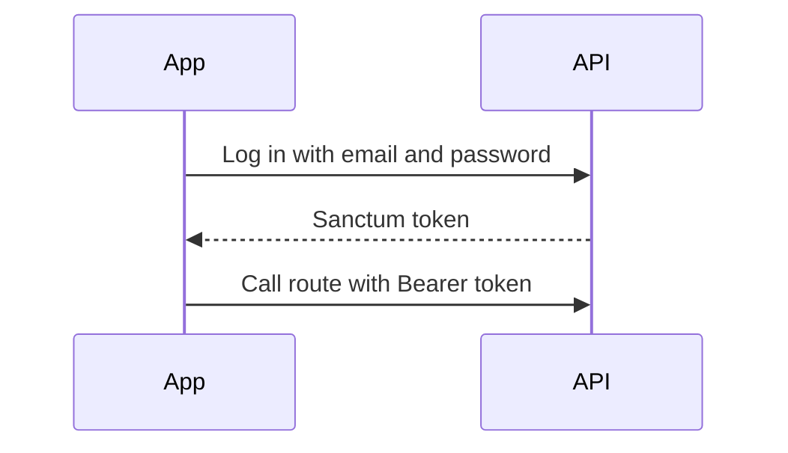
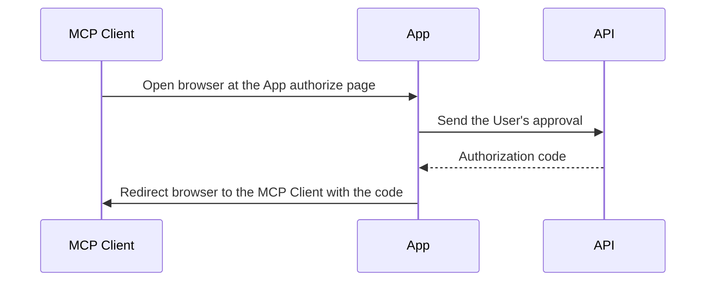

# Auth

Status: wip
Updated: 2026-10-07

The API runs two auth setups. Sanctum covers the App with straightforward bearer authentication. Passport is Laravel's OAuth implementation, which MCP Clients such as claude.ai and Claude Desktop use to connect to the API MCP Servers. The step by step login is the [MCP Login flow](/flows/auth/McpLogin).

## Diagrams

Sanctum, for regular App usage with a bearer token.

Passport, for MCP Clients with OAuth approval through the App.

