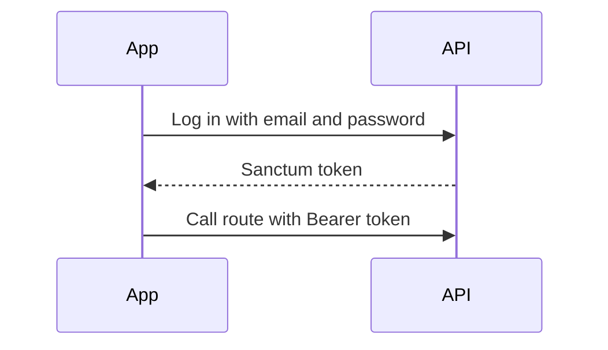
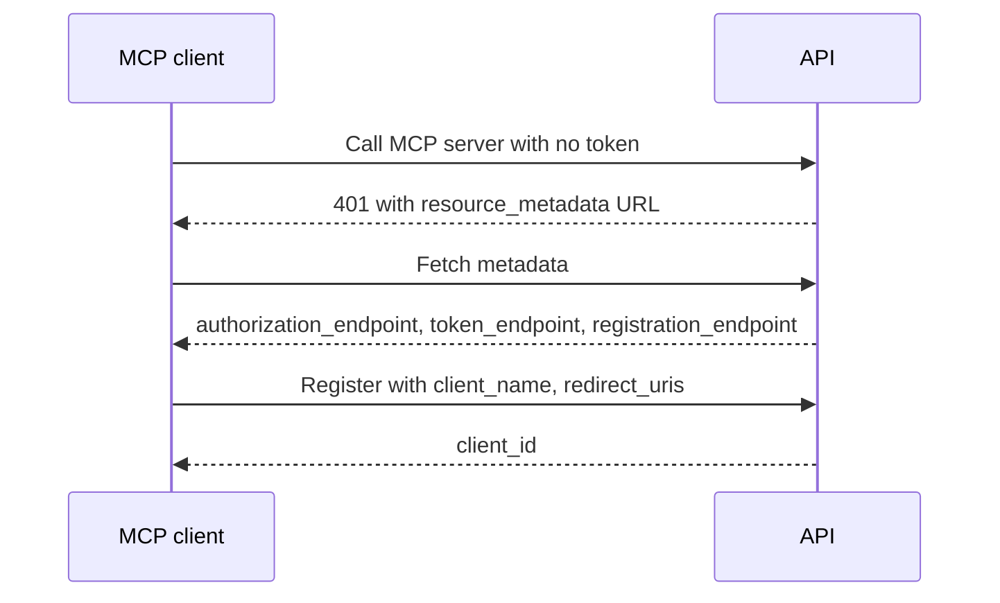
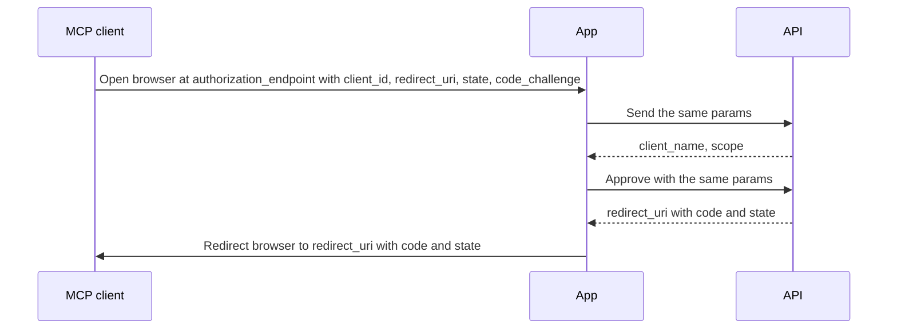
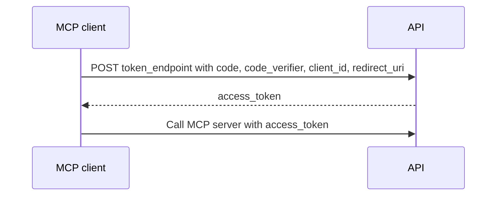

# Auth

Status: wip
Updated: 2026-10-07

The API runs two auth setups. Sanctum covers the App with straightforward bearer authentication. Passport is Laravel's OAuth implementation, which MCP clients such as claude.ai and Claude Desktop use to connect to the MCP servers. The step by step login is the [MCP Login flow](/flows/auth/McpLogin).

## Flow

1. The User adds the MCP server URL to the MCP client.
2. The MCP client calls the MCP server URL with no Authorization header.
3. The API answers 401 with a WWW-Authenticate header carrying a resource_metadata URL.
4. The MCP client fetches the resource_metadata URL and reads authorization_servers and scopes_supported.
5. The MCP client fetches the authorization server metadata from the API and reads authorization_endpoint, token_endpoint, registration_endpoint, code_challenge_methods_supported, grant_types_supported and scopes_supported. The authorization_endpoint holds the App authorize page address.
6. The MCP client POSTs client_name, redirect_uris, logo_uri and client_uri to the registration_endpoint. The API checks each redirect_uris entry against its permitted domains, stores the client, and returns a client_id.
7. The MCP client generates a random state, a random code_verifier, and a code_challenge, which is the hash of the code_verifier.
8. The MCP client opens the browser at the authorization_endpoint, the App authorize page, with response_type=code, client_id, redirect_uri, scope, state, code_challenge and code_challenge_method=S256.
9. The App sends those same eight params to the API. The API checks the client_id exists and the redirect_uri matches one of the registered redirect_uris, then returns the client_name and scope for the consent screen.
10. The App shows the login screen if the User is not signed in, then the consent screen showing the client_name and scope.
11. The User approves.
12. The App sends the approval to the API with client_id, redirect_uri, scope, state, code_challenge and code_challenge_method.
13. The API issues a code, stores it with the code_challenge, and answers the App with the redirect_uri plus the code and the state.
14. The App sends the browser to the redirect_uri with the code and state added as query params.
15. The MCP client that started the flow, such as Claude Desktop or Claude Code, receives the code and state at the redirect_uri and handles everything from here itself.
16. The MCP client checks the returned state equals the state from step 7.
17. The MCP client POSTs grant_type=authorization_code, code, redirect_uri, client_id and the code_verifier from step 7 to the token_endpoint.
18. The API hashes the code_verifier, checks it equals the stored code_challenge, and returns an access_token and a refresh_token.
19. The MCP client calls the MCP server with the access_token as a Bearer token in the Authorization header.

## Diagrams

Sanctum.

Passport.

Discovery and registration.

Authorization.

Token.

