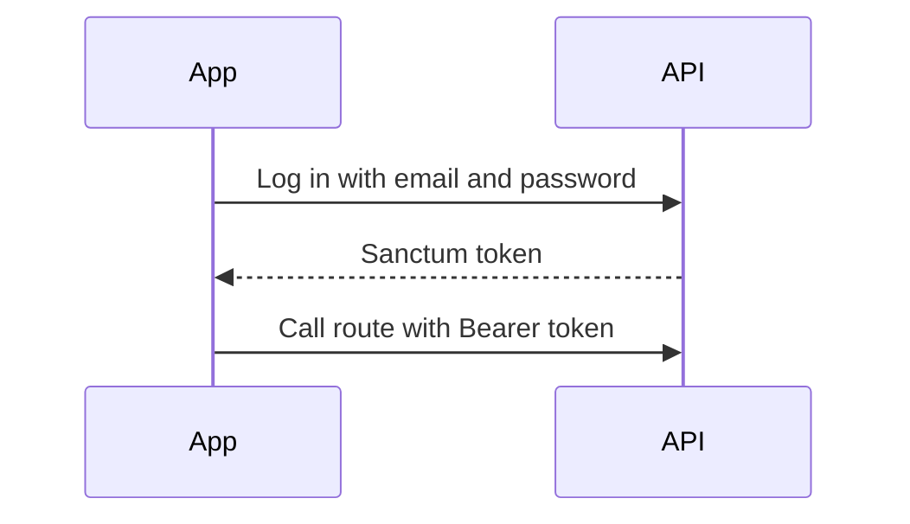
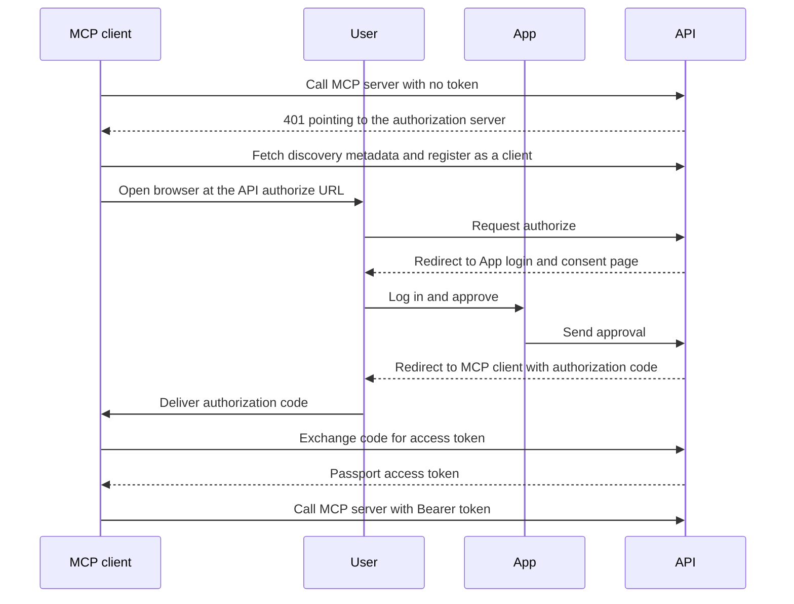

# Auth

Status: wip
Updated: 2026-10-07

The API runs two auth setups. Sanctum covers the App with straightforward bearer authentication. Passport is Laravel's OAuth implementation, which MCP clients such as claude.ai and Claude Desktop use to connect to the MCP servers.

## Diagrams

Sanctum.

Passport.

