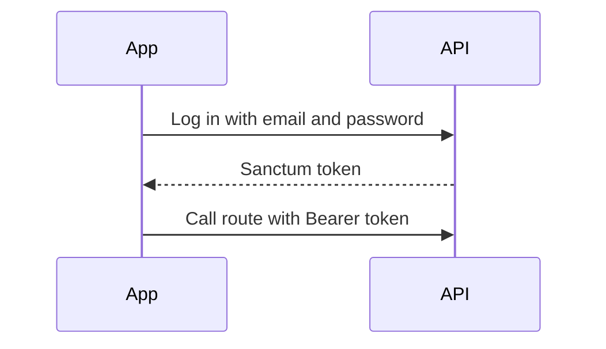
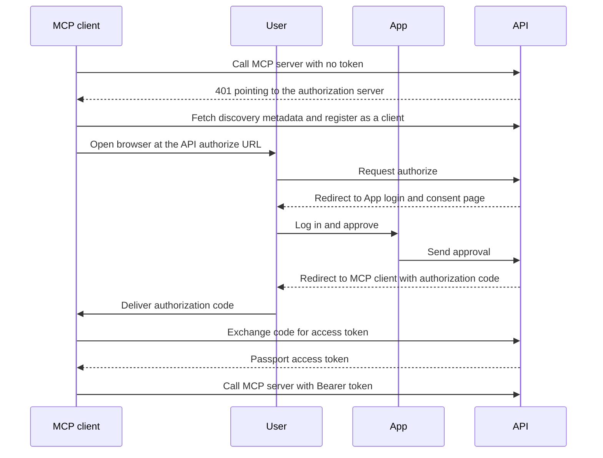

# Auth

Status: wip
Updated: 2026-10-07

The API authenticates with two systems side by side. Sanctum covers the App and the admin App. Passport covers the MCP servers.

## Sanctum and Passport

| | Sanctum | Passport |
| --- | --- | --- |
| Used by | App, admin App | MCP clients such as claude.ai and Claude Desktop |
| Protects | Regular API routes | User MCP server, admin MCP server |
| Credential | Bearer token from the API login | OAuth access token |
| Login screen | App | App |
| User approval | None, the App is first party | Consent screen |

## Why Sanctum

- The App is first party. The User logs in with email and password and the API returns a bearer token, with no consent step.
- A token is a stored record, so logout and refresh revoke exactly one token.
- The same login serves a web App and a mobile App.
- Sanctum is not an OAuth server. An MCP client could only use Sanctum if the User pasted a token into the client by hand.

## Why Passport

- MCP clients authenticate with OAuth. claude.ai and Claude Desktop take no custom header. The User pastes the server URL, logs in, approves, and is connected.
- Passport is the OAuth server. The MCP package adds the discovery and client registration endpoints a client looks for.
- Each connected MCP client holds its own token, so revoking one leaves the others working.
- Both MCP servers share the one Passport login. The admin MCP server also requires the admin role, the same as the admin API routes.

## Passport login runs through the App

The API serves no html pages. Passport's login and consent screens would render from the API, so the authorize step redirects the User's browser to the App instead. The App signs the User in, shows the consent screen, and sends the approval back to the API. The API then redirects the browser to the MCP client with an authorization code, and the MCP client exchanges the code for an access token.

## Diagrams

Sanctum.

Passport.

