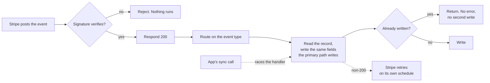

# Stripe Webhooks

Status: done
Updated: 2026-09-29

Every Stripe event the API listens for arrives at one endpoint. The flows each name the event that backs them up and say the same write runs, and this is where the endpoint, the verification and the idempotency rule live once rather than six times.

## The endpoint

One route, one signing secret, every event. Stripe posts the raw body and a signature header, and the handler verifies the signature against the signing secret before reading anything out of the payload. An event that fails verification is rejected and nothing runs.

Respond before doing the work. Stripe treats a slow handler the same as a failed one, retries on its own schedule for up to a few days, and a handler that does its writing inline makes every retry do them again. Acknowledge, then write.

A non-200 is a retry. That is the safety net behind every backstop the flows describe, and it is also why a handler that throws on a duplicate is worse than one that returns early.

## Idempotency

Every handler runs at least once and may run many times. The same event arrives twice on a Stripe retry, and on the two events that have a sync call racing them the write may already have landed from the App's side.

So no handler assumes it is writing first. Each one reads the record it is about to write, writes the same fields the primary path writes, and returns without error when the values are already there. Nothing keys off whether a record existed beforehand.

## Events

| Event | What it writes | Primary path |
| --- | --- | --- |
| `checkout.session.completed` | API Subscription, API Payment Method, both Stripe defaults | [Subscription Create Submit](#flows/subscription/stripe/Create3Submit) |
| `customer.subscription.updated` | API Subscription, cancelled marker, end date, plan, interval | [Cancel](#flows/subscription/stripe/Cancel), [Resume](#flows/subscription/stripe/Resume), [Update](#flows/subscription/stripe/Update) |
| `payment_method.detached` | Clears the API Payment Method's brand and last4 | [Payment Method Delete](#flows/payment-method/stripe/Delete) |
| `setup_intent.succeeded` | API Payment Method, both Stripe defaults | [Payment Method Update Submit](#flows/payment-method/stripe/Update2Submit) |

One handler covers `customer.subscription.updated` for all three subscription flows. The event carries the same fields whichever one produced it, so the handler reads the Stripe Subscription and writes what it finds rather than branching on which flow ran.

## Racing the sync call

Two flows write from the browser and from a webhook, subscription create and payment method update. Neither order is guaranteed.

The sync call exists because the User is waiting and needs an answer. The webhook exists because the browser can be closed, sent to a bank and never come back, or die after the confirm. Both write the same fields, so whichever lands second rewrites the same values.

The one asymmetry is the address on a payment method update. A Stripe Setup Intent carries a Stripe Payment Method and nothing else, so the webhook has no address to write and the sync call is the only path that writes it.

## Events with no flow behind them

Stripe fires these whether or not anything listens, and nothing in the flows handles them yet.

| Event | Why it matters |
| --- | --- |
| `invoice.paid` | The renewal that keeps a Stripe Subscription live. Nothing reads it, so the API learns about a renewal only through `customer.subscription.updated`. |
| `invoice.payment_failed` | The start of dunning. The Stripe Subscription moves to `past_due` and the User has to be sent somewhere that can settle it. |
| `customer.subscription.deleted` | The end of a cancelled term, and a Stripe Dashboard deletion. The API Subscription is counted as subscribed until its stored end date passes, so nothing breaks, but no event clears it. |

A Stripe Subscription created or changed in the Stripe Dashboard lands on the same `customer.subscription.updated` handler as the flows, so an admin acting there is already covered. Everything else in this table is open.

## Local development

The Stripe CLI container forwards events inward to the API, so a local endpoint receives the same payloads and the same signature header as production with its own signing secret. See the [Docker setup](#docs/setup/DockerSetup) for the container.
