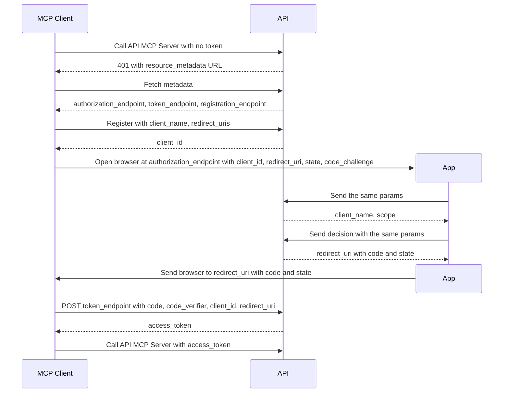

# MCP Login

Status: wip
Updated: 2026-10-07

## Description

A User connects an MCP Client, such as Claude Desktop or Claude Code, to the API MCP Server by signing in and approving it in the App. The MCP Client ends with an access token for that User.

## Terms

| Term | Description |
| --- | --- |
| API | The back end. Holds the API records and talks to the providers. |
| API MCP Server | The MCP server the API exposes, one for Users and one for admins. |
| App | The front end the User is looking at, web or mobile. |
| MCP Client | The program a User connects to the API MCP Server, such as Claude Desktop or Claude Code. |
| User | The human using the App. Never the App and never the API. |

## Requirements

- A User connects an MCP Client by pasting the API MCP Server URL.
- The MCP Client finds where to log in without any setup.
- Each MCP Client registers itself and gets its own client_id.
- The User signs in through the App, never through the API.
- The consent screen names the MCP Client and the access it asks for.
- The User can approve or deny.
- Nothing goes back to the MCP Client until the User decides.
- Only the MCP Client that started the login can turn the code into a token.
- An expired access token renews without the User logging in again.

## Flow

1. MCP Client calls the API MCP Server URL with no Authorization header.
2. API answers 401 with a WWW-Authenticate header carrying a resource_metadata URL.
3. MCP Client reads the discovery metadata.
   1. Fetches the resource_metadata URL and reads authorization_servers and scopes_supported.
   2. Fetches the authorization server metadata and reads authorization_endpoint, token_endpoint, registration_endpoint, code_challenge_methods_supported, grant_types_supported and scopes_supported. The authorization_endpoint holds the App authorize page address. See the note below.
4. MCP Client registers with the API.
   1. POSTs client_name, redirect_uris, logo_uri and client_uri to the registration_endpoint.
5. API stores the MCP Client.
   1. Checks each redirect_uris entry against its permitted domains. An entry outside them fails and nothing is stored.
   2. Returns a client_id.
6. MCP Client opens the browser at the App authorize page.
   1. Generates a random state, a random code_verifier, and a code_challenge, the hash of the code_verifier.
   2. Opens the authorization_endpoint with response_type=code, client_id, redirect_uri, scope, state, code_challenge and code_challenge_method=S256.
7. App sends the response_type, client_id, redirect_uri, scope, state, code_challenge and code_challenge_method to the API.
8. API checks the request.
   1. Checks the client_id exists and the redirect_uri matches a registered redirect_uris entry.
   2. Returns the client_name and scope. An unknown client_id or a redirect_uri mismatch returns an error. The App shows the error and never redirects.
9. App shows the login screen if the User is not signed in, then the consent screen showing the client_name and scope.
10. App sends the User's decision to the API with the client_id, redirect_uri, scope, state, code_challenge and code_challenge_method.
11. API issues the code.
    1. Stores the code with the code_challenge.
    2. Answers the App with the redirect_uri plus the code and state. A denial answers with the redirect_uri plus error=access_denied and state.
12. App sends the browser to the redirect_uri with the answer added as query params.
13. MCP Client receives the code and state at the redirect_uri and handles everything from here itself. A state that differs from the one generated in 6.1 discards the code.
14. MCP Client exchanges the code.
    1. POSTs grant_type=authorization_code, code, redirect_uri, client_id and the code_verifier from 6.1 to the token_endpoint.
15. API issues the tokens.
    1. Hashes the code_verifier and checks it equals the stored code_challenge.
    2. Returns an access_token and a refresh_token. A wrong code_verifier, or a used or expired code, returns an error and no token.
16. MCP Client calls the API MCP Server with the access_token as a Bearer token in the Authorization header.
    1. An expired access_token returns 401. The MCP Client POSTs grant_type=refresh_token, refresh_token and client_id to the token_endpoint for a new access_token.

## Diagram

## Notes

### Note on 3.2 - why the authorize address is the App

The App over the API, because the API serves no html pages. The discovery metadata names the App authorize page as the authorization_endpoint, so the login and consent screens render in the App and the API only answers JSON.

### Note on 6.1 - state and code_verifier

The state ties the answer in step 13 to the request in step 6, so the MCP Client ignores an answer it did not ask for. The code_challenge is sent first and the code_verifier last, so a stolen code is useless to anyone but the MCP Client that generated both.

## Todo

- The scopes shown on the consent screen are not defined.
- Revoking a connected MCP Client is not covered.
- How often an MCP Client registers is not known.
