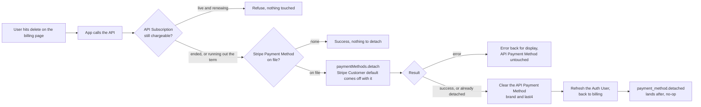

# Payment Method Delete - Stripe

Status: built
Updated: 2026-09-29

## Description

A User removes the Stripe Payment Method held against them, once the Stripe Subscription can no longer be charged. Removal is permanent, and a User who subscribes again later enters a Stripe Payment Method from scratch.

## Requirements

- Authenticated Users only.
- Remove the Stripe Payment Method on file.
- The billing page shows the control only when a Stripe Payment Method is on file.
- Allowed only when nothing further is going to be billed. A Stripe Subscription that has ended qualifies, so does one that is cancelled and running out the paid term.
- Refused while the Stripe Subscription is live and renewing.
- The App shows the control whenever a Stripe Payment Method is on file, and tells the User why when nothing can be removed yet. The API decides it again on every request.
- Removal takes the Stripe Payment Method off the Stripe Customer along with the Stripe Customer's default.
- Clear the API Payment Method's brand and last4.
- Removal is permanent. The same card entered again is a different Stripe Payment Method.
- Nothing is charged and no invoice is created.
- The response is the answer. Nothing settles afterwards, so there is nothing to poll.

## Flow

1. App shows the delete control on the billing page, only when a Stripe Payment Method is on file. Refusing in the App is display, the API reads the same rule again on the request.
   1. Tell the User why nothing can be removed yet while the Stripe Subscription is live and renewing. Nothing further is going to be billed once it has ended, or while it is cancelled and running out the paid term.
2. App calls the API when the User hits delete. No body, the Stripe Payment Method is resolved from the API User.
3. API removes the Stripe Payment Method.
   1. Re-read the API Subscription and refuse while anything is still going to be billed. See the note below.
   2. Return a success when nothing is on file, already removed or never there. There is nothing to detach, and a double submit, a second tab and a direct call all land here.
   3. Detach the Stripe Payment Method from the Stripe Customer. The Stripe Customer's `invoice_settings.default_payment_method` comes off with the detach, so there is no separate unset call. One Stripe already holds as detached, from a Stripe Dashboard removal or a retried request, is not an error.
   4. Error back for display when Stripe refuses the detach. The API Payment Method is left as it is and the User retries.
   5. Clear the API Payment Method's brand and last4. See the note below.
4. App refreshes the Auth User, and the billing page comes back with no Stripe Payment Method on file and no delete control.
   1. Read the new state off the refreshed Auth User rather than the response body, since payment method state is spread across flags the Auth User carries and the response holds only the one record.
5. API takes `payment_method.detached` as a no-op, since the API Payment Method is already clear.

## Diagram

## Notes

### Detach over delete

Stripe has no delete for a Stripe Payment Method. Past charges, invoices and refunds reference the Stripe Payment Method by id, so Stripe nulls `customer` on it and keeps the object retrievable. A detached Stripe Payment Method can never be attached to a Stripe Customer again, which is what makes removal here permanent. The same card entered later produces a new Stripe Payment Method with a new id.

### The gate is chargeability, not subscription status

Cancelled with the paid term still running and ended both mean no invoice is coming, and both allow removal. Keying on a live Stripe Subscription instead locks a cancelled User out of removing their Stripe Payment Method for the rest of a term they already paid for. Refusing while a renewal is still coming is the other half of the same rule, since a renewal with nothing on file books a failed payment and puts a User into dunning over a Stripe Payment Method they removed on purpose.

### Nothing to wait on

There is no Stripe Setup Intent, no confirm and no bank challenge, so nothing can settle after the response and there is nothing to poll. That is what separates this from the [payment method update submit flow](#flows/payment-method/stripe/Update2Submit), where the browser confirms first and the writes follow.

### Note on 3.1 - a Stripe Subscription resumed mid-request

A User who resumes the Stripe Subscription in another tab between the page rendering and the request hits the same re-read here. The gate refuses it the same as a Stripe Subscription that was never cancelled.

### Note on 3.5 - when Stripe detaches and the API Payment Method write fails

The Stripe Payment Method is gone at Stripe and the billing page still shows a brand and last4. Nothing renews, since the gate only passes when nothing further is billed, so there is no billing consequence. A retry takes the already detached path and clears the API Payment Method.

## Todo

- Multiple Stripe Payment Methods on a Stripe Customer. A Stripe Customer should never hold more than one, but the API has no way to detect one that accumulates outside the app's control without reconciling every API User holding a Stripe id and no Stripe Payment Method against Stripe directly. Detaching every Stripe Payment Method on the Stripe Customer at delete time is out of scope for now.
