# Payment Method Update - Stripe (Payment Element)

Status: done
Updated: 2026-09-25

## Description

A User puts a Stripe Payment Method on file from the account pages, entered in a Stripe Payment Element alongside a billing address, whether or not one is already held against them. Confirming stores the Stripe Payment Method and an API sync call is what makes it the one on file, and nothing is charged along the way.

This is the housekeeping case, a User in good standing putting a Stripe Payment Method on file or swapping one for another. A User whose renewal has failed is a different flow with a different answer, and is not resolved here.

## Terms

| Term | Description |
| --- | --- |
| API | The back end. Holds the API records and talks to the providers. |
| API Payment Method | The API record holding the Stripe Payment Method's brand and last4. |
| API User | The User's record on the API side. |
| App | The front end the User is looking at, web or mobile. |
| Auth User | The signed in User's data held by the App. |
| Stripe Billing Address Element | The Stripe Element collecting the billing address and name. |
| Stripe Customer | The Stripe object holding the User's id, address and saved Stripe Payment Methods. |
| Stripe Element | A Stripe UI component mounted by the App. |
| Stripe Payment Element | The Stripe Element collecting the Stripe Payment Method. |
| Stripe Payment Method | The payment method at Stripe, saved against the Stripe Customer. |
| Stripe Setup Intent | The Stripe object that stores a Stripe Payment Method against a Stripe Customer without charging it. |
| Stripe Subscription | The subscription at Stripe. |
| User | The human using the App. Never the App and never the API. |

## Requirements

- Authenticated Users only.
- Put a Stripe Payment Method on file whether or not one is already there. The page takes an addition and a replacement on the same path.
- The billing page links here for every authenticated User, and the route carries no guard beyond auth.
- Two step wizard, the billing address and name first, followed by the payment method.
- Collect the address with the Stripe Billing Address Element, so field layout and country rules come from Stripe.
- Collect the Stripe Payment Method with the Stripe Payment Element, mounted and ready when the page opens.
- Style both Stripe Elements with the App's own appearance so the page matches the rest of the App.
- Both forms open empty. Nothing is prefilled from what is already held.
- Verify the address resolves to a real tax jurisdiction before saving it. An address Stripe cannot place is refused and no defaults move.
- Handle bank authentication challenges (3DS), including one that takes the User off the page and returns them.
- A refused Stripe Payment Method leaves the User on the page to correct it, with nothing changed anywhere.
- Make the new Stripe Payment Method the default for both the Stripe Customer and the Stripe Subscription, and remove the old one.
- Write the address and name to the Stripe Customer, where every renewal invoice reads them for tax.
- Write the API Payment Method's brand and last4 for display.
- An API sync call does the work while the User waits, and a Stripe webhook runs the payment method writes as a backstop.
- Mark the Stripe Payment Method so it can be offered back to the User later, since subscribe reads the Stripe Customer's saved Stripe Payment Methods.
- Nothing is charged and no invoice is created. The new Stripe Payment Method is what the next renewal invoice bills.
- Nothing here settles an invoice a failed renewal left open, or reads whether there is one. A User behind on payment is resolved elsewhere. See the note below.

## Flow

1. User opens the payment method page. Every authenticated User can open it, so there is nothing to check before the page loads.
   1. The App asks the API for a Stripe Setup Intent on load, without waiting for the User to do anything. See the note below.
   2. Load the API User's Stripe Customer id and create the Stripe Customer when there isn't one, saving the returned id. A User who has never subscribed reaches this page, so a missing Stripe Customer is the first add rather than a broken state. See the note below.
   3. Create the Stripe Setup Intent with the Stripe Customer and `usage` set to `off_session`. The renewal charges with nobody at the keyboard, and the mandate that allows it is what `off_session` sets up.
   4. No amount, no price, nothing about the Stripe Subscription. A Stripe Setup Intent only ever stores a Stripe Payment Method.
   5. Stripe erroring on the create errors back for display. Without a secret there is nothing to mount, so the page cannot continue.
   6. Return the client secret.
2. The App mounts both Stripe Elements against that secret. They go up together once the loading state drops and the containers exist, and the steps take it from there.
   1. Load stripe.js if it isn't already on the page.
   2. Build an Elements instance off the client secret, with the same appearance and locale objects the rest of the App's Stripe Elements take. Neither `mode` nor `currency` is passed, Stripe reads what it needs off the Stripe Setup Intent.
   3. The appearance is a snapshot taken when the instance is created. A Stripe Element has no access to the page's own custom properties, so a colour scheme or breakpoint change is pushed into the mounted instance rather than cascading into it.
   4. Create the Stripe Billing Address Element in billing mode with no `defaultValues`. Both forms open empty, so there is nothing to seed and nothing to wait on before the mount.
   5. Country is an ISO alpha-2 select and the field layout follows the country, so the shape of an address is Stripe's problem rather than a hand rolled form's. Labels, postal formats and whether a region field appears at all come with it.
   6. Neither `contacts` nor `customerSessionClientSecret` is passed to the Stripe Billing Address Element, so it stays a plain form and never renders the addresses Stripe has saved against the Stripe Customer.
   7. The two Stripe Elements do not interact. The Stripe Billing Address Element's value is held by the App and travels to the sync call, and the Stripe Payment Element collects its own billing details for the bank. See the note below.
   8. A step that is not open hides its container, it never removes it. Taking the container out of the document tears the mount down and the Stripe Element does not come back on its own.
   9. Anything that stops either mount, a dead stripe.js among them, shows the failure. An empty form with a live submit button under it is the one outcome to avoid.
3. Address step. The User fills the Stripe Billing Address Element and presses continue.
   1. The change event reports `complete` along with the value. Continue stays disabled until the value is complete, and nothing has left the browser at any point.
   2. Continue holds the value in the App and opens the payment step. There is no call to Stripe and no call to the API, so the address is still only in the browser.
   3. The Stripe Billing Address Element always renders a name field and there is no turning it off. Setting `display.name` only chooses between a full name, a split first and last, or an organization.
   4. Going back to the address step reopens the same instance with everything typed into it still there.
4. Payment step. The User enters the Stripe Payment Method and submits. The App confirms the Stripe Setup Intent with a `return_url`, `redirect` set to `if_required`, and `allow_redisplay` set to `always`.
   1. A bank challenge either runs in a dialog and resolves inline, or sends the User away to the bank and back to the return url. Nothing is being charged and the bank can still want the Stripe Payment Method verified.
   2. A refusal leaves the Stripe Setup Intent confirmable and both Stripe Elements standing. The User corrects the Stripe Payment Method and submits again on the same secret, with no new Stripe Setup Intent.
   3. The return url is the page's own url with Stripe's return keys stripped off it. A second attempt that carried the first attempt's secret back would resume a Stripe Setup Intent that is already spent.
   4. Setting `allow_redisplay` to `always` is what lets subscribe offer this Stripe Payment Method back to the User later. See the note below.
5. Landing back from a bank. The page loads with no state and Stripe has appended the Stripe Setup Intent's secret to the url.
   1. Read the secret and retrieve the Stripe Setup Intent rather than opening a second one. A create here spends a Stripe Setup Intent that nothing mounts and buries a challenge the User already passed.
   2. The address is gone. It was only ever held in the App, so the page comes back on the address step with both Stripe Elements empty and the User walks the two steps again.
   3. Anything other than a success remounts against the same secret and shows what came back, so the User tries again without a new Stripe Setup Intent.
6. A confirmed Stripe Setup Intent attaches the Stripe Payment Method to the Stripe Customer and that is all. It is not the default and nothing will charge it. Attaching and defaulting are two separate things, and this is where the flow is easy to get wrong.
7. The App posts the Stripe Setup Intent's id and the address to the API sync call as soon as the confirm resolves. Stripe fires `setup_intent.succeeded` carrying the same Stripe Setup Intent, and that handler runs the payment method writes without the address, which it has no way to read.
   1. The sync call checks that the Stripe Setup Intent belongs to the authenticated User's Stripe Customer and that it succeeded, and rejects anything else. The webhook is verified by its signature.
   2. Validate the basic shape of the address. The check does not need to be anything fancy, since the Stripe Billing Address Element has already enforced the country's own field rules and Stripe verifies the address properly on the next call. This is a backstop for a request that did not come from the Stripe Element, not the validation the User sees, and nothing here should be built to render field errors.
   3. Update `address` and `name` on the Stripe Customer with `tax[validate_location]` set to `immediately`, so the address has to resolve to a valid tax jurisdiction. The `name` field is `customer.name`, which sits alongside `address` on the Stripe Customer rather than inside it. See the note below.
   4. Send every address field on every save, empty where the User left it blank. Stripe only touches what it is sent, so a field left out of the call keeps whatever was on the Stripe Customer before.
   5. An address Stripe cannot place errors back for display and no default moves. The new Stripe Payment Method is attached and the old one is still the one billing, which is the state the User arrived in. See the note below.
   6. Set `invoice_settings.default_payment_method` on the Stripe Customer to the new Stripe Payment Method. That is what a future invoice reads.
   7. Set `default_payment_method` on the Stripe Subscription to the same Stripe Payment Method. A Stripe Subscription level default overrides the Stripe Customer level one, so an old Stripe Payment Method left pinned there bills at the next renewal. Nothing fails at update time, it surfaces a month later. A User with no Stripe Subscription skips this and the rest of the writes still run.
   8. Detach the old Stripe Payment Method, otherwise every visit leaves another one sitting on the Stripe Customer. One that is already detached is not an error, and an addition has nothing to detach.
   9. Write the API Payment Method's brand and last4.
   10. Both paths are idempotent. The same Stripe Setup Intent can arrive twice on either.
   11. Every write lands before the sync call responds, since the App reads the result off the Auth User it refreshes next.
8. The sync call is what the User waits on, so its response is the answer and there is nothing to poll for.
   1. On success the App refreshes the Auth User and sends the User back to billing, where the new brand and last4 are what shows.
   2. On failure the User is held on the page with the message. The Stripe Setup Intent is confirmed and kept, so submitting again retries the sync rather than asking for the Stripe Payment Method a second time.
   3. The webhook is not a second thing to wait for. It covers the User who closed the tab or never came back from the bank, and lands as a no-op when the sync call already ran.
9. A Stripe Setup Intent is opened for everyone who lands on the page. There is no Stripe Subscription and no API record behind an unconfirmed one, and Stripe ages it out on its own, so there is nothing to clean up.
10. Nothing is charged, no invoice is created and no proration happens. The new Stripe Payment Method is what the next renewal invoice bills, and the address change applies to the tax on that same invoice.

## Diagram

```mermaid
flowchart LR
    A[User opens the payment method page] -->|on load| B["POST /payment-method/intent"]
    B --> C[Load or create the Stripe Customer,<br/>save the returned id]
    C --> D["setupIntents.create<br/>usage: off_session"]
    D --> E[Return the client secret]

    E --> F["Elements off the secret. Mount the Stripe<br/>Billing Address Element, empty, and the<br/>Stripe Payment Element"]
    F --> G[Address step. Continue gated on complete.<br/>Value held in the App, nothing sent]
    G --> H[Payment step. User submits]
    H --> I["confirmSetup<br/>allow_redisplay: always"]
    I --> J{Result}

    J -->|refused| H
    J -->|challenge redirect| J1["Back at the return url<br/>retrieveSetupIntent"]
    J1 -->|not succeeded| F
    J1 -->|succeeded, address gone| F
    J -->|succeeded| K

    K["Stripe Payment Method attached to the<br/>Stripe Customer, nothing defaulted"] --> L1["POST /payment-method/sync<br/>Stripe Setup Intent id and the address"]
    K --> L2["Stripe fires<br/>setup_intent.succeeded"]

    L1 --> M["customers.update, every address field sent<br/>address, name, validate_location"]
    M --> N{Result}
    N -->|error| N1["Relay the error. No default moves,<br/>the old Stripe Payment Method still bills"]
    N -->|success| O

    O["Stripe Customer<br/>invoice_settings.default_payment_method"] --> P["Stripe Subscription<br/>default_payment_method"]
    L2 --> O
    P --> Q[Detach the old Stripe Payment Method]
    Q --> R["API Payment Method<br/>brand and last4"]
    R --> S[Refresh the Auth User]
    S --> T[Back to billing]
    T --> U["Next renewal invoice bills the new Stripe<br/>Payment Method and computes tax<br/>off the new address"]
```

## Notes

### Both Stripe Elements on a page of their own

A bank challenge can send the browser away and bring it back to a cold url with the secret on it. A dedicated page comes back up as itself, reads the secret and retrieves the Stripe Setup Intent. A dialog or an inline section has to work out that it is mid flow and rebuild the state it was in before the redirect. Same result, more work.

### The Stripe Billing Address Element over a form of the App's own

Setting `tax[validate_location]` to `immediately` makes address correctness a hard requirement rather than a nicety, and getting there by hand means an ISO alpha-2 country list, per country subdivision lists, per country postal rules and labels, and translations for all of it. Stripe ships that and keeps it current. The cost is that validation stops being the App's, so field rules, field labels and their translations go with the form.

### The address travels with the Stripe Payment Method

The address is collected here and nowhere else in the account pages, so a User correcting a tax address walks the payment method step as well. One page collects both, which is why the Stripe Customer's address and the Stripe Payment Method on file always move together.

A blank address form is the consequence. Every submit sends a full address and Stripe writes what it is sent, so the tax address that bills the next renewal invoice is whatever was typed on the last visit.

### The address is not on the Stripe Setup Intent

A Stripe Setup Intent carries a Stripe Payment Method and nothing else, so the webhook has no address to write. The sync call is the only path that writes the Stripe Customer's address, and the webhook covers the payment method writes alone. A User who confirms at the bank and never comes back ends up with the Stripe Payment Method on file and the address they typed discarded.

### The sync call alongside the webhook

Leaving the writes to the webhook alone puts the User in front of a spinner for something that has already succeeded, and the obvious thing to poll on, the last4, does not change when the same Stripe Payment Method is entered again. The sync call gives the page a straight answer to wait on. The webhook stays because the browser can be closed or sent to the bank and never come back, and the webhook is the only path that always arrives. Two writers is the cost and idempotency is what pays for it.

### One Stripe Payment Method on file

Detaching the old Stripe Payment Method keeps exactly one against the Stripe Customer, which is what a single brand and last4 on the API Payment Method can describe and what every screen showing the Stripe Payment Method assumes. Keeping a list buys a picker, a default marker and a delete path on every one of those screens.

### A past due User is not resolved here

This flow puts a Stripe Payment Method on file and stops. It does not look for an invoice a failed renewal left open, does not charge one, and does not report on one. A User who is behind on payment can walk through this whole flow, get a success, and still be past due at the end of it, because replacing a Stripe Payment Method does not prompt Stripe to retry anything.

That is deliberate. Resolving a failed renewal is a different job with a different answer. The Stripe Payment Method on file might be fine and only need a bank challenge cleared, in which case sending the User here to type a card in again asks them for something that was never the problem. It is also the one case where the User might need to be charged before they get their access back, and charging is not what this page does.

So a past due User defaults to billing until the App handles them. See the [subscription guards flow](../../subscription/Guards.md).

### Note on 1.1 - opening the Stripe Setup Intent on page load

The page does one job, so arriving on it is the User declaring intent already and a button asking for the same declaration is the second time. The Stripe Payment Element also cannot mount without a secret, so the call has to land before the form is usable whichever way it is triggered. A button would lower the number of abandoned Stripe Setup Intents rather than remove them, and an abandoned one costs nothing.

### Note on 1.2 - creating the Stripe Customer here

A User with no Stripe Subscription can put a Stripe Payment Method on file, so the Stripe Customer is created on the way in rather than assumed. That is what gives a cancelled User who removed their card a way back, since [resume](../../subscription/stripe/Resume.md) refuses without a Stripe Payment Method that resolves and this page is the only place to put one.

### Note on 2.7 - two Stripe Elements that do not compete

The Stripe Billing Address Element's value never reaches Stripe from the browser. It goes to the API, and the API writes it to the Stripe Customer. So the Stripe Payment Element keeps collecting its own billing details for the bank, both Stripe Elements stay mounted for the whole visit, and neither has to stand down for the other.

The Stripe Payment Method's `billing_details.address` is AVS data the bank checks against the Stripe Payment Method. Tax reads the Stripe Customer's address while one is set, and Stripe only falls back to `billing_details.address` when the Stripe Customer carries none. The two answer different questions off the same typing.

### Note on 4.4 - why allow_redisplay is set to always

Stripe only returns a saved Stripe Payment Method to a Stripe Checkout Session when its `allow_redisplay` is `always`. Left at the default, the Stripe Payment Method sits on the Stripe Customer and bills renewals correctly while subscribe cannot see it, so a User with a card on file gets asked for one again. See the [subscription create flow](../../subscription/stripe/Create.md).

### Note on 7.3 - what validate_location does not check

Setting `tax[validate_location]` to `immediately` returns an error and leaves the Stripe Customer unchanged when the address cannot be placed. What it does not check is registration. An address that resolves cleanly in a jurisdiction you are not registered in comes back with `automatic_tax` at `not_collecting` and bills zero tax, which you may still be liable for.

### Note on 7.5 - why the address write goes first

An address Stripe refuses stops the sync before any default moves, so the Stripe Customer and the Stripe Subscription still point at the Stripe Payment Method that was already billing and the old one is still attached. The new Stripe Payment Method is attached and idle, which costs nothing. The User corrects the address and submits again on the same confirmed Stripe Setup Intent, so the card is never asked for twice.

Running the defaults first would leave the opposite, a new Stripe Payment Method billing against a tax address that was never updated, which reads as a success on every screen.

## Todo

- Manual reconcile for a Stripe Payment Method that confirmed at Stripe where neither the sync call nor the webhook ran. Stripe holds the new Stripe Payment Method attached to the Stripe Customer, nothing is defaulted at either level, and the API still shows the old brand and last4, so the next renewal bills the old Stripe Payment Method and nothing on any screen says so. It takes both writers failing on the same update, and the webhook retries itself, so this is thin. Closing it means a sweep that finds succeeded Stripe Setup Intents whose Stripe Payment Method is not the Stripe Customer default and runs the same writes over them.
- An address that never reaches the Stripe Customer because the User confirmed at the bank and closed the tab. The webhook stores the Stripe Payment Method and has no address to write, so the two halves of one submit land apart and nothing surfaces it.
- Multiple Stripe Payment Methods on file. The flow assumes exactly one throughout.
- Tax IDs, VAT numbers and reverse charge.
- Address autocomplete. Stripe lends its Google Maps key when a Stripe Payment Element sits in the same Elements group, so it is available here, and turning it on is `autocomplete: { mode: 'google_maps_api' }` on the Stripe Billing Address Element.
