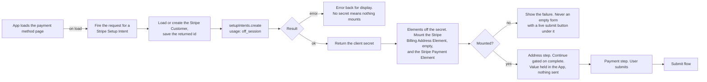

# Payment Method Update Collect - Stripe (Payment Element)

Status: done
Updated: 2026-09-29

## Description

A User opens the payment method page and the API hands out a Stripe Setup Intent for them to work against. The address and the Stripe Payment Method are one submit, split across two steps so the page stays readable. Both Stripe Elements mount together and nothing has left the browser by the time the User presses submit.

## Requirements

- Authenticated Users only.
- Put a Stripe Payment Method on file whether or not one is already there. The page takes an addition and a replacement on the same path.
- The billing page links here for every authenticated User, and the route carries no guard beyond auth.
- Two step wizard, the billing address and name first, followed by the payment method.
- Collect the address with the Stripe Billing Address Element, so field layout and country rules come from Stripe.
- Collect the Stripe Payment Method with the Stripe Payment Element, mounted and ready when the page opens.
- Style both Stripe Elements with the App's own appearance so the page matches the rest of the App.
- Both forms open empty. Nothing is prefilled from what is already held.

## Flow

1. App loads the payment method page. Every authenticated User can open it, so there is nothing to check first.
   1. Fire the request for a Stripe Setup Intent on load, without waiting for the User to do anything. See the note below.
2. API creates the Stripe Setup Intent.
   1. Load or create the Stripe Customer, and save the returned id. See the note below.
   2. Create the Stripe Setup Intent with the Stripe Customer and `usage` set to `off_session`. The renewal charges with nobody at the keyboard, and the mandate that allows it is what `off_session` sets up.
   3. Error back for display when Stripe refuses the create. No secret means nothing to mount.
   4. Return the Stripe Setup Intent's client secret.
3. App mounts both Stripe Elements against that secret, together, once the loading state drops and the containers they go into are in the document.
   1. Load stripe.js if it isn't already on the page.
   2. Build an Elements instance off the client secret, with the App's appearance and locale. Neither `mode` nor `currency` is passed, Stripe reads what it needs off the Stripe Setup Intent. See the note below.
   3. Create the Stripe Billing Address Element in billing mode with no `defaultValues`. Both forms open empty, so there is nothing to seed and nothing to wait on.
   4. Create the Stripe Payment Element. Neither Stripe Element has to stand down for the other, since the Stripe Billing Address Element's value never reaches Stripe from the browser. See the note below.
   5. Hide the container of a step that is not open, never remove it. Removing it tears the mount down and the Stripe Element does not come back.
   6. Show the failure when either mount fails. An empty form with a live submit button under it is the one outcome to avoid.
4. App collects the address.
   1. Gate continue on the Stripe Billing Address Element's change event, which carries the value and a `complete` flag.
   2. Hold the value in the App on continue and open the payment step. No call to Stripe, no call to the API, so the address is still only in the browser.
   3. Reopen the same instance when the User goes back, with everything typed into it still there.
5. App collects the payment method. The User enters the Stripe Payment Method and presses submit, which hands to the [submit flow](#flows/payment-method/stripe/Update2Submit).

## Diagram

## Notes

### Both Stripe Elements on a page of their own

A bank challenge can send the browser away and bring it back to a cold url with the secret on it. A dedicated page comes back up as itself, reads the secret and retrieves the Stripe Setup Intent. A dialog or an inline section has to work out that it is mid flow and rebuild the state it was in before the redirect. Same result, more work.

### The Stripe Billing Address Element over a form of the App's own

Setting `tax[validate_location]` to `immediately` makes address correctness a hard requirement rather than a nicety, and getting there by hand means an ISO alpha-2 country list, per country subdivision lists, per country postal rules and labels, and translations for all of it. Stripe ships that and keeps it current. The cost is that validation stops being the App's, so field rules, field labels and their translations go with the form.

The element always renders a name field and there is no turning it off. Setting `display.name` only chooses between a full name, a split first and last, or an organization.

### The address travels with the Stripe Payment Method

The address is collected here and nowhere else in the account pages, so a User correcting a tax address walks the payment method step as well. One page collects both, which is why the Stripe Customer's address and the Stripe Payment Method on file always move together.

A blank address form is the consequence. Every submit sends a full address and Stripe writes what it is sent, so the tax address that bills the next renewal invoice is whatever was typed on the last visit.

### What exists once the page has loaded

A Stripe Setup Intent is opened for everyone who lands on the page, carrying no amount, no price and nothing about the Stripe Subscription, since it only ever stores a Stripe Payment Method. There is no API record behind an unconfirmed one and Stripe ages it out on its own, so there is nothing to clean up.

### Note on 1.1 - opening the Stripe Setup Intent on page load

The page does one job, so arriving on it is the User declaring intent already and a button asking for the same declaration is the second time. The Stripe Payment Element also cannot mount without a secret, so the call has to land before the form is usable whichever way it is triggered. A button would lower the number of abandoned Stripe Setup Intents rather than remove them, and an abandoned one costs nothing.

### Note on 2.1 - creating the Stripe Customer here

A User who has never subscribed reaches this page, so a missing Stripe Customer is the first add rather than a broken state. That is what gives a cancelled User who removed their card a way back, since [resume](#flows/subscription/stripe/Resume) refuses without a Stripe Payment Method that resolves and this page is the only place to put one.

### Note on 3.2 - the appearance is a snapshot

The appearance object is read when the Elements instance is created. A Stripe Element has no access to the page's own custom properties, so a colour scheme or breakpoint change is pushed into the mounted instance rather than cascading into it.

### Note on 3.4 - two Stripe Elements that do not compete

The Stripe Billing Address Element's value never reaches Stripe from the browser. It goes to the API, and the API writes it to the Stripe Customer. So the Stripe Payment Element keeps collecting its own billing details for the bank, both Stripe Elements stay mounted for the whole visit, and neither has to stand down for the other.

The Stripe Payment Method's `billing_details.address` is AVS data the bank checks against the Stripe Payment Method. Tax reads the Stripe Customer's address while one is set, and Stripe only falls back to `billing_details.address` when the Stripe Customer carries none. The two answer different questions off the same typing.

Neither `contacts` nor `customerSessionClientSecret` is passed to the Stripe Billing Address Element, so it stays a plain form and never renders the addresses Stripe has saved against the Stripe Customer.

## Todo

- Address autocomplete. Stripe lends its Google Maps key when a Stripe Payment Element sits in the same Elements group, so it is available here, and turning it on is `autocomplete: { mode: 'google_maps_api' }` on the Stripe Billing Address Element.
