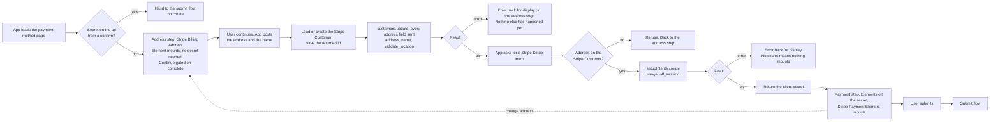

# Payment Method Update Collect - Stripe (Payment Element)

Status: built
Updated: 2026-09-30

## Description

A User opens the payment method page and walks two steps, the address first and the Stripe Payment Method after. The address is saved to the Stripe Customer when they continue, and only then does the API hand out a Stripe Setup Intent for the Stripe Payment Element to mount against. So the address is never carried in the browser past the step that collects it, and a Stripe Payment Method cannot exist against a Stripe Customer with no address.

## Requirements

- Authenticated Users only.
- Put a Stripe Payment Method on file whether or not one is already there. The page takes an addition and a replacement on the same path.
- The billing page links here for every authenticated User, and the route carries no guard beyond auth.
- Two step wizard, the billing address and name first, followed by the payment method.
- Collect the address with the Stripe Billing Address Element, so field layout and country rules come from Stripe.
- Save the address to the Stripe Customer on the way out of the address step, before any Stripe Setup Intent exists.
- Collect the Stripe Payment Method with the Stripe Payment Element, mounted when the payment step opens.
- Style both Stripe Elements with the App's own appearance so the page matches the rest of the App.
- Both forms open empty. Nothing is prefilled from what is already held.

## Flow

1. App loads the payment method page and opens the address step. Every authenticated User can open it, so there is no guard to run.
   1. Check the url for a returning redirect. A secret there is a User coming back from a bank challenge, so hand to the [submit flow](#flows/payment-method/stripe/Update2Submit) without creating.
   2. Mount the Stripe Billing Address Element. It needs no secret, so nothing is requested from the API to open this step. See the note below.
   3. Create the Stripe Billing Address Element in billing mode with no `defaultValues`. Both forms open empty, so there is nothing to seed and nothing to wait on.
   4. Gate continue on the Stripe Billing Address Element's change event, which carries the value and a `complete` flag.
2. App saves the address when the User continues, then asks for a Stripe Setup Intent. Two calls, in that order, and the payment step only opens once both land.
   1. Post the address and the name to the API. See the note below.
   2. Show the failure on the address step when the API refuses it, since that is the step carrying the fields the User has to correct.
   3. Ask for the Stripe Setup Intent once the address is saved.
3. API writes the address to the Stripe Customer.
   1. Load or create the Stripe Customer, and save the returned id. See the note below.
   2. Update `address` and `name` on the Stripe Customer with `tax[validate_location]` set to `immediately`. Every field goes on every save, empty where the User left it blank, since Stripe only touches what it is sent.
   3. Error back for display when Stripe cannot place the address. Nothing else has happened yet, so there is nothing to undo.
   4. Store nothing locally. The Stripe Customer holds the address and every renewal invoice computes tax off it.
4. API creates the Stripe Setup Intent.
   1. Refuse when the Stripe Customer has no address, and refuse the same way when there is no Stripe Customer at all, since one implies the other. Nothing is created here, the address call ahead of it is what makes the Stripe Customer. See the note below.
   2. Create the Stripe Setup Intent with the Stripe Customer and `usage` set to `off_session`. The renewal charges with nobody at the keyboard, and the mandate that allows it is what `off_session` sets up.
   3. Error back for display when Stripe refuses the create. No secret means nothing to mount.
   4. Return the Stripe Setup Intent's client secret.
5. App opens the payment step and mounts the Stripe Payment Element against that secret, once the container it goes into is in the document.
   1. Load stripe.js if it isn't already on the page.
   2. Build an Elements instance off the client secret, with the App's appearance and locale. Neither `mode` nor `currency` is passed, Stripe reads what it needs off the Stripe Setup Intent. See the note below.
   3. Create the Stripe Payment Element. Neither Stripe Element has to stand down for the other, since the Stripe Billing Address Element's value never reaches Stripe from the browser. See the note below.
   4. Hide the container of a step that is not open, never remove it. Removing it tears the mount down and the Stripe Element does not come back.
   5. Show the failure when the mount fails. An empty form with a live submit button under it is the one outcome to avoid.
   6. Reopen the address step with the same instance when the User goes back, with everything typed into it still there. Continuing again saves the address again and reuses the Stripe Setup Intent already held, since a Stripe Setup Intent carries no address.
6. App collects the payment method. The User enters the Stripe Payment Method and presses submit, which hands to the [submit flow](#flows/payment-method/stripe/Update2Submit).

## Diagram

## Notes

### Both Stripe Elements on a page of their own

A bank challenge can send the browser away and bring it back to a cold url with the secret on it. A dedicated page comes back up as itself, reads the secret and retrieves the Stripe Setup Intent. A dialog or an inline section has to work out that it is mid flow and rebuild the state it was in before the redirect. Same result, more work.

### The Stripe Billing Address Element over a form of the App's own

Setting `tax[validate_location]` to `immediately` makes address correctness a hard requirement rather than a nicety, and getting there by hand means an ISO alpha-2 country list, per country subdivision lists, per country postal rules and labels, and translations for all of it. Stripe ships that and keeps it current. The cost is that validation stops being the App's, so field rules, field labels and their translations go with the form.

The element always renders a name field and there is no turning it off. Setting `display.name` only chooses between a full name, a split first and last, or an organization.

### The address travels with the Stripe Payment Method

The address is collected here and nowhere else in the account pages, so a User correcting a tax address walks the payment method step as well. One page collects both, which is why the Stripe Customer's address and the Stripe Payment Method on file always move together.

A blank address form is the consequence. Every continue sends a full address and Stripe writes what it is sent, so the tax address that bills the next renewal invoice is whatever was typed on the last visit.

### Why the address is saved before the Stripe Setup Intent exists

The other order loses addresses. A bank challenge can take the browser away and never bring it back, and an address that is still sitting in the browser at that point is gone, while Stripe reports the Stripe Payment Method as stored either way. The User ends up with a card on file and the address they came to change untouched, and nothing on any screen says so. Writing it first removes the window rather than narrowing it.

It also puts Stripe's rejection on the step that owns the fields. The User fixes the address before a card has been asked for, instead of after clearing a bank challenge.

The cost is two calls on one continue and an address that stands even if the User then abandons the card step. Neither matters. The second write is the same write, and an address saved by a User who came to save an address is not a wrong state.

### What exists once the address is saved

A Stripe Customer carrying an address, and a Stripe Setup Intent carrying no amount, no price and nothing about the Stripe Subscription, since it only ever stores a Stripe Payment Method. There is no API record behind an unconfirmed one and Stripe ages it out on its own, so there is nothing to clean up.

### Note on 1.2 - the address step needs nothing from the API

The Stripe Billing Address Element is a plain form and mounts without a secret, so the page opens on a step that costs no call at all. Only the Stripe Payment Element needs one, which is why the Stripe Setup Intent is requested on the way into the payment step rather than on load.

### Note on 2.1 and 3.1 - creating the Stripe Customer here

A User who has never subscribed reaches this page, so a missing Stripe Customer is the first add rather than a broken state. That is what gives a cancelled User who removed their card a way back, since [resume](#flows/subscription/stripe/Resume) refuses without a Stripe Payment Method that resolves and this page is the only place to put one.

### Note on 4.1 - why the Stripe Setup Intent refuses without an address

The refusal is what makes the ordering a rule rather than a convention. No secret means no confirm, so a Stripe Payment Method cannot be stored against a Stripe Customer with no address by any path through the App.

It does not cover a Stripe Payment Method attached at the Dashboard, which arrives without passing through here at all. Nothing on this side can, which is why [subscribe](#flows/subscription/stripe/Create1Load) reads the Stripe Customer rather than trusting the invariant.

### Note on 5.2 - the appearance is a snapshot

The appearance object is read when the Elements instance is created. A Stripe Element has no access to the page's own custom properties, so a colour scheme or breakpoint change is pushed into the mounted instance rather than cascading into it.

### Note on 5.3 - two Stripe Elements that do not compete

The Stripe Billing Address Element's value never reaches Stripe from the browser. It goes to the API, and the API writes it to the Stripe Customer. So the Stripe Payment Element keeps collecting its own billing details for the bank, both Stripe Elements stay mounted once they are up, and neither has to stand down for the other.

The Stripe Payment Method's `billing_details.address` is AVS data the bank checks against the Stripe Payment Method. Tax reads the Stripe Customer's address while one is set, and Stripe only falls back to `billing_details.address` when the Stripe Customer carries none. The two answer different questions off the same typing.

Neither `contacts` nor `customerSessionClientSecret` is passed to the Stripe Billing Address Element, so it stays a plain form and never renders the addresses Stripe has saved against the Stripe Customer.

## Todo

- Address autocomplete. Stripe lends its Google Maps key when a Stripe Payment Element sits in the same Elements group, so it is available here, and turning it on is `autocomplete: { mode: 'google_maps_api' }` on the Stripe Billing Address Element.
