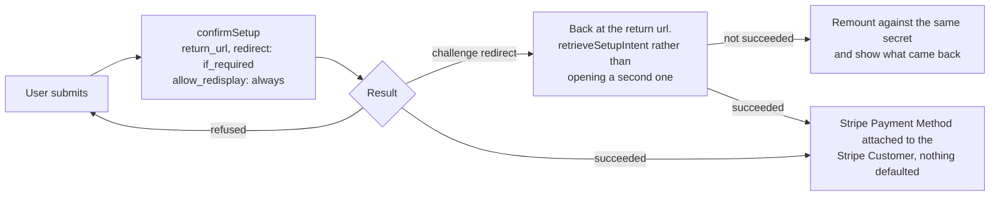
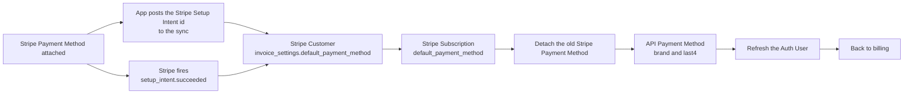

# Payment Method Update Submit - Stripe (Payment Element)

Status: built
Updated: 2026-09-30

## Description

The User submits and one confirm against the Stripe Setup Intent the [collect flow](/flows/payment-method/stripe/Update1Collect) handed them stores the Stripe Payment Method, handling a bank challenge and a refusal along the way. An API sync call then moves both defaults to the new Stripe Payment Method and detaches the old one, with a Stripe webhook running the same writes as a backstop. The address is already on the Stripe Customer by this point, written before the Stripe Setup Intent was ever issued, so nothing here touches it.

## Requirements

- Handle bank authentication challenges (3DS), including one that takes the User off the page and returns them.
- A refused Stripe Payment Method leaves the User on the page to correct it, with nothing stored and no default moved.
- Mark the Stripe Payment Method so it can be offered back to the User later, since subscribe reads the Stripe Customer's saved Stripe Payment Methods.
- Make the new Stripe Payment Method the default for both the Stripe Customer and the Stripe Subscription, and remove the old one.
- Write the API Payment Method's brand and last4 for display.
- Nothing is charged and no invoice is created. The new Stripe Payment Method is what the next renewal invoice bills.
- Nothing here settles an invoice a failed renewal left open, or reads whether there is one. A User behind on payment is resolved elsewhere. See the note below.

## Flow

1. App confirms the Stripe Setup Intent when the User submits, with a `return_url`, `redirect` set to `if_required`, and `allow_redisplay` set to `always`. See the note below.
   1. A confirmed Stripe Setup Intent attaches the Stripe Payment Method to the Stripe Customer and nothing more. It is not the default and nothing will charge it. See the note below.
   2. Handle the bank challenge inside the confirm. A challenge either runs in a dialog and resolves inline, or sends the User away to the bank and back to the return url.
   3. Hold the User on the page when the Stripe Payment Method is refused. The Stripe Setup Intent stays confirmable and the Stripe Payment Element stays standing, so the User corrects the Stripe Payment Method and submits again on the same secret.
   4. Strip Stripe's return keys off the return url, which is the page's own. A second attempt carrying the first attempt's secret would resume a Stripe Setup Intent that is already spent.
2. App picks the Stripe Setup Intent back up on landing from a bank, with no state and the secret Stripe appended to the url.
   1. Read the secret and retrieve the Stripe Setup Intent rather than opening a second one. A create here spends one that nothing mounts and buries a challenge the User already passed.
   2. Go straight to the sync on a success. The address is already on the Stripe Customer, so there is nothing left to collect and no step to reopen.
   3. Reopen on the payment step against the same secret and show what came back for anything other than a success.
3. App posts the Stripe Setup Intent's id to the payment method sync as soon as the confirm resolves.
4. API writes every record off that one Stripe Setup Intent, idempotently.
   1. Check that the Stripe Setup Intent belongs to the authenticated User's Stripe Customer and that it succeeded, and reject anything else.
   2. Set `invoice_settings.default_payment_method` on the Stripe Customer to the new Stripe Payment Method. That is what a future invoice reads.
   3. Set `default_payment_method` on the Stripe Subscription to the same Stripe Payment Method. See the note below.
   4. Detach the old Stripe Payment Method. One that is already detached is not an error, and an addition has nothing to detach.
   5. Write the API Payment Method's brand and last4.
   6. Land every write before the response, since the App reads the result off the Auth User it refreshes next.
5. API runs the same writes on `setup_intent.succeeded`, verified by its signature and idempotent. Since the address is already held, this covers the whole sync on its own. See the note below.
6. App refreshes the Auth User on success and sends the User back to billing, where the new brand and last4 are what shows.
   1. Hold the User on the page with the message on failure. The Stripe Setup Intent is confirmed and kept, so submitting again retries the sync rather than asking for the Stripe Payment Method a second time.

## Diagram

The confirm and what comes back.

Writing the records once the Stripe Setup Intent succeeds.

## Notes

### The sync call alongside the webhook

Leaving the writes to the webhook alone puts the User in front of a spinner for something that has already succeeded, and the obvious thing to poll on, the last4, does not change when the same Stripe Payment Method is entered again. The sync call gives the page a straight answer to wait on, so its response is the answer and there is nothing to poll for. The webhook stays because the browser can be closed or sent to the bank and never come back, and it is the only path that always arrives, landing as a no-op when the sync call already ran. Two writers is the cost and idempotency is what pays for it.

### One Stripe Payment Method on file

Detaching the old Stripe Payment Method keeps exactly one against the Stripe Customer, which is what a single brand and last4 on the API Payment Method can describe and what every screen showing the Stripe Payment Method assumes. Keeping a list buys a picker, a default marker and a delete path on every one of those screens.

Skipping the detach leaves another one sitting on the Stripe Customer every visit.

### Nothing is charged here

No invoice is created and no proration happens. The new Stripe Payment Method is what the next renewal invoice bills.

### A past due User is not resolved here

This flow puts a Stripe Payment Method on file and stops. It does not look for an invoice a failed renewal left open, does not charge one, and does not report on one. A User who is behind on payment can walk through this whole flow, get a success, and still be past due at the end of it, because replacing a Stripe Payment Method does not prompt Stripe to retry anything.

That is deliberate. Resolving a failed renewal is a different job with a different answer. The Stripe Payment Method on file might be fine and only need a bank challenge cleared, in which case sending the User here to type a card in again asks them for something that was never the problem. It is also the one case where the User might need to be charged before they get their access back, and charging is not what this page does.

So a past due User defaults to billing until the App handles them. See the [subscription guards flow](/flows/subscription/Guards).

### Note on 1 - why allow_redisplay is set to always

Setting `allow_redisplay` to `always` on the confirm is what lets subscribe offer this Stripe Payment Method back to the User later. Stripe only returns a saved Stripe Payment Method to a Stripe Checkout Session when `allow_redisplay` is `always`, so left at the default it bills renewals correctly while subscribe cannot see it and a User with a card on file gets asked for one again. See the [subscription create flow](/flows/subscription/stripe/Create1Load).

### Note on 1.1 - attaching and defaulting are two separate things

A confirmed Stripe Setup Intent puts the Stripe Payment Method on the Stripe Customer and stops there. Nothing bills it until the defaults move, which is the sync call's job at 4.2 and 4.3, and this is where the flow is easy to get wrong.

### Note on 4.3 - why the Stripe Subscription default matters

A Stripe Subscription level default overrides the Stripe Customer level one, so an old Stripe Payment Method left pinned there bills at the next renewal. Nothing fails at update time, it surfaces a month later.

A User with no Stripe Subscription skips this write and the rest still run.

## Todo

- Manual reconcile for a Stripe Payment Method that confirmed at Stripe where neither the sync call nor the webhook ran. Stripe holds the new Stripe Payment Method attached to the Stripe Customer, nothing is defaulted at either level, and the API still shows the old brand and last4, so the next renewal bills the old Stripe Payment Method and nothing on any screen says so. It takes both writers failing on the same update, and the webhook retries itself, so this is thin. Closing it means a sweep that finds succeeded Stripe Setup Intents whose Stripe Payment Method is not the Stripe Customer default and runs the same writes over them.
- Multiple Stripe Payment Methods on file. The flow assumes exactly one throughout.
- Tax IDs, VAT numbers and reverse charge.
