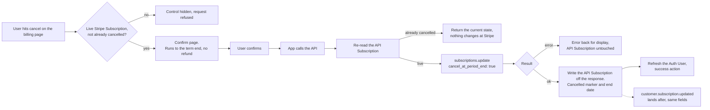

# Subscription Cancel - Stripe

Status: done
Updated: 2026-09-29

## Description

A User cancels their Stripe Subscription from a dedicated confirm page, and access runs to the end of the paid term rather than stopping on confirm. Nothing is charged and nothing is refunded.

## Requirements

- Authenticated Users only.
- Cancel a Stripe Subscription that is live and not already cancelled.
- The control leads to a dedicated confirm page rather than an inline button or a dialog.
- The page states what cancelling does before the User commits. Access runs to the end of the paid term, no further charge, no refund.
- A trialing Stripe Subscription cancels the same way, but nothing was ever charged so there is nothing to refund, and access runs to the end of the trial instead.
- Confirm is the only action on the page.
- The App hides the control on the same rule, and the API decides it again on every request.
- A cancelled API Subscription counts as subscribed until the stored end date passes.
- Nothing is charged and nothing is refunded.
- The API writes the API Subscription off Stripe's response, and the matching Stripe webhook rewrites the same fields as a backstop.
- The response is the answer. Nothing settles afterwards, so there is nothing to poll.

## Flow

1. App shows the cancel control on the billing page, only on a live Stripe Subscription that is not already cancelled. Hiding it is display, the API reads the same rule again on the request.
2. App opens a dedicated confirm page. Access runs to the end of the paid term, nothing further is charged, nothing is refunded, and confirm is the only action on it.
   1. Show the trial wording to a User still on a trial. Access runs to the end of the trial and nothing is charged, with no mention of a refund since nothing was ever taken, and the date comes off the trial rather than the API Subscription. See the note below.
3. App calls the API when the User confirms. No body, the Stripe Subscription is resolved from the API User.
4. API cancels the Stripe Subscription.
   1. Re-read the API Subscription and refuse when there is no live Stripe Subscription.
   2. Return the current state when the Stripe Subscription is already cancelled, and change nothing at Stripe. A double submit, a second tab and a direct call all land here.
   3. Update the Stripe Subscription with `cancel_at_period_end` set to true. Stripe returns the updated Stripe Subscription in the same call, status still `active`, `cancel_at_period_end` true, `cancel_at` holding the term end.
   4. Write the API Subscription off the returned object. The cancelled marker comes from `cancel_at_period_end` and the end date from `cancel_at`. A trialing Stripe Subscription takes the same call and needs no special casing, since Stripe puts `cancel_at` on the trial end. See the note below.
   5. Error back for display when Stripe refuses the update. The API Subscription is left as it is and the User retries.
5. App refreshes the Auth User and takes the success action, back to billing or a confirmation page.
   1. Read the new state off the refreshed Auth User rather than the response body, since subscription state is spread across flags the Auth User carries and the response holds only the one record.
6. API runs the same write on `customer.subscription.updated`. The event and the response carry the same fields, so whichever lands second rewrites the same values, and the same handler covers a cancel done in the Stripe Dashboard.

## Diagram

## Notes

### Cancel at the end of the term over cancelling on the spot

Cancelling on the spot cuts access that is already paid for, which means either the User forfeits the remainder or a proration and a refund have to be settled. Neither belongs in a self-serve cancel.

### What a cancelled Stripe Subscription still is

A cancelled API Subscription counts as subscribed until the stored end date passes, and the Stripe Subscription stays `active` at Stripe for the same window.

### Note on 2.1 - the date the confirm page names

The page renders before anything has been cancelled, so any date on it has to already be sitting on the Auth User. A trial carries its end date, so the trial wording has one to show. A paid term does not, since the API Subscription's end date is only set once the subscription is cancelled and running out its term, and nothing else on the Auth User carries the renewal date.

So the paid wording puts the term end in words and names no date, over the Auth User carrying the current term end. That field would be sourced from a subscription item's `current_period_end` and rewritten on every renewal, and the first renewal that write is missed leaves the page naming a date in the past. The exact date is one step away either way, since `cancel_at` is written on confirm and billing carries it from then on.

### Note on 4.4 - where the end date comes from

Both fields come off the same update response. The end date is `cancel_at`, not `current_period_end`, which is not on the Stripe Subscription at all and sits on the subscription items instead.
