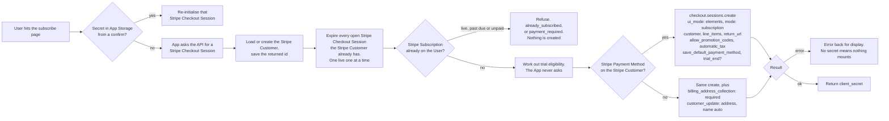
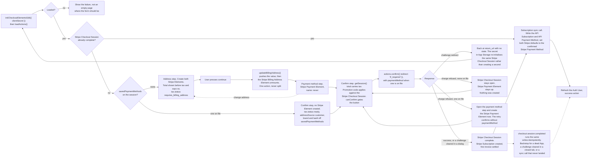

# Subscription Create - Stripe (Checkout Sessions, Payment Element)

Status: done
Updated: 2026-09-25

## Description

A User with no Stripe Subscription signs up for a plan. A three step wizard collects the billing address, then the payment method, then confirms, and a User who already has a Stripe Payment Method on file opens on the confirm step with nothing to type. Everything hangs off a single Stripe Checkout Session, so the address, the promotion code, the tax and the total are all Stripe's to hold and calculate.

## Terms

| Term | Description |
| --- | --- |
| API | The back end. Holds the API records and talks to the providers. |
| API Payment Method | The API record holding the Stripe Payment Method's brand and last4. |
| API Subscription | The API record mirroring the Stripe Subscription. Stripe id, plan, interval, status. |
| API User | The User's record on the API side. |
| App | The front end the User is looking at, web or mobile. |
| App Storage | Short lived storage in the App that survives a redirect away and back. |
| Auth User | The signed in User's data held by the App. |
| Stripe Billing Address Element | The Stripe Element collecting the billing address and name. |
| Stripe Checkout Session | The Stripe object a checkout runs on. Carries the line items, the address, the promotion code, the total and the Stripe Payment Method. |
| Stripe Customer | The Stripe object holding the User's id, address and saved Stripe Payment Methods. |
| Stripe Element | A Stripe UI component mounted by the App. |
| Stripe Payment Element | The Stripe Element collecting the Stripe Payment Method. |
| Stripe Payment Method | The payment method at Stripe, saved against the Stripe Customer. |
| Stripe Subscription | The subscription at Stripe. |
| User | The human using the App. Never the App and never the API. |

## Requirements

- Create an initial Stripe Subscription, either for a new User or for a User whose previous Stripe Subscription has ended.
- Authenticated Users only.
- Three step wizard, the billing address and name first, required for tax purposes, then the payment method, then the confirm.
- A User with a Stripe Payment Method already on file opens on the confirm step. The address and the payment method are both already held, so there is nothing to collect and no Stripe Element on screen.
- Use the Stripe Payment Element in the App against a Stripe Checkout Session created by the API.
- Collect the address with the Stripe Billing Address Element, so field layout and country rules come from Stripe.
- Style both Stripe Elements with the App's own appearance so the page matches the rest of the App.
- Support promotion codes, applied and validated by Stripe against the Stripe Checkout Session.
- Show the total, tax and discount as Stripe calculates them. Nothing is priced in the App.
- The address step shows a total before tax and says so, since tax cannot be calculated until the Stripe Checkout Session carries an address.
- Start a trial when the User is eligible, with a Stripe Payment Method collected up front. Eligibility is decided by the API.
- Refuse anyone who already has a Stripe Subscription. Past due and unpaid refuse with their own error, and default to billing until the App handles them. See the [subscription guards flow](../Guards.md).
- Only one Stripe Checkout Session at a time per User. Opening the subscribe page cancels any the User already has open, so a page left sitting in another tab or on another device cannot be completed later and subscribe them twice.
- Handle bank authentication challenges (3DS), including one that takes the User off the page and returns them.
- A refused charge leaves nothing behind. The User corrects the Stripe Payment Method and tries again on the same Stripe Checkout Session.
- A refused charge against the Stripe Payment Method on file opens the payment method step, so the User enters a different one without leaving the page.
- Nothing is created until the User confirms. Abandoning the page leaves no Stripe Subscription, no trial and no API records.
- Write the API Subscription and the API Payment Method once the Stripe Checkout Session completes, via an API sync call.
- A Stripe webhook runs the same write as a backstop, for the case where the App never comes back to make the sync call.

## Flow

1. User hits the subscribe page. The App asks the API for a Stripe Checkout Session. The steps are component state rather than routes, so there is nothing to route between and no landing checks in the App.
   1. Load the API User's Stripe Customer id. Create the Stripe Customer if there isn't one, and save the returned id. The load goes first because the sweep below is addressed to a Stripe Customer, and a Stripe Customer made a moment ago has nothing to sweep. Passing `customer` on the Stripe Checkout Session is also what satisfies its email requirement, so no contact details element is needed.
   2. Expire every open Stripe Checkout Session the Stripe Customer already has. One live Stripe Checkout Session at a time, so a tab left open on another device cannot be confirmed after this one is handed out. Only an `open` Stripe Checkout Session can be expired and a completed one throws, so the sweep swallows the throw rather than failing the create on it. See the note below.
   3. Refuse if the User already has a Stripe Subscription. A live one, which counts a trial and a cancelled one still inside its paid term, comes back as `already_subscribed` on the response's `error` field. Past due or unpaid is `payment_required`, kept separate so the two can be told apart rather than telling a past due User they are already subscribed. Both default to billing until the App handles the past due case. See the [subscription guards flow](../Guards.md). Reject either way, and there is no success to hand back. The check sits after the sweep so that anything an abandoned Stripe Checkout Session already completed is visible to it rather than racing it. See the note below.
   4. Work out trial eligibility here. The API decides eligibility and never answers a question about it. The App reads whether the Stripe Checkout Session it was handed carries a trial, and uses that for what it says on screen and nothing else.
   5. Read whether the Stripe Customer has a Stripe Payment Method on file. That answer decides which address parameters go on the create, and nothing else on this request changes with it. See the note below.
   6. Create the Stripe Checkout Session with `ui_mode: 'elements'`, `mode: 'subscription'`, the Stripe Customer, `line_items` carrying the plan's price id at quantity one, a `return_url`, `allow_promotion_codes: true`, `automatic_tax: { enabled: true }` when the API's automatic tax flag is on, `subscription_data.payment_settings.save_default_payment_method`, and `subscription_data.trial_end` when eligible. Use `trial_end` rather than `trial_period_days`, since a User carrying a partial trial keeps whatever is left of it and a whole number of days cannot say that.
   7. Add `billing_address_collection: 'required'` and `customer_update: { address: 'auto', name: 'auto' }` only when there is no Stripe Payment Method on file. Those two are what carry a collected address onto the Stripe Customer at confirm, and a User with a Stripe Payment Method on file already has an address there for tax to read.
   8. A Stripe Payment Method already on the Stripe Customer comes back on the Stripe Checkout Session as `savedPaymentMethods`, carrying its id, brand and last4. Only one whose `allow_redisplay` is `always` appears, which is what the [payment method flow](../../payment-method/stripe/Update.md) sets when it stores one.
   9. A Stripe Payment Method up front on a trial is the default. `payment_method_collection` only needs setting when you want a trial without one, which is the opposite of what this flow wants, so the field is left alone.
   10. Nothing is created beyond the Stripe Checkout Session itself. No address is written to the Stripe Customer, no intent is opened, no Stripe Subscription exists. A User who abandons here leaves a Stripe Checkout Session that ages out on its own, or gets swept on their next visit, so there is nothing to deduplicate and nothing to clean up.
   11. Stripe erroring on the create errors back for display. Without a client secret there is nothing to mount, so the page cannot continue.
   12. Return the Stripe Checkout Session's `client_secret`.
2. The App initialises the Stripe Checkout SDK against that secret.
   1. Load stripe.js if it isn't already on the page.
   2. Call `stripe.initCheckoutElementsSdk({ clientSecret })`, then `await checkout.loadActions()` for the actions the rest of the page runs on.
   3. Nothing is mounted here. The page is still showing its loading state at this point and the containers the Stripe Elements go into are not in the document yet.
   4. Failing to load stripe.js, or failing to resolve the actions, leaves the User with nowhere to enter anything. Show the failure rather than an empty page where the form should be.
3. Which step opens, and what goes up with it, follows `savedPaymentMethods` on the Stripe Checkout Session.
   1. A Stripe Payment Method on file opens the confirm step and creates no Stripe Element at all. The address is on the Stripe Customer, the Stripe Payment Method is on the Stripe Customer, and there is nothing left for the User to type.
   2. No Stripe Payment Method on file opens the address step and creates both Stripe Elements once the loading state drops and the containers exist.
   3. Create the address element with `checkout.createBillingAddressElement()` and no prefill, the name along with the address. `contacts` is a different thing, a picker for addresses already saved against the Stripe Customer.
   4. Create the payment element with `checkout.createPaymentElement({ fields: { billingDetails: { name: 'never' } } })`. The Stripe Billing Address Element collects a name and gives no option not to, so the Stripe Payment Element has to stand down. Leaving both on it fails the confirm for collecting the same field twice.
   5. Country is an ISO alpha-2 select and the field layout follows the country, so the shape of an address is Stripe's problem rather than a hand rolled form's.
   6. Both Stripe Elements take the same appearance object, so they match the rest of the App.
   7. A step that is not open hides its container, it never removes it. Taking the container out of the document tears the mount down and the Stripe Element does not come back on its own.
   8. The Stripe Billing Address Element's change event is the only thing that reports what is in it. The event carries the value, which is what gets pushed onto the Stripe Checkout Session, and a complete flag, which is what says the User can move on. Both have to be held, since nothing else on the page knows either.
4. Read the Stripe Checkout Session for what to display, on every step.
   1. Call `actions.getSession()` for `total` and `lineItems`. Render those rather than pricing the plan in the App. This is enforced rather than advised. Reading and displaying either `total.total.amount`, or `total.total.minorUnitsAmount` alongside `currency` and `minorUnitsAmountDivisor`, is required and Stripe throws if you skip it.
   2. Tax is calculated off whatever address the Stripe Checkout Session is carrying and the discount off the promotion code, both by Stripe, both before anything is charged.
   3. The address step shows a total before tax and needs a line saying so. `tax.status` reads `requires_billing_address` until the Stripe Checkout Session has an address to calculate against, and the Stripe Billing Address Element does not put one there.
   4. A Stripe Payment Method on file means the Stripe Checkout Session reads tax off the Stripe Customer's address from the moment it is created. `tax.status` is `ready` and `tax.automaticTax.addressSource` is `customer`, so the confirm step opens with a final total.
   5. Use `canConfirm` to gate the confirm button. Stripe is the one that knows whether enough has been collected on either path.
5. Address step. The User fills the Stripe Billing Address Element and presses continue.
   1. Continue pushes the value onto the Stripe Checkout Session with `updateBillingAddress()` and unmounts the Stripe Billing Address Element. One action, never split. Stripe refuses to confirm while the Stripe Billing Address Element is mounted and the address has also been set that way, since the two are competing sources.
   2. Unmounting keeps the instance and everything typed into it, so coming back is a remount and nothing is lost.
   3. An address Stripe cannot place errors on the step. The User corrects the address and continues again.
6. Payment method step. The Stripe Payment Element and a continue to the confirm step.
   1. The Stripe Billing Address Element is already down by the time this step opens, which is the whole of what satisfies the competing sources refusal.
   2. Going back to the address step remounts the Stripe Billing Address Element, so the confirm step cannot be reached while it is standing.
7. Confirm step. The total, the promotion code and the subscribe button.
   1. Promotion codes belong to the Stripe Checkout Session. Setting `allow_promotion_codes` puts the field in play and the actions apply the code, so there is no verify call of your own and no code travelling on a subscribe payload to be resolved later.
   2. A rejected code belongs to the field it was typed into rather than to the page, since nothing else about the Stripe Checkout Session has gone wrong.
   3. A Stripe Payment Method on file shows as its brand and last4, read off `savedPaymentMethods`. There is no picker, since exactly one is ever on file.
8. User presses subscribe. The App calls `actions.confirm({ redirect: 'if_required' })`, passing the Stripe Payment Method's id as `paymentMethod` when one is on file.
   1. One call. The call submits the Stripe Payment Method, creates the Stripe Subscription and settles the first invoice. The address is already on the Stripe Checkout Session or the Stripe Customer by this point.
   2. Passing `paymentMethod` makes Stripe ignore whatever a Stripe Payment Element holds and confirm against the id, which is what lets the confirm step stand alone with no Stripe Element behind it.
   3. On a trial the invoice is `$0`, nothing is charged, and the Stripe Subscription lands at `trialing` with `trial_end` stamped from now. Otherwise Stripe charges the total it already showed the User.
   4. A bank challenge either runs in a dialog and resolves inline or sends the User away to the bank and back to the `return_url`. There is no separate next action step, confirm owns the challenge.
   5. A refused charge leaves the Stripe Checkout Session open. The User corrects and confirms again on the same Stripe Checkout Session, no new one needed.
   6. A refused charge against a Stripe Payment Method on file opens the payment method step and creates the Stripe Payment Element at that point. The retry confirms without `paymentMethod`, so the new Stripe Payment Method is what pays. See the note below.
   7. A refused charge creates nothing. No Stripe Subscription, no invoice, nothing to compare against and nothing to tear down before the retry.
   8. The App puts the Stripe Checkout Session secret in App Storage on the way into the call, keyed to the User, and clears it the moment the call lands either way. A challenge that leaves the page comes back to nothing else. See the note below.
9. Landing back from a bank. The page loads with no state and finds a secret in App Storage.
   1. Re-initialise against that Stripe Checkout Session rather than creating one. The Stripe Checkout Session may have completed while the User was away, and a new one would subscribe them twice.
   2. A Stripe Checkout Session that comes back `complete` skips the steps entirely. Nothing is created and the sync call runs straight away.
   3. A stored secret that will not load is spent or expired. Clear it and create over the top of it.
   4. Every visit without a stored secret creates. The create is where the API sweeps the Stripe Customer's other open Stripe Checkout Sessions and refuses anyone already subscribed, and reusing one from an earlier visit walks past both.
10. The App makes the subscription sync call once the Stripe Checkout Session completes. One call writes every API record and both Stripe defaults, all of it read off the one Stripe Checkout Session.
    1. Retrieve the Stripe Checkout Session with the Stripe Subscription expanded.
    2. Write the API Subscription. The Stripe Subscription id exists by this point. Stripe id, plan, interval, status.
    3. Read the Stripe Payment Method the Stripe Checkout Session confirmed with, and set `invoice_settings.default_payment_method` on the Stripe Customer and `default_payment_method` on the Stripe Subscription to it. The same writes run whichever step the User came through. See the note below.
    4. Write the API Payment Method's brand and last4.
    5. The address needs no write here. Stripe copies it onto the Stripe Customer at confirm on the path that collected one, and the other path never touched it.
    6. The sync call failing errors back for display. Everything is already correct at Stripe, only the API records are behind, so a retry is idempotent and the webhook lands regardless.
    7. Stripe fires `checkout.session.completed` for the same Stripe Checkout Session. The handler runs the same writes, idempotently, so it is the backstop for every path where the sync call never lands. An App that died after confirm. A challenge that cleared at the bank while the User closed the tab rather than returning. A sync call that errored or timed out after the confirm already succeeded.
    8. Both writers should expect a User who is already subscribed by the time they run, rather than assuming they are writing the first Stripe Subscription.
    9. Do not look for the invoice before the Stripe Checkout Session reaches `complete`. The invoice does not exist until then, which is why completion is the trigger rather than a payment intent event.
    10. Any Stripe Element on the page comes down once the sync lands, and on leaving the page whatever happened.
11. The App refreshes the Auth User so everything reading subscription state picks up the API Subscription, then takes the success action. Redirect to billing, a success page, wherever.

## Diagram

The API handing out the Stripe Checkout Session.

The App walking the steps.

## Notes

### The Stripe Payment Element over hosted and embedded checkout

The Stripe Payment Element on a page the App renders itself over [hosted](../../../refs/subscription/stripe/CreateHosted.md) and [embedded](../../../refs/subscription/stripe/CreateEmbedded.md) checkout. The address, the payment method and the promotion code are Stripe Elements the App mounts and styles with the same appearance object as everything else in it, where hosted and embedded render Stripe's UI, styled by the logo, colors, fonts and border radius set in the Dashboard and nothing further. All three create the same kind of Stripe Checkout Session, so the checkout mechanics match and the fork is UI control against build cost.

What the choice costs is everything Stripe's UI does inside its own page. The steps, since the Stripe Billing Address Element does not write itself onto the Stripe Checkout Session. The mount lifecycle, including a secret held in App Storage so a bank challenge returns to the same Stripe Checkout Session. The total read off the Stripe Checkout Session and rendered by hand.

What it buys beyond styling is the confirm step for a User with a Stripe Payment Method on file, which is a page of the App's own text and no Stripe UI at all. Hosted and embedded put a payment form in front of that User whether or not anything needs collecting.

### Stripe API version

Everything here assumes `2026-03-25.dahlia` or later. Two separate reasons stack up to that floor. Version `2025-03-31.basil` is where the Stripe Subscription is created after payment completes, and anything earlier creates it upfront, so a refused charge leaves an incomplete Stripe Subscription with a finalized invoice sitting behind it to reconcile. Dahlia is where `ui_mode` gained `elements`, which is the value used throughout this flow. On Basil the same mode is named `custom`.

### Where the address comes from

Two paths put an address on the Stripe Customer, and this flow is one of them. A User with no Stripe Payment Method on file types an address here, `customer_update: { address: 'auto', name: 'auto' }` has Stripe copy it and the name onto the Stripe Customer at confirm, and the API writes neither. A User who already has a Stripe Payment Method on file put both there through the [payment method flow](../../payment-method/stripe/Update.md), which writes the Stripe Customer's address directly.

Nothing about the address is stored on the API. The Stripe Customer holds it, every renewal invoice computes tax off it, and Stripe's own invoices are where the User reads it back.

### Note on 1.2 - why open Stripe Checkout Sessions are expired

The check runs once, when the secret is handed out, and Stripe keeps a Stripe Checkout Session usable for up to a day after that. So a User could pass the check with no subscription, leave the tab open, subscribe on another device, then come back to the stale tab and press subscribe. It went through, and they had two.

Expiring the Stripe Customer's open Stripe Checkout Sessions on every create is what closes the hole. The stale tab is confirming against one that no longer accepts a confirm, so it fails there instead of buying a second Stripe Subscription, and the User starts again on a fresh Stripe Checkout Session. That is the whole reason the sweep exists.

A narrow window survives. The subscription check reads the API Subscription, and that record is only written once the sync call or the webhook lands, so it trails Stripe by a moment. Confirm on one device and then confirm on a second before the first API Subscription arrives and both go through. It takes the same person confirming twice within seconds of each other, so we are living with it.

Closing the window properly means asking Stripe for the Stripe Customer's live Stripe Subscriptions on every create rather than reading the API Subscription, which is a call to Stripe on every subscribe to cover that. Worth looking into later, not important now.

A Stripe Subscription created at the Dashboard or by an admin is outside all of this. There is no Stripe Checkout Session to expire, and blocking a second one could be wrong anyway, since it may well be deliberate.

### Note on 1.3 - why the subscription check sits here

Stripe creates the Stripe Subscription inside the confirm, in the App. The API sees the User once, when it hands out the Stripe Checkout Session secret, so that is the only place a check can run at all.

Reject either way. The Stripe Subscription exists whether it is live, past due or unpaid, so a second one is wrong regardless. There is nothing to hand back on success either, since the only thing this request returns is a Stripe Checkout Session secret, and a Stripe Subscription is not that. A double submit gets the same refusal as anything else.

Past due and unpaid get their own `error` code rather than sharing one, so the two can be told apart. Both default to billing until the App handles the past due case, which is a guard question and not one this flow answers. See the [subscription guards flow](../Guards.md).

### Note on 1.5 - why the branch is only about the address

The two creates differ by `billing_address_collection` and `customer_update` and nothing else. Both carry the same plan, the same promotion code setting, the same automatic tax setting and the same trial. The App reads `savedPaymentMethods` off the Stripe Checkout Session to decide which step to open, so the API never has to say which branch it took and the App never has to ask.

Asking for the address on a Stripe Checkout Session whose Stripe Customer already has one would put a step in front of a User with nothing to correct, and `customer_update` would then overwrite a tax address from a form they did not come to fill in.

### Note on 8.6 - a refused charge against the Stripe Payment Method on file

The confirm step stands with no Stripe Payment Element behind it, so a refusal has nothing on screen for the User to correct. Opening the payment method step and creating the Stripe Payment Element at that moment puts the form in front of them on the same page, on the same Stripe Checkout Session, and the retry confirms without `paymentMethod` so the new Stripe Payment Method is what Stripe charges.

The alternative is sending them to the [payment method flow](../../payment-method/stripe/Update.md) and back, which is two page transitions and a detach of the Stripe Payment Method they were trying to replace, for a card that may simply have been over its limit.

Tax is unaffected. The address is on the Stripe Customer and the Stripe Checkout Session is reading it there, so the total the User already saw is still the total.

### Note on 8.8 - why the secret is held across a confirm

A bank challenge can take the User off the page entirely and drop them back at the `return_url` with nothing in memory. The Stripe Checkout Session that was being confirmed is the one that has to be picked back up, since it may already be `complete` by the time the User lands, and creating a second one at that point subscribes them twice.

App Storage is enough for it. The secret only has to survive a redirect in the same tab, and it is keyed to the User so a Stripe Checkout Session one account walked away from is not picked up by the next one to sign in.

The secret is written going into the confirm and cleared as soon as the call lands, successfully or not, so the only thing App Storage ever holds is a confirm with an unknown outcome. That is what keeps a normal visit on the create path, where the sweep and the subscription check run, rather than quietly resuming something stale.

### Note on 10.3 - why the defaults are written on both paths

`subscription_data.payment_settings.save_default_payment_method` has Stripe make whatever paid the invoice the Stripe Subscription's default, which covers most of this on its own. It has nothing to act on when the first invoice is `$0`, which is every trial, so the write has to be explicit.

Running the same writes whichever step the User came through is what covers the refused charge at 8.6, where a User who opened on the confirm step ends up paying with a Stripe Payment Method that was not the one on file. Reading the Stripe Payment Method off the completed Stripe Checkout Session rather than off what the Stripe Customer held beforehand means one rule for both paths.

## Todo

- Dunning. Past due and unpaid are refused here and belong to a flow that does not exist.
- A Stripe Payment Method that cannot be charged at trial end. Nothing is charged at signup on a trial, so one that will fail is indistinguishable from one that will not until the first real invoice runs with no User on the page. The failure arrives as a webhook, and the Stripe Subscription has to carry state that forces the User back into entering a Stripe Payment Method.
- Asking Stripe for the Stripe Customer's live Stripe Subscriptions on every create rather than reading the API Subscription, to close the window where two confirms seconds apart both go through.
- A Stripe Checkout Session that ages out while the page sits open untouched. Step 9.3 covers a dead secret found on the way back from a bank, nothing covers a page standing for longer than Stripe keeps the Stripe Checkout Session usable.
- Trial eligibility is restricted to a single plan, always the cheapest one. Which plan that is, how the API identifies it, and what the App shows a User who picks any other plan are not pinned down.
- The old Stripe Payment Method is left attached when a refused charge at 8.6 leads to a new one. The Stripe Customer ends the flow with two, which the API Payment Method's single brand and last4 cannot describe.
