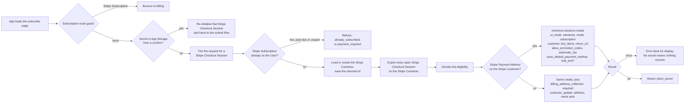
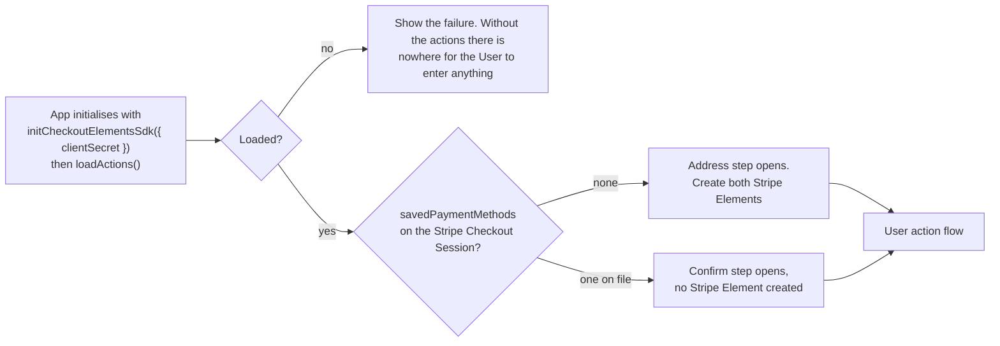

# Subscription Create Load - Stripe (Checkout Sessions, Payment Element)

Status: done
Updated: 2026-09-29

## Description

A User with no Stripe Subscription opens the subscribe page and the API hands out a Stripe Checkout Session for them to work against. The App initialises against it and opens the form on the address step, or straight on the confirm step when a Stripe Payment Method is already on file.

## Requirements

- Create an initial Stripe Subscription, either for a new User or for a User whose previous Stripe Subscription has ended.
- Authenticated Users only.
- One form with two steps, the billing address and name first, required for tax purposes, then the payment method.
- A User with a Stripe Payment Method already on file opens on the confirm step. The address and the payment method are both already held, so there is nothing to collect and no Stripe Element on screen.
- Use the Stripe Payment Element in the App against a Stripe Checkout Session created by the API.
- Collect the address with the Stripe Billing Address Element, so field layout and country rules come from Stripe.
- Style both Stripe Elements with the App's own appearance so the page matches the rest of the App.
- Start a trial when the User is eligible, with a Stripe Payment Method collected up front. Eligibility is decided by the API.
- Refuse anyone who already has a Stripe Subscription. Past due and unpaid refuse with their own error, and default to billing until the App handles them. See the [subscription guards flow](#flows/subscription/Guards).
- The billing page shows the subscribe control only to a User with no Stripe Subscription, and the route is guarded on the same. The API decides it again on the create.
- Only one Stripe Checkout Session at a time per User. Opening the subscribe page cancels any the User already has open, so a page left sitting in another tab or on another device cannot be completed later and subscribe them twice.

## Flow

1. App loads the subscribe page. The steps are component state, so nothing routes.
   1. Subscription route guard runs. A User with a Stripe Subscription bounces to billing. See the [subscription guards flow](#flows/subscription/Guards).
   2. Check App Storage for a returning redirect. A secret there is a User coming back from a bank challenge, so re-initialise that Stripe Checkout Session and hand to the [submit flow](#flows/subscription/stripe/Create3Submit). See the note below.
   3. Fire the request for a Stripe Checkout Session. A Stripe Checkout Session is always required, whether or not a Stripe Payment Method is already on file, since the confirm runs against one.
2. API creates the Stripe Checkout Session.
   1. Refuse a User who already has a Stripe Subscription. A live one is `already_subscribed`, past due or unpaid is `payment_required`. See the note below.
   2. Load or create the Stripe Customer, and save the returned id. The create carries the User's email.
   3. Expire every open Stripe Checkout Session on the Stripe Customer. Only an `open` one can be expired and a completed one throws, so the sweep swallows the throw. See the note below.
   4. Decide trial eligibility. The API owns the answer and the App never asks for it.
   5. Read whether the Stripe Customer has a Stripe Payment Method on file. The answer decides which address parameters go on the Stripe Checkout Session create. See the note below.
   6. Create the Stripe Checkout Session with `ui_mode: 'elements'`, `mode: 'subscription'`, the Stripe Customer, `line_items` carrying the plan's price id at quantity one, a `return_url`, `allow_promotion_codes: true`, `automatic_tax: { enabled: true }` when the API's automatic tax flag is on, `subscription_data.payment_settings.save_default_payment_method`, and `subscription_data.trial_end` when eligible. Use `trial_end` rather than `trial_period_days`, since a User carrying a partial trial keeps whatever is left of it and a whole number of days cannot say that. Passing the Stripe Customer covers the Stripe Checkout Session's email requirement, so no contact details element is needed.
   7. Add `billing_address_collection: 'required'` and `customer_update: { address: 'auto', name: 'auto' }` when there is no Stripe Payment Method on file. Those two carry a collected address onto the Stripe Customer at confirm, and a User with one on file already has an address there.
   8. Error back for display when Stripe refuses the create. No secret means nothing to mount.
   9. Return the Stripe Checkout Session's `client_secret`.
3. App initialises the Stripe Checkout SDK against that secret.
   1. Load stripe.js if it isn't already on the page.
   2. Initialise with `stripe.initCheckoutElementsSdk({ clientSecret })`, then `await checkout.loadActions()` for the actions the rest of the page runs on.
   3. Show the failure when either one fails. Without the actions there is nowhere for the User to enter anything.
4. App opens the form on the step matching `savedPaymentMethods`. Nothing mounts before this point, the containers are not in the document yet.
   1. Open the confirm step when a Stripe Payment Method is on file, and create no Stripe Element. Only one whose `allow_redisplay` is `always` appears in `savedPaymentMethods`, the value the [payment method flow](#flows/payment-method/stripe/Update) sets when it stores one.
   2. Open the address step when there is none, and create both Stripe Elements once the containers exist.
   3. Create the address element with `checkout.createBillingAddressElement()` and no prefill, the name along with the address. Country is an ISO alpha-2 select and the field layout follows the country.
   4. Create the payment element with `checkout.createPaymentElement({ fields: { billingDetails: { name: 'never' } } })`. The Stripe Billing Address Element already collects a name, and both collecting it fails the confirm.
   5. Give both Stripe Elements the same appearance object.
   6. Hide the container of a step that is not open, never remove it. Removing it tears the mount down and the Stripe Element does not come back.
   7. Hold what the Stripe Billing Address Element's change event reports. The event carries the value to push onto the Stripe Checkout Session and a complete flag saying the User can move on, and nothing else on the page knows either.

## Diagram

The App requesting and the API creating the Stripe Checkout Session.

The App initialising and opening the form.

## Notes

### The Stripe Payment Element over hosted and embedded checkout

The Stripe Payment Element on a page the App renders itself over [hosted](#refs/subscription/stripe/CreateHosted) and [embedded](#refs/subscription/stripe/CreateEmbedded) checkout. The address and the payment method are Stripe Elements the App mounts and styles with the same appearance object as everything else in it, where hosted and embedded render Stripe's UI, styled by the logo, colors, fonts and border radius set in the Dashboard and nothing further. All three create the same kind of Stripe Checkout Session, so the checkout mechanics match and the fork is UI control against build cost.

What the choice costs is everything Stripe's UI does inside its own page. The steps, since the Stripe Billing Address Element does not write itself onto the Stripe Checkout Session. The mount lifecycle, including a secret held in App Storage so a bank challenge returns to the same Stripe Checkout Session. The total read off the Stripe Checkout Session and rendered by hand. The promotion code field, which no Stripe Element provides, so the input, the apply, the remove and the error a rejected code lands on are all the App's.

What it buys beyond styling is the confirm step for a User with a Stripe Payment Method on file, which is a page of the App's own text and no Stripe UI at all. Hosted and embedded put a payment form in front of that User whether or not anything needs collecting.

### Stripe API version

Everything here assumes `2026-03-25.dahlia` or later. Two separate reasons stack up to that floor. Version `2025-03-31.basil` is where the Stripe Subscription is created after payment completes, and anything earlier creates it upfront, so a refused charge leaves an incomplete Stripe Subscription with a finalized invoice sitting behind it to reconcile. Dahlia is where `ui_mode` gained `elements`, which is the value used throughout this flow. On Basil the same mode is named `custom`.

### Where the address comes from

Two paths put an address on the Stripe Customer, and this flow is one of them. A User with no Stripe Payment Method on file types an address here, `customer_update: { address: 'auto', name: 'auto' }` has Stripe copy it and the name onto the Stripe Customer at confirm, and the API writes neither. A User who already has a Stripe Payment Method on file put both there through the [payment method flow](#flows/payment-method/stripe/Update), which writes the Stripe Customer's address directly.

Nothing about the address is stored on the API. The Stripe Customer holds it, every renewal invoice computes tax off it, and Stripe's own invoices are where the User reads it back.

### What exists once the page has loaded

Nothing is created beyond the Stripe Checkout Session itself. No address is written to the Stripe Customer, no intent is opened, no Stripe Subscription exists. A User who abandons here leaves a Stripe Checkout Session that ages out on its own, or gets swept on their next visit, so there is nothing to deduplicate and nothing to clean up.

### Note on 1.2 - why the secret comes from App Storage

A bank challenge can take the User off the page and drop them back at the `return_url` with nothing in memory. The App owns that url and can mark it, so a query parameter is one way to know a return happened.

The client secret cannot travel there. Re-initialising needs the secret itself, and a url puts it into browser history, referrers and server logs, so App Storage holds it and the url at most says a return happened. Since App Storage already answers the question on its own, nothing on the url is required.

### Note on 2.1 - why the subscription check sits here

Stripe creates the Stripe Subscription inside the confirm, in the App. The API sees the User once, when it hands out the Stripe Checkout Session secret, so that is the only place a check can run at all.

The check goes first because it reads the API Subscription off the API User, so it needs neither the Stripe Customer nor the sweep, and a refused User costs no Stripe call at all.

Reject either way. The Stripe Subscription exists whether it is live, past due or unpaid, so a second one is wrong regardless. There is nothing to hand back on success either, since the only thing this request returns is a Stripe Checkout Session secret, and a Stripe Subscription is not that. A double submit gets the same refusal as anything else.

Past due and unpaid get their own `error` code rather than sharing one, so the two can be told apart. Both default to billing until the App handles the past due case, which is a guard question and not one this flow answers. See the [subscription guards flow](#flows/subscription/Guards).

### Note on 2.3 - why open Stripe Checkout Sessions are expired

The check runs once, when the secret is handed out, and Stripe keeps a Stripe Checkout Session usable for up to a day after that. So a User could pass the check with no subscription, leave the tab open, subscribe on another device, then come back to the stale tab and press subscribe. It went through, and they had two.

Expiring the Stripe Customer's open Stripe Checkout Sessions on every create is what closes the hole. The stale tab is confirming against one that no longer accepts a confirm, so it fails there rather than buying a second Stripe Subscription, and the User starts again on a fresh Stripe Checkout Session. That is the whole reason the sweep exists.

A narrow window survives. The subscription check reads the API Subscription, and that record is only written once the sync call or the webhook lands, so it trails Stripe by a moment. Confirm on one device and then confirm on a second before the first API Subscription arrives and both go through. It takes the same person confirming twice within seconds of each other, so we are living with it.

Closing the window properly means asking Stripe for the Stripe Customer's live Stripe Subscriptions on every create rather than reading the API Subscription, which is a call to Stripe on every subscribe to cover that. Worth looking into later, not important now.

A Stripe Subscription created at the Dashboard or by an admin is outside all of this. There is no Stripe Checkout Session to expire, and blocking a second one could be wrong anyway, since it may well be deliberate.

### Note on 2.5 - why the branch is only about the address

The two creates differ by `billing_address_collection` and `customer_update` and nothing else. Both carry the same plan, the same promotion code setting, the same automatic tax setting and the same trial. The App reads `savedPaymentMethods` off the Stripe Checkout Session to decide which step to open, so the API never has to say which branch it took and the App never has to ask.

Asking for the address on a Stripe Checkout Session whose Stripe Customer already has one would put a step in front of a User with nothing to correct, and `customer_update` would then overwrite a tax address from a form they did not come to fill in.

### Note on 2.6 - why payment_method_collection is left alone

A Stripe Payment Method up front on a trial is the default. Setting `payment_method_collection` is only needed to run a trial without one, which is the opposite of what this flow wants, so the field never appears on the create.

## Todo

- Dunning. Past due and unpaid are refused here and belong to a flow that does not exist.
- Asking Stripe for the Stripe Customer's live Stripe Subscriptions on every create rather than reading the API Subscription, to close the window where two confirms seconds apart both go through.
- Trial eligibility is restricted to a single plan, always the cheapest one. Which plan that is, how the API identifies it, and what the App shows a User who picks any other plan are not pinned down.
