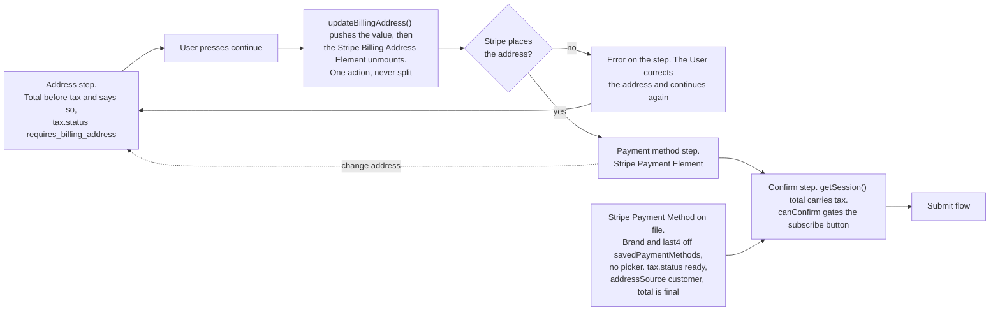

# Subscription Create User Action - Stripe (Checkout Sessions, Payment Element)

Status: built
Updated: 2026-09-29

## Description

The User works through the subscribe page on the Stripe Checkout Session the [load flow](#flows/subscription/stripe/Create1Load) handed them, filling the address and entering a payment method. Everything typed goes onto the Stripe Checkout Session as the User moves, so the total and the tax are Stripe's to calculate and the App only renders them.

## Requirements

- Show the total and tax as Stripe calculates them. Nothing is priced in the App.
- The address step shows a total before tax and says so, since tax cannot be calculated until the Stripe Checkout Session carries an address.
- The confirm step shows the Stripe Payment Method on file as its brand and last4, with no picker.

## Flow

1. App renders the totals off the Stripe Checkout Session, on every step.
   1. Call `actions.getSession()` for `total` and `lineItems`. Rendering either `total.total.amount`, or `total.total.minorUnitsAmount` alongside `currency` and `minorUnitsAmountDivisor`, is required and Stripe throws if you skip it.
   2. Read the tax off the Stripe Checkout Session, calculated by Stripe against whatever address it carries, before anything is charged.
   3. Gate the subscribe button on `canConfirm`. Stripe is the one that knows whether enough has been collected.
2. App collects the address. A User with a Stripe Payment Method on file enters at step 4, so this step and step 3 never run for them. The [load flow](#flows/subscription/stripe/Create1Load) decides which one they open on.
   1. Show a total before tax and say so. `tax.status` reads `requires_billing_address` until the Stripe Checkout Session carries an address, and the Stripe Billing Address Element does not put one there.
   2. Push the value with `updateBillingAddress()` and unmount the Stripe Billing Address Element when the User continues. One action, never split. Stripe refuses to confirm while the Stripe Billing Address Element is mounted and the address has also been set that way, since the two are competing sources.
   3. Keep the instance on unmount, along with everything typed into it, so coming back is a remount and nothing is lost.
   4. Error on the step when Stripe cannot place the address. The User corrects the address and continues again.
3. App collects the payment method.
   1. Show the Stripe Payment Element and a continue to the confirm step. The Stripe Billing Address Element is already down by this point, which is the whole of what satisfies the competing sources refusal.
   2. Remount the Stripe Billing Address Element when the User goes back, which blocks the confirm step while it stands.
4. App shows the confirm step.
   1. Show the total and the subscribe button.
   2. Show the Stripe Payment Method on file as its brand and last4, read off `savedPaymentMethods`. There is no picker, since exactly one is ever on file.
   3. Show a final total when a Stripe Payment Method is on file. `tax.status` is `ready` and `tax.automaticTax.addressSource` is `customer`, since the Stripe Checkout Session reads tax off the Stripe Customer's address from the moment it is created.

## Diagram

