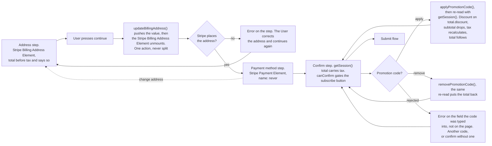
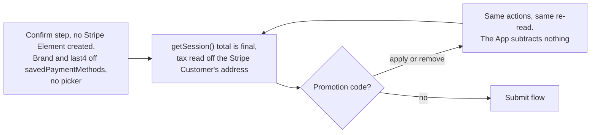

# Subscription Create User Action - Stripe (Checkout Sessions, Payment Element)

Status: done
Updated: 2026-09-28

## Description

The User works through the subscribe page, filling the address, entering a payment method and applying a promotion code, on the Stripe Checkout Session the [load flow](Create1Load.md) handed them. Everything typed goes onto the Stripe Checkout Session as the User moves, so the total, the tax and the discount are Stripe's to calculate and the App only renders them.

## Requirements

- Collect the address with the Stripe Billing Address Element, so field layout and country rules come from Stripe.
- Style both Stripe Elements with the App's own appearance so the page matches the rest of the App.
- Support promotion codes, applied and validated by Stripe against the Stripe Checkout Session.
- Let the User take an applied promotion code back off and see the total return to what it was.
- A promotion code on a trial discounts the first charge at trial end, since signup charges nothing either way.
- Show the total, tax and discount as Stripe calculates them. Nothing is priced in the App.
- The address step shows a total before tax and says so, since tax cannot be calculated until the Stripe Checkout Session carries an address.
- A User with a Stripe Payment Method already on file opens on the confirm step. The address and the payment method are both already held, so there is nothing to collect and no Stripe Element on screen.

## Flow

1. Address step. The User fills the Stripe Billing Address Element and presses continue.
   1. Continue pushes the value onto the Stripe Checkout Session with `updateBillingAddress()` and unmounts the Stripe Billing Address Element. One action, never split. Stripe refuses to confirm while the Stripe Billing Address Element is mounted and the address has also been set that way, since the two are competing sources.
   2. Unmounting keeps the instance and everything typed into it, so coming back is a remount and nothing is lost.
   3. An address Stripe cannot place errors on the step. The User corrects the address and continues again.
2. Payment method step. The Stripe Payment Element and a continue to the confirm step.
   1. The Stripe Billing Address Element is already down by the time this step opens, which is the whole of what satisfies the competing sources refusal.
   2. Going back to the address step remounts the Stripe Billing Address Element, so the confirm step cannot be reached while it is standing.
3. Confirm step. The total, the promotion code and the subscribe button.
   1. Promotion codes belong to the Stripe Checkout Session. Setting `allow_promotion_codes` puts the field in play and `actions.applyPromotionCode()` sends the code, so there is no verify call of your own and no code travelling on a subscribe payload to be resolved later.
   2. No Stripe Element collects a promotion code, so the field and its apply control are markup the App writes and styles like the rest of the page.
   3. Applying mutates the Stripe Checkout Session at Stripe. The discount lands on `total.discount`, `total.subtotal` drops, tax recalculates against the reduced amount and `total.total` follows. Re-read with `getSession()` once the action resolves and render the new figures. The App subtracts nothing.
   4. Removing runs `actions.removePromotionCode()` and the same re-read puts the total back, so a User who applied a code can reach the undiscounted total without reloading the page.
   5. A rejected code belongs to the field it was typed into rather than to the page, since nothing else about the Stripe Checkout Session has gone wrong. Expired, unknown and not applicable to the plan all land there the same way, and the User types another code or confirms without one.
   6. The confirm carries no code. The discount is already on the Stripe Checkout Session, so `actions.confirm()` charges the discounted total with nothing in its payload naming a promotion code and nothing for the API to resolve afterwards. See the [submit flow](Create3Submit.md).
   7. A Stripe Payment Method on file shows as its brand and last4, read off `savedPaymentMethods`. There is no picker, since exactly one is ever on file.

## Diagram

The User walking the steps.

The confirm step opening with a Stripe Payment Method on file.

## Notes

### A promotion code against a trial

A trial charges nothing at signup, so an applied promotion code takes nothing off what the User is about to pay. The discount sits on the recurring total the Stripe Checkout Session is carrying, rides onto the Stripe Subscription at confirm, and comes off the first real invoice when the trial ends.

Two figures have to be on screen for that to read correctly. A total of `$0` today, and the discounted amount from trial end. Showing only the discounted recurring figure reads as a charge that is not happening, and showing only the `$0` throws away the reason the User typed a code.

Whether the discount survives to trial end is the coupon's own duration rather than anything this flow sets. A code lasting one billing period is spent on the first invoice after the trial, which is the invoice the User was expecting it against.

## Todo

- A promotion code restricted to a plan, a User or a campaign. Every active code Stripe holds applies here, and nothing on the API side limits which ones a given User can redeem.
- An offer the User does not have to type. Nothing on the page surfaces an available promotion code, so a code only applies when the User already has it in hand.
