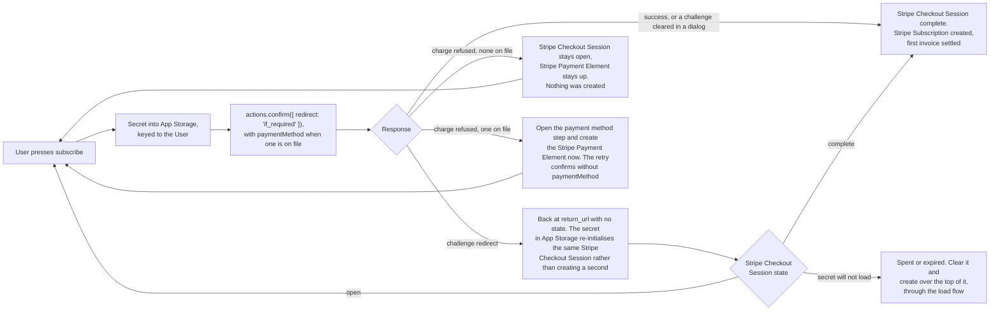
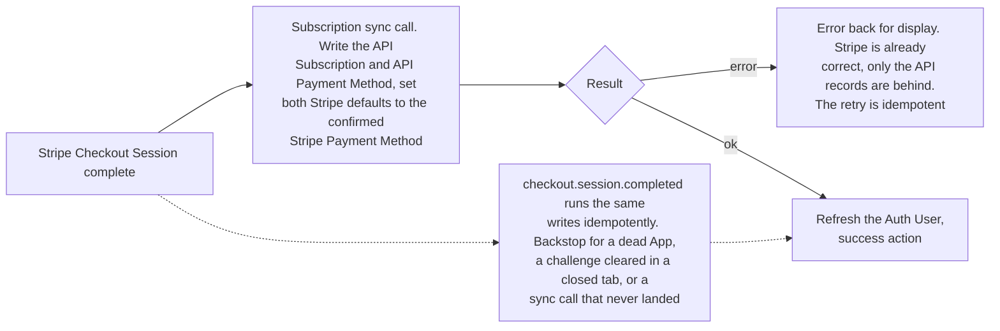

# Subscription Create Submit - Stripe (Checkout Sessions, Payment Element)

Status: done
Updated: 2026-09-29

## Description

The User presses subscribe and one confirm call against the Stripe Checkout Session submits the Stripe Payment Method, creates the Stripe Subscription and settles the first invoice, handling a bank challenge and a refused charge along the way. Once the Stripe Checkout Session completes, a sync call writes the API records and a Stripe webhook runs the same writes as a backstop.

## Requirements

- Handle bank authentication challenges (3DS), including one that takes the User off the page and returns them.
- A refused charge leaves nothing behind. The User corrects the Stripe Payment Method and tries again on the same Stripe Checkout Session.
- A refused charge against the Stripe Payment Method on file opens the payment method step, so the User enters a different one without leaving the page.
- Nothing is created until the User confirms. Abandoning the page leaves no Stripe Subscription, no trial and no API records.
- Write the API Subscription and the API Payment Method once the Stripe Checkout Session completes, via an API sync call.
- A Stripe webhook runs the same write as a backstop, for the case where the App never comes back to make the sync call.

## Flow

1. User presses subscribe. The App calls `actions.confirm({ redirect: 'if_required' })`, passing the Stripe Payment Method's id as `paymentMethod` when one is on file.
   1. One call. The call submits the Stripe Payment Method, creates the Stripe Subscription and settles the first invoice. The address is already on the Stripe Checkout Session or the Stripe Customer by this point.
   2. Passing `paymentMethod` makes Stripe ignore whatever a Stripe Payment Element holds and confirm against the id, which is what lets the confirm step stand alone with no Stripe Element behind it.
   3. On a trial the invoice is `$0`, nothing is charged, and the Stripe Subscription lands at `trialing` with `trial_end` stamped from now. Otherwise Stripe charges the total it already showed the User.
   4. A bank challenge either runs in a dialog and resolves inline or sends the User away to the bank and back to the `return_url`. There is no separate next action step, confirm owns the challenge.
   5. A refused charge leaves the Stripe Checkout Session open. The User corrects and confirms again on the same Stripe Checkout Session, no new one needed.
   6. A refused charge against a Stripe Payment Method on file opens the payment method step and creates the Stripe Payment Element at that point. The retry confirms without `paymentMethod`, so the new Stripe Payment Method is what pays. See the note below.
   7. A refused charge creates nothing. No Stripe Subscription, no invoice, nothing to compare against and nothing to tear down before the retry.
   8. The App puts the Stripe Checkout Session secret in App Storage on the way into the call, keyed to the User, and clears it the moment the call lands either way. A challenge that leaves the page comes back to nothing else. See the note below.
2. Landing back from a bank. The page loads with no state and finds a secret in App Storage.
   1. Re-initialise against that Stripe Checkout Session rather than creating one. The Stripe Checkout Session may have completed while the User was away, and a new one would subscribe them twice.
   2. A Stripe Checkout Session that comes back `complete` skips the steps entirely. Nothing is created and the sync call runs straight away.
   3. A stored secret that will not load is spent or expired. Clear it and create over the top of it, through the [load flow](#flows/subscription/stripe/Create1Load).
   4. Every visit without a stored secret creates. The create is where the API sweeps the Stripe Customer's other open Stripe Checkout Sessions and refuses anyone already subscribed, and reusing one from an earlier visit walks past both. See the [load flow](#flows/subscription/stripe/Create1Load).
3. The App makes the subscription sync call once the Stripe Checkout Session completes. One call writes every API record and both Stripe defaults, all of it read off the one Stripe Checkout Session.
   1. Retrieve the Stripe Checkout Session with the Stripe Subscription expanded.
   2. Write the API Subscription. The Stripe Subscription id exists by this point. Stripe id, plan, interval, status.
   3. Read the Stripe Payment Method the Stripe Checkout Session confirmed with, and set `invoice_settings.default_payment_method` on the Stripe Customer and `default_payment_method` on the Stripe Subscription to it. The same writes run whichever step the User came through. See the note below.
   4. Write the API Payment Method's brand and last4.
   5. The address needs no write here. Stripe copies it onto the Stripe Customer at confirm on the path that collected one, and the other path never touched it.
   6. The sync call failing errors back for display. Everything is already correct at Stripe, only the API records are behind, so a retry is idempotent and the webhook lands regardless.
   7. Stripe fires `checkout.session.completed` for the same Stripe Checkout Session. The handler runs the same writes, idempotently, so it is the backstop for every path where the sync call never lands. An App that died after confirm. A challenge that cleared at the bank while the User closed the tab rather than returning. A sync call that errored or timed out after the confirm already succeeded.
   8. Both writers should expect a User who is already subscribed by the time they run, rather than assuming they are writing the first Stripe Subscription.
   9. Do not look for the invoice before the Stripe Checkout Session reaches `complete`. The invoice does not exist until then, which is why completion is the trigger rather than a payment intent event.
   10. Any Stripe Element on the page comes down once the sync lands, and on leaving the page whatever happened.
4. The App refreshes the Auth User so everything reading subscription state picks up the API Subscription, then takes the success action. Redirect to billing, a success page, wherever.

## Diagram

The confirm and what comes back.

Writing the API records once the Stripe Checkout Session completes.

## Notes

### Note on 1.6 - a refused charge against the Stripe Payment Method on file

The confirm step stands with no Stripe Payment Element behind it, so a refusal has nothing on screen for the User to correct. Opening the payment method step and creating the Stripe Payment Element at that moment puts the form in front of them on the same page, on the same Stripe Checkout Session, and the retry confirms without `paymentMethod` so the new Stripe Payment Method is what Stripe charges.

The alternative is sending them to the [payment method flow](#flows/payment-method/stripe/Update) and back, which is two page transitions and a detach of the Stripe Payment Method they were trying to replace, for a card that may simply have been over its limit.

Tax is unaffected. The address is on the Stripe Customer and the Stripe Checkout Session is reading it there, so the total the User already saw is still the total.

### Note on 1.8 - why the secret is held across a confirm

A bank challenge can take the User off the page entirely and drop them back at the `return_url` with nothing in memory. The Stripe Checkout Session that was being confirmed is the one that has to be picked back up, since it may already be `complete` by the time the User lands, and creating a second one at that point subscribes them twice.

App Storage is enough for it. The secret only has to survive a redirect in the same tab, and it is keyed to the User so a Stripe Checkout Session one account walked away from is not picked up by the next one to sign in.

The secret is written going into the confirm and cleared as soon as the call lands, successfully or not, so the only thing App Storage ever holds is a confirm with an unknown outcome. That is what keeps a normal visit on the create path, where the sweep and the subscription check run, rather than quietly resuming something stale.

### Note on 3.3 - why the defaults are written on both paths

`subscription_data.payment_settings.save_default_payment_method` has Stripe make whatever paid the invoice the Stripe Subscription's default, which covers most of this on its own. It has nothing to act on when the first invoice is `$0`, which is every trial, so the write has to be explicit.

Running the same writes whichever step the User came through is what covers the refused charge at 1.6, where a User who opened on the confirm step ends up paying with a Stripe Payment Method that was not the one on file. Reading the Stripe Payment Method off the completed Stripe Checkout Session rather than off what the Stripe Customer held beforehand means one rule for both paths.

## Todo

- A Stripe Payment Method that cannot be charged at trial end. Nothing is charged at signup on a trial, so one that will fail is indistinguishable from one that will not until the first real invoice runs with no User on the page. The failure arrives as a webhook, and the Stripe Subscription has to carry state that forces the User back into entering a Stripe Payment Method.
- A Stripe Checkout Session that ages out while the page sits open untouched. Step 2.3 covers a dead secret found on the way back from a bank, nothing covers a page standing for longer than Stripe keeps the Stripe Checkout Session usable.
- The old Stripe Payment Method is left attached when a refused charge at 1.6 leads to a new one. The Stripe Customer ends the flow with two, which the API Payment Method's single brand and last4 cannot describe.
