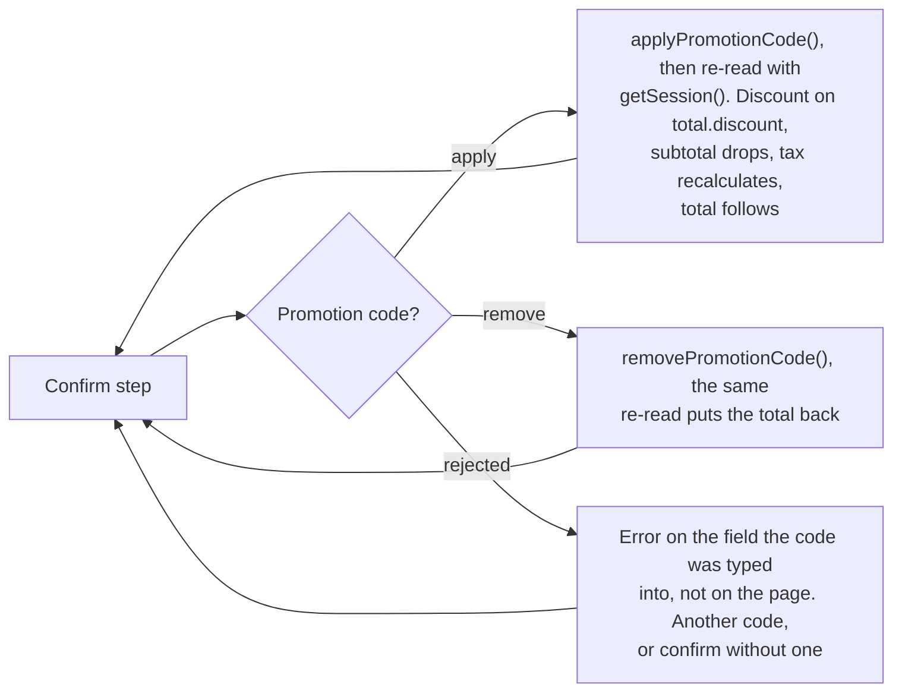

# Subscription Promotion Codes - Stripe (Checkout Sessions, Payment Element)

Status: ready
Updated: 2026-09-29

## Description

A promotion code field on the subscribe page's confirm step, applied and validated by Stripe against the Stripe Checkout Session. The feature is layered onto the create flow and a config flag turns it on, which this flow assumes. See the note below.

## Requirements

- A config flag controls whether promotion codes are enabled.
- The Stripe Checkout Session is created with promotion codes allowed.
- Promotion codes are applied and validated by Stripe, never by the App.
- Let the User take an applied promotion code back off and see the total return to what it was.
- A promotion code on a trial discounts the first charge at trial end, since signup charges nothing either way.
- Show the discount as Stripe calculates it. Nothing is priced in the App.
- The field sits on the confirm step, alongside the total and the subscribe button.

## Flow

1. API adds `allow_promotion_codes: true` to the Stripe Checkout Session create. That one parameter is what puts the field in play, so there is no verify call of the App's own and no code travelling on a payload to be resolved later. See the [load flow](/flows/subscription/stripe/Create1Load) for the rest of the create.
2. App writes the promotion code field and its apply control by hand on the confirm step. No Stripe Element collects one. See the [user action flow](/flows/subscription/stripe/Create2UserAction) for the rest of the step.
3. App applies a code with `actions.applyPromotionCode()`, which mutates the Stripe Checkout Session at Stripe.
   1. Re-read with `getSession()` once the action resolves. The discount lands on `total.discount`, `total.subtotal` drops, tax recalculates against the reduced amount and `total.total` follows. The App subtracts nothing.
   2. Error on the field the code was typed into, not on the page. Expired, unknown and not applicable to the plan all land there the same way, and the User types another code or confirms without one.
4. App removes a code with `actions.removePromotionCode()` and the same re-read, so a User who applied one can reach the undiscounted total without reloading the page.
5. App sends no promotion code in the confirm payload. The discount is already on the Stripe Checkout Session, so the confirm charges the discounted total and there is nothing for the API to resolve afterwards. See the [submit flow](/flows/subscription/stripe/Create3Submit).

## Diagram

## Notes

### A layered feature rather than part of create

Subscribing does not need promotion codes, so the create flow is written without them and this flow adds to it. That keeps the option of the feature not existing at all, with nothing to strip back out of three files.

Layered in, a config flag decides whether it runs. This flow is the subscribe page with the flag on. With it off the Stripe Checkout Session is created without `allow_promotion_codes`, the confirm step carries no field, and the create flow reads exactly as written.

### A promotion code against a trial

A trial charges nothing at signup, so an applied promotion code takes nothing off what the User is about to pay. The discount sits on the recurring total the Stripe Checkout Session is carrying, rides onto the Stripe Subscription at confirm, and comes off the first real invoice when the trial ends.

Two figures have to be on screen for that to read correctly. A total of `$0` today, and the discounted amount from trial end. Showing only the discounted recurring figure reads as a charge that is not happening, and showing only the `$0` throws away the reason the User typed a code.

Whether the discount survives to trial end is the coupon's own duration rather than anything this flow sets. A code lasting one billing period is spent on the first invoice after the trial, which is the invoice the User was expecting it against.
