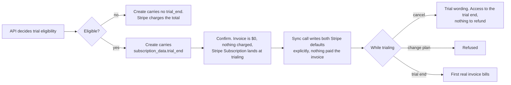

# Subscription Trials - Stripe (Checkout Sessions, Payment Element)

Status: ready
Updated: 2026-09-29

## Description

A User eligible for a trial subscribes without being charged, and the Stripe Subscription runs at `trialing` until the trial end date, when the first real invoice bills. The feature is layered onto the subscription flows and a config flag turns it on, which this flow assumes. See the note below.

## Requirements

- A config flag controls whether trials are enabled.
- Start a trial when the User is eligible, with a Stripe Payment Method collected up front.
- Eligibility is decided by the API. The App never asks.
- Nothing is charged at signup. The first real invoice bills at trial end.
- Cancelling during a trial runs access to the end of the trial, with nothing to refund.
- Changing plan during a trial is refused.

## Flow

1. API decides trial eligibility on the Stripe Checkout Session create, and adds `subscription_data.trial_end` when the User is eligible. Use `trial_end` rather than `trial_period_days`, since a User carrying a partial trial keeps whatever is left of it and a whole number of days cannot say that. See the [load flow](#flows/subscription/stripe/Create1Load) for the rest of the create.
   1. Leave `payment_method_collection` alone. A Stripe Payment Method up front on a trial is the default, and setting the field is only needed to run a trial without one, which is the opposite of what this flow wants.
2. App reads the trial off the Stripe Checkout Session it was handed. That is the only place it learns there is one, since the API decides eligibility and never answers a question about it. See the [user action flow](#flows/subscription/stripe/Create2UserAction).
3. Stripe charges nothing on the confirm. The invoice is `$0` and the Stripe Subscription lands at `trialing` with `trial_end` stamped from now. See the [submit flow](#flows/subscription/stripe/Create3Submit).
   1. Write both Stripe defaults explicitly on the sync call. Nothing paid the `$0` invoice, so `save_default_payment_method` has nothing to act on and the Stripe Payment Method has to be set on the Stripe Customer and the Stripe Subscription by hand.
4. App shows the trial wording on the cancel confirm page. Access runs to the end of the trial and nothing is charged, with no mention of a refund since nothing was ever taken, and the date comes off the trial rather than the API Subscription. See the [cancel flow](#flows/subscription/stripe/Cancel) and the note below.
   1. Cancel needs no special casing at the API. Stripe puts `cancel_at` on the trial end, so the same two fields are read the same way.
5. API refuses a plan change while the Stripe Subscription is trialing. See the [subscription update flow](#flows/subscription/stripe/Update).

## Diagram

## Notes

### A layered feature rather than part of create

Subscribing does not need trials, so the subscription flows are written without them and this flow adds to them. That keeps the option of the feature not existing at all, with nothing to strip back out of four files.

Layered in, a config flag decides whether it runs. This flow is the subscription with the flag on. With it off no Stripe Checkout Session carries a `trial_end`, every signup is charged on confirm, and the cancel page has one wording rather than two.

### A Stripe Payment Method up front

The card is collected at signup even though nothing is charged, so the Stripe Subscription has something to bill at trial end. The cost is that a Stripe Payment Method which will fail is indistinguishable from one that will not until the first real invoice runs with no User on the page.

### Note on 4 - the date the cancel page names

The cancel page renders before anything has been cancelled, so any date on it has to already be sitting on the Auth User. A trial carries its end date, so the trial wording has one to show. A paid term does not, since the API Subscription's end date is only set once the subscription is cancelled and running out its term.

## Todo

- Trial eligibility is restricted to a single plan, always the cheapest one. Which plan that is, how the API identifies it, and what the App shows a User who picks any other plan are not pinned down.
- A Stripe Payment Method that cannot be charged at trial end. The failure arrives as a webhook, and the Stripe Subscription has to carry state that forces the User back into entering a Stripe Payment Method.
- Changing plan during a trial is refused outright. Revisit once a trial is tied to a specific plan rather than to the Stripe Subscription.
