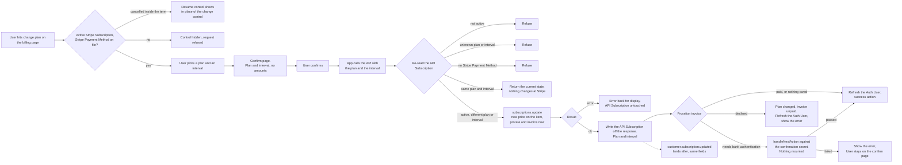

# Subscription Update - Stripe

Status: built
Updated: 2026-09-29

## Description

A User on an active Stripe Subscription changes the plan, the interval, or both. The existing Stripe Subscription carries on with a different price against it, so nothing is cancelled and nothing is created, and the difference is charged on confirm.

## Requirements

- Authenticated Users only.
- Change the plan, the interval, or both, on an active Stripe Subscription.
- Keep the existing Stripe Subscription. Nothing is cancelled and nothing is created.
- Refused on anything other than an active Stripe Subscription. Past due and unpaid each refuse with their own error. See the [subscription guards flow](/flows/subscription/Guards).
- A cancelled Stripe Subscription still inside the term shows the resume control and never the change control. See the [subscription resume flow](/flows/subscription/stripe/Resume).
- Refused when no Stripe Payment Method resolves.
- The control leads to a dedicated confirm page rather than an inline picker.
- The page states the plan and the interval being changed to. No amounts are shown.
- The difference is prorated and charged on confirm.
- A downgrade leaves a credit on the Stripe Customer rather than a refund.
- A charge the bank wants authenticated is challenged on the confirm page.
- A declined charge leaves the User on the changed plan with an unpaid invoice.
- The App hides the control on the same rule, and the API decides it again on every request.
- The API writes the API Subscription off Stripe's response, and the matching Stripe webhook rewrites the same fields as a backstop.

## Flow

1. App shows the change control on the billing page, only on an active Stripe Subscription with a Stripe Payment Method on file. Hiding it is display, the API reads the same rule again on the request.
   1. Show the resume control in place of the change control on a cancelled Stripe Subscription still inside the term. The User resumes first and changes plan after.
2. App takes the plan and interval pick. The combination currently on the Stripe Subscription is marked and cannot be picked, so the same plan on a different interval is a valid pick.
3. App opens a dedicated confirm page stating the plan and the interval being changed to. Confirm is the only action on it and no amounts are shown.
4. App calls the API with the plan and the interval when the User confirms. The Stripe Subscription is resolved from the API User.
5. API changes the price on the Stripe Subscription.
   1. Re-read the API Subscription and refuse anything other than an active Stripe Subscription. No Stripe Subscription at all, past due, unpaid and cancelled inside the term each refuse.
   2. Refuse a plan or an interval the API does not know.
   3. Refuse when no Stripe Payment Method resolves. Read `default_payment_method` on the Stripe Subscription, falling back to `invoice_settings.default_payment_method` on the Stripe Customer, which is the order the charge itself reads. Not the API Payment Method, which is display and lags the webhook. See the note below.
   4. Return the current state when the plan and interval are already on the Stripe Subscription, and change nothing at Stripe. A double submit, a second tab and a direct call all land here.
   5. Update the Stripe Subscription's item with the new price, prorating and invoicing on the spot. Stripe returns the updated Stripe Subscription in the same call.
   6. Write the API Subscription off the returned object, plan and interval.
   7. Read the proration invoice off the same call and answer with one of three, exclusive. Paid, or nothing owed on a downgrade, ends the call. A charge the bank wants authenticated returns the invoice's confirmation secret. A declined charge returns the failure with the price change already applied. See the note below.
   8. Error back for display when Stripe refuses the update itself. The API Subscription is left as it is and the User retries.
6. App acts on which of the three came back.
   1. Refresh the Auth User and take the success action on a settled charge, nothing owed or paid outright. Read the new state off the refreshed Auth User rather than the response body, since subscription state is spread across flags the Auth User carries and the response holds only the one record.
   2. Hand a confirmation secret to `handleNextAction` after loading stripe.js, which runs the bank challenge. Nothing is mounted and no card is collected. Passing takes the same success action, failing shows the error and leaves the User on the confirm page. See the note below.
   3. Show the error on a failure, and refresh the Auth User on this path too since the API Subscription already carries the new plan from 5.6.
7. API runs the same write on `customer.subscription.updated`. The event and the response carry the same fields, so whichever lands second rewrites the same values, and the same handler covers a change done in the Stripe Dashboard.

## Diagram

## Notes

### Charging the difference on confirm over riding it to the next renewal

Immediate proration over deferring the difference, because deferring hands the User the higher plan for the rest of the term at the old price. An upgrade taken the day after a renewal runs almost a full period before costing anything, and the pattern is repeatable. Charging on confirm keeps what the User pays and what the User has in step, at the cost of a payment that can fail in the middle of the change.

### Downgrades leave a credit

Stripe does not refund on its own. The unused portion of the old plan comes back as a negative line item that sits as credit on the Stripe Customer and eats into the next invoice. A refund is a separate deliberate action against the original charge, and nothing here takes one.

### Note on 5.3 - why the Stripe Payment Method is read off Stripe

The API Payment Method is display and lags the webhook, so a Stripe Payment Method that was just replaced can read as missing or stale on it. Reading `default_payment_method` on the Stripe Subscription and falling back to the Stripe Customer's `invoice_settings.default_payment_method` is the order the charge itself reads, so the check answers the same question the charge will.

### Note on 5.7 - a declined charge does not roll the price change back

Stripe applies the price to the Stripe Subscription and raises the invoice as two separate things, so the price change stands whether or not the invoice is paid. Rolling the price back would buy nothing. The invoice exists either way, sits unpaid either way, and drops the Stripe Subscription into `past_due` on Stripe's retry schedule either way. The User is blocked by the same guard on both sides of a rollback, so the change stays and the User is sent to settle the invoice. See the [subscription guards flow](/flows/subscription/Guards).

### Note on 6.2 - handing the challenge to stripe.js over mounting a Stripe Payment Element

A call to `handleNextAction` over a Stripe Payment Element, because the card is not in question. The Stripe Payment Method was resolved at 5.3 and charged at 5.5, and the bank is asking the User to prove they are the cardholder, not asking for a different card. Mounting a Stripe Payment Element would put a card form in front of a User who came to change a plan, and a card entered into it would be a second, unrelated change riding on the confirm.

## Todo

- A flat decline at 6.3 leaves the Stripe Subscription on the new plan with the proration invoice unpaid, and nothing in the App settles it. Rare, and tied to the payment recovery page in the [subscription guards flow](/flows/subscription/Guards).
